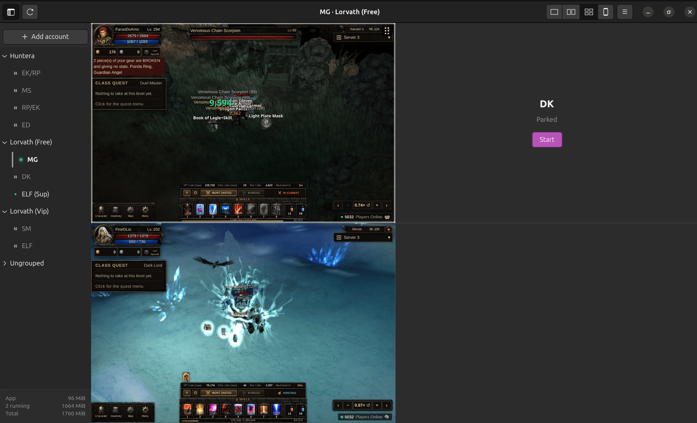
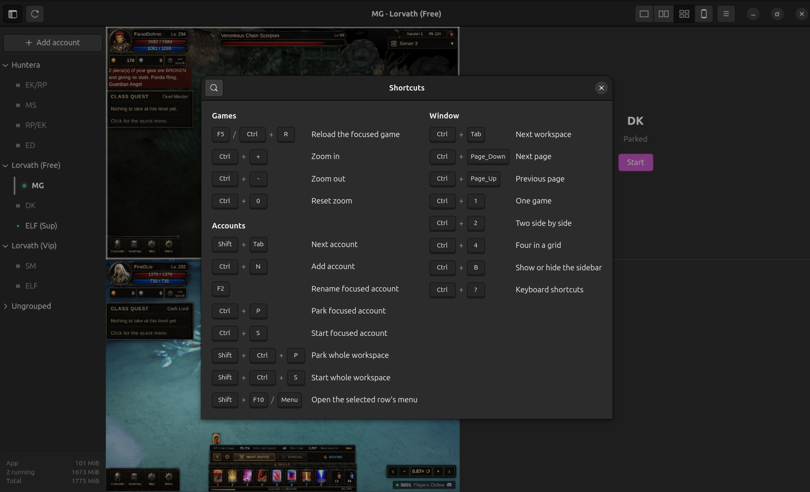
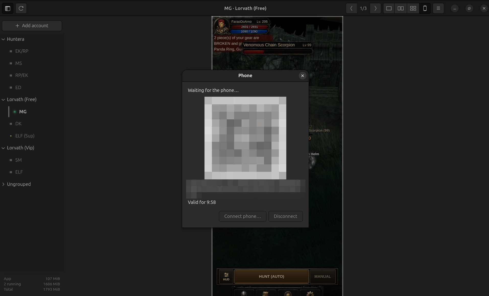

# Idle Manager

English | [Português (Brasil)](README.pt-BR.md)

Idle Manager keeps several browser idle games running at once in one window,
on Linux and on Windows. It is for someone who plays a few of these games on
more than one account each and is tired of losing them in browser tabs: every
account gets its own isolated login, a place in a grid and a row in a sidebar,
and the games keep ticking while the window sits minimised.

  

<em>The main window: three workspaces in the sidebar, two games side by side, a parked account waiting on its <strong>Start</strong> button, and the memory footer.</em>

## What it does

- **Isolated accounts in one window.** Each account has its own cookies and
  storage, so two accounts of the same game stay logged in side by side and
  neither logs the other out. The window shows one, two or four games at a
  time; the rest keep running out of sight, and `F5` reloads the focused one.
- **A sidebar that knows every account.** Every account is a row with a
  coloured mark: green when it is on screen, amber when it runs in the
  background, and a grey mark when it is parked. Click a row and that game
  takes the focused place in the grid.
- **Parking.** Park an account and it hands its memory back while its login
  stays on disk. **Start** brings it back a few seconds later, still logged in.
- **Keep-awake for hidden games.** Browsers slow down pages nobody is looking
  at. Mark an account to keep running when hidden and it plays at full speed
  while the window is minimised, which is the whole point of an idle game.
- **Memory you can see.** The footer shows what the app itself costs, what the
  running accounts cost, and the total, so you can see what parking an account
  actually returns.
- **Presets.** Adding an account is picking a game from a list and typing a
  name. The address, the zoom and the browser identity come from a small text
  file per game: three ship with the app, your own go in the config folder's
  `presets/`, and "Something else…" takes any address.
- **The workspace comes back.** Every account, name, arrangement and setting
  is saved as you change it and restored one account at a time on launch, so
  you can close the app whenever you like.
- **Workspaces, pages and zoom.** Group accounts into named workspaces, turn
  pages through a workspace with more accounts than the grid can show, and
  resize a game in place with `Ctrl` `+` / `-` / `0` or `Ctrl` + wheel; the zoom
  is remembered per arrangement.
- **Keyboard everywhere.** `Ctrl` + `?` opens the Shortcuts dialog below: park
  or start one account or a whole workspace, switch workspace, turn a page,
  change the layout, all without the mouse.

  

<em>The Shortcuts dialog (<code>Ctrl</code> + <code>?</code>): every chord for games, accounts and the window.</em>

- **Operate an account from a phone.** Open the Phone dialog, scan the QR code,
  and the focused game fills the phone's screen, streamed live from the desktop
  and laid out by the game for a phone-sized viewport. A tap on the phone lands
  as a click in the game. It needs a mesh network such as Tailscale that gives
  the desktop and the phone addresses in `100.64.0.0/10`; nothing is opened on
  the home router.
- **Releases and updates from inside the app.** Every release ships a Windows
  zip and a Linux AppImage built from the same source. A running copy notices
  a newer release, downloads it in the background while every game keeps
  running, and installs it when you quit, never on its own.

  

<em>The Phone dialog: scan the QR code with the phone and the focused game fills its screen. Behind it, the window is in the phone layout on page 1 of 3. The code and the address are blurred in this picture.</em>

## Download

Every release publishes one file per system, both built from the same source
and the same version number:

| System | File | Needs |
| --- | --- | --- |
| Windows 10 22H2 / 11, 64-bit | `IdleManager-win-Portable.zip` | nothing extra — the WebView2 runtime Windows already ships |
| Linux, Ubuntu 24.04+ or Debian 13+, 64-bit | `IdleManager.AppImage` | the system's own GTK 4 (4.10+) and WebKitGTK 6.0 (2.42+), already met by those distributions |

Get the latest release from the
[Releases page](https://github.com/LucasSGomide/msg-idle-manager/releases/latest).
`SHA256SUMS` and a `.minisig` beside every file let you check by hand what you
downloaded; `release/minisign.pub` is the public key ([`release/README.md`](release/README.md)
has the detail on how that pair works).

**Windows.** Unzip `IdleManager-win-Portable.zip` anywhere — no installer, no
administrator rights — and run `IdleManager.exe` inside the unzipped
`current\` folder. Because the program is not signed with a code-signing
certificate, the first run shows Windows' own **"Windows protected your PC"**
warning (SmartScreen). This is expected: click **More info**, then
**Run anyway**. A Windows 11 machine with Smart App Control turned on may
refuse the program outright instead of showing that prompt; turning Smart App
Control off is the only way past it today.

**Linux.** Download `IdleManager.AppImage`, mark it executable
(`chmod +x IdleManager.AppImage`), and run it — no installation, no root, and
nothing but GTK 4 and WebKitGTK need to already be on the system.

**Updating.** The app checks GitHub for a newer release once at launch and
once every 24 hours, and `Check for updates` in the header bar's `☰` menu
runs the same check by hand at any time. When a newer version exists, a
notice offers **Update**: it downloads in the background while every game
keeps running, verifies the download's signature, and then offers
**Restart now**. The update installs the moment you quit either way — by
`Restart now` or by closing the app any other way — and every account, login,
workspace, preset and zoom level is exactly where you left it afterwards.

## Documentation

- [`docs/stack.md`](docs/stack.md) — what the app is built with, at which
  version, and why.
- [`docs/architecture.md`](docs/architecture.md) — the crates, the one
  dependency rule, and where a change goes.
- [`docs/code-standards.md`](docs/code-standards.md) — how the code inside a
  crate is written.
- [`docs/naming.md`](docs/naming.md) — how files, crates and identifiers are
  named.
- [`docs/design.md`](docs/design.md) — the numbered rules every screen follows.
- [`docs/requirements.md`](docs/requirements.md) — the append-only log of user
  needs and functional requirements.
- [`docs/roadmap/README.md`](docs/roadmap/README.md) — every roadmap item,
  what is next, and why.
- [`CHANGELOG.md`](CHANGELOG.md) — what each release changed.
- [`release/README.md`](release/README.md) — the release signing key and how to
  verify a download.

## Licence

Copyright © 2026 Lucas Gomide. Idle Manager is free software under the
[GNU Affero General Public License, version 3](LICENSE): you may run, study,
share and change it, and anyone who distributes a changed version, or runs one
for others over a network, must publish their complete source under the same
licence.
