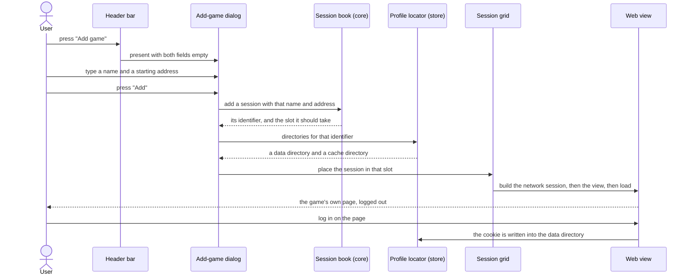
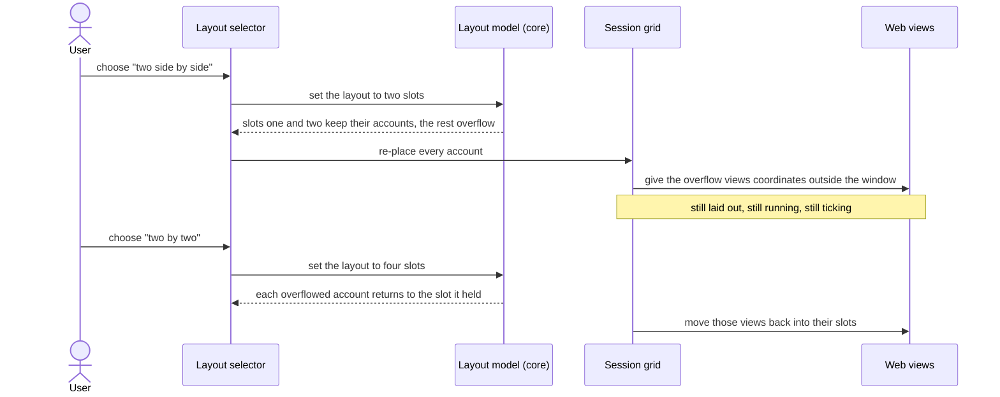

# 01 — Isolated game accounts in one splittable window

**Depends on:** — · **Status:** done · **Estimate:** 13 · **Landed:** 2026-09-06

## Context

Idle games are browser games that keep playing while nobody is looking at them.
People who play them seriously play several at once, and often play the same
game on more than one account. An ordinary browser makes that awkward. A website
recognises an account by a cookie it leaves behind, and a browser keeps one set
of cookies per profile, so opening the same game twice in one browser gets you
the same account twice. Logging in as the second account logs the first one out.

Every workaround costs a whole browser. You can create a second browser profile,
open a guest window, or install a different browser alongside the first. Each of
those is a separate program with its own settings, its own extensions, its own
window to place on screen and its own several hundred megabytes of memory before
a single game has loaded. Someone playing six accounts ends up with six browser
windows and a machine with nothing left over.

This item is the foundation of the alternative: a small Linux desktop
application that hosts those games itself, in one window, without being a
general-purpose browser. It builds three things together, because none of them
is useful without the other two.

The first is the session. A session is one game account. It owns a private area
on disk holding everything the site stores — the cookie that remembers the
login, the browser storage the game saves progress in, its offline databases,
its background workers and its cached files. Two sessions are strangers to each
other even when they point at the same game, so both can be logged in at the
same time and neither can read the other's saved data. That private area is
written as the game uses it and is still there the next time the application
starts, which is how an account stays logged in for months at a time. The
application itself never sees a password. It has no login screen of its own, no
place to store credentials, and it sends nothing anywhere. Logging in happens on
the game's own page exactly as it would in a browser, and the only thing kept
afterwards is what the game left behind.

The second is a way to create a session. Here that is deliberately plain: give
the account a name and the address the game starts at, and the application makes
its private area and opens the page. A catalogue of ready-made entries for known
games comes later, and it is built on top of this.

One detail was expected to matter here and turned out to matter in the opposite
direction. The plan was for every session to introduce itself as a current
version of a common desktop browser, because the engine underneath announces a
name few game sites recognise and some refuse to load for a browser they do not
know. Measured against a real game login, that claim is what breaks the login.
The engine does not provide the things a browser it is imitating would, and the
sites that check compare the two: presented with a claim of Chrome from
something that has none of Chrome's fixtures, a hosted sign-in button answers a
click by doing nothing at all, and a bot check never clears. Under the engine's
own name both work. So a session introduces itself honestly, and a game that
genuinely needs a different introduction gets one of its own in item 06, tested
against that game — `FR.10.5` in `docs/requirements.md` records the reversal and
supersedes `FR.10.4`.

Logging in also means letting the game open a window. Hosted sign-in — the
"continue with Google" button most of these games use — finishes in a second
window and never returns without one, so a window the page asks for opens as a
real one, sharing the account's private area so the cookie it is granted lands
there (`FR.2.4`).

The third is the arrangement. One window shows either a single account filling
it, two accounts side by side, or four in a two-by-two grid. Changing between
those never restarts a game and never logs anything out. When you switch to an
arrangement with fewer places than you have accounts open, the accounts that no
longer fit are moved out of sight rather than shut down: they keep running,
their place is remembered, and they return to it when there is room again. That
distinction — out of sight but still running — is the most important idea in the
whole application, and it needs care because the engine treats a view it
believes to be hidden very differently from one that is merely somewhere the
window is not showing. Anything genuinely hidden gets slowed down, which for an
idle game means losing progress.

What this item deliberately leaves out: there is no list of your accounts
anywhere except the window itself, no way to shut one down to reclaim its
memory, no report of what memory is being used, no memory of anything across a
restart, and no special handling when a game stops responding. Each of those is
its own item, and each assumes this one is finished.

## User Experience

- **Entry** — the application window at launch. It opens empty, with a single
  "Add game" button in the header bar and nothing else.
- **Flow** — press "Add game"; a dialog asks for a display name and a starting
  address; confirming creates the account's private area, places it in a slot
  and loads the page.
- **Flow** — log in on the game's own page, the same way you would in a browser.
  Nothing about the login passes through the application.
- **Flow** — press "Add game" again for a second account. It takes the next free
  slot in the current arrangement; when every slot is full it takes the focused
  slot and pushes that slot's previous occupant out of sight.
- **Flow** — pick one of three arrangements from the header bar: one slot, two
  side by side, or four in a two-by-two grid.
- **Flow** — click inside a slot to focus it. The focused slot is where the next
  account added, or the next account swapped in, will land.
- **States** — **empty**: no accounts yet, so the grid area is replaced by a
  short line and an "Add your first game" button. **Loading**: a slot that has
  not painted yet shows the account's name on a plain background, replaced the
  moment the page draws. **Out of sight**: an account with no slot has no
  representation in this item at all — nothing on screen says it exists, which
  is exactly the gap the sidebar in item 02 fills. **Bad address**: whatever the
  engine renders for an address it cannot reach; nothing catches it until item
  08.
- **New pattern** — the slot grid with its out-of-sight holding area. Nothing in
  `docs/design.md` covers it, because that file has no rules in it yet; the
  design doc owes a rule about slots, focus and the out-of-sight state once this
  ships.
- **New pattern** — the add-game dialog, a two-field modal over the main window.
  Same reason: `docs/design.md` owes a rule for modal input once this ships.

### Adding a game account

The screen is the main window. The dialog has two entry fields and an "Add"
button that stays insensitive until both are filled. The account's identifier is
minted by the core and is what names its directory on disk, so a rename later
never moves any files. The view is built only after the directories exist,
because the network session takes them at construction and cannot be given them
afterwards. Nothing in this path touches a password: the login is a page the
user drives, and the cookie it leaves is written by the engine into the
directory the network session was constructed with.

### Changing the arrangement

The screen is the same main window. The layout selector is three toggle buttons
in the header bar. The core decides the placement: it is given the current
layout, the accounts in order and the slot each one last held, and it returns
where every account goes now — a slot, or out of sight. The grid only obeys.
Overflowed views are placed at coordinates outside the visible area of a
container that clips, rather than being removed from the layout, because a view
the engine believes to be unrealised is a view it stops running.

## Technical Details

### Back-end

For this project "back-end" means the non-widget crates: the pure domain in
`idle-manager-core`, the disk adapter in `idle-manager-store`, and the wiring in
the `idle-manager` binary. Architecture rules 1 to 4 hold throughout — the
domain crate takes no dependency on GTK, WebKit, serde, the filesystem or
`/proc`, and `make arch-check` is what enforces that rather than review.

In `idle-manager-core`, add `session.rs` holding the identity of an account: a
`SessionId` newtype over a string and a `Session` record carrying a display
name, a start address and its `Visibility`. Code standards rules 1 and 2 apply —
`Visibility` is an enum of `InSlot(SlotId)` and `OffGrid` rather than a boolean
beside an optional slot, and every identifier is a newtype so a preset
identifier can never be passed where a session identifier belongs. Deliberately
absent: `Liveness`. Parking is item 03 and adding a second state field now would
mean two fields describing three states, which rule 1 forbids.

Add `layout.rs` holding `Layout` with its three variants, `SlotId`, and the
placement function that is the heart of the item: given a layout, the sessions
in order and the slot each last occupied, it returns the new visibility of every
session. Every rule the requirements state about arrangement lives in that one
function — filling free slots first, displacing the focused slot's occupant when
none is free, overflowing to `OffGrid` when the layout shrinks, and restoring
remembered slots when it grows. It is synchronous and pure with no clock and no
randomness, per architecture rule 9, which is what makes the whole of that
behaviour testable in unit tests at the foot of the file (code standards rules
21 to 24).

Add `ports.rs` with one trait, `ProfileLocator`, returning the data directory
and cache directory for a `SessionId` and creating them if absent. This port is
not optional bookkeeping: architecture rule 3 forbids the shell crate from
depending on the store crate at all, and `scripts/arch-check.sh` already lists
that edge, so the only way the shell can learn where a profile lives is through
a trait the binary hands it. Architecture rules 5 and 6 and naming rule 10 are
satisfied together — the port names the capability, and its adapter names the
technology.

In `idle-manager-store`, add `paths.rs` implementing that port as
`XdgProfileLocator` using the `directories` crate, putting session profiles
under the XDG data directory with no hardcoded path anywhere. The session file
and the config directory are item 07's; only the profile directories are needed
here. Failures come back as a `thiserror` enum per architecture rule 11 and code
standards rule 12, distinguishing a directory that cannot be created from one
that exists but cannot be written. Cover it with an integration test under
`tests/` against a temporary directory, per architecture rule 14.

In `crates/idle-manager/src/main.rs`, construct the locator, hand it to the
shell, and run the GTK application — nothing else, per architecture rule 3. The
binary is the only place that knows the locator is XDG-backed, and it returns
`anyhow::Result` where the libraries return enums.

### Front-end

"Front-end" here is `idle-manager-shell`, the GTK 4 and WebKitGTK adapter.
`docs/design.md` has no numbered rules yet, so both patterns this item
introduces are new and the design doc owes a rule for each once they exist in
code — that is recorded in the User Experience section rather than written into
the design doc now. The rules that do bind are architectural: rule 10 keeps
every widget call on the GTK main context, rule 12 puts each widget's private
implementation in an `imp` module beside it, and rule 13 describes every widget
in a `.ui` composite template compiled into a GResource by `build.rs`. Naming
rules 1, 2 and 4 fix the spellings: `session-grid.ui` beside `session_grid.rs`
beside `session_grid/imp.rs`.

Add `window.rs` with `window/imp.rs` and `resources/ui/window.ui`: a
`gtk::ApplicationWindow` whose `gtk::HeaderBar` carries the "Add game"
button and the three layout toggles, and whose content is the session grid. The
empty state is a second child shown when the grid holds nothing.

Add `session_grid.rs` with `session_grid/imp.rs`: a `gtk::Widget` subclass with
a custom `LayoutManager` and `set_overflow(gtk::Overflow::Hidden)`. The layout
manager reads the placement the core computed and allocates each child either
its slot rectangle or a rectangle whose origin is outside the widget's own
bounds. This is the mechanism the requirements demand and it is worth a comment
under code standards rule 18: a `GtkStack` would be the obvious choice and is
wrong here, because it unrealises the children it is not showing and the engine
treats an unrealised view as hidden, which throttles the game. Clipping is what
makes an out-of-bounds child invisible without unrealising it.

Give each slot a label behind its view carrying the account's name, drawn by
the grid and covered the instant the view paints. That is the loading state the
User Experience section describes, and it is a label rather than a widget of its
own because item 03 introduces the real placeholder when a parked account needs
one. The empty state is the window's second child, swapped for the grid whenever
the session book is empty.

Add `web_view.rs` owning the lifecycle of one account's engine objects, in this
order, because the order is forced: build a `webkit6::NetworkSession` with the
data and cache directories from the port; take its cookie manager and call
`set_persistent_storage` with a path inside the data directory and the SQLite
storage kind, so the cookie survives a restart; then build the `WebView` through
its builder with `network_session` set, because that property is construct-only
and cannot be rebound later — a constraint that matters little now and decides
the whole shape of item 03. Leave the user agent alone: `set_user_agent` is not
called, and the comment standing where the constant was records the measurement
that removed it, per code standards rule 18. One web process per view and one
shared network process is the engine's own default in this API version, so
nothing configures it; the item's job is to record that in the runbook rather
than to arrange it.

`web_view.rs` also owns the popup path and the diagnostics, because both are
per-view and neither has a widget of its own. A `create` signal is answered with
a second `WebView` built on the construct-only `related-view` property — same
network session, same web process, so the sign-in that completes there is the
same logged-in browser — parented into a transient `gtk::Window` once the engine
has sized it (`ready-to-show`). Nothing in front of that checks for a user
gesture: with `javascript-can-open-windows-automatically` left at its default the
engine has already applied a browser's popup policy before the signal is emitted,
so a second check can only reject a window the engine was willing to open.

The diagnostics are what make a login that silently does nothing readable at all,
and until item 08 turns failures into UI they are the only thing that does. The
load lifecycle, every subresource and its failure, script dialogs, permission
requests, TLS failures and web-process death all go to `tracing` in fields per
code standards rule 15. The page's own console needs one more piece: a
document-start user script injected into every frame forwards `console` output
and uncaught errors through a `UserContentManager` message handler, which is what
attaches an origin to each line — without it a login failing inside one
third-party frame is indistinguishable from the several hundred lines a bot-check
frame logs per load. `WebKit`'s console-to-stdout stream stays on in debug builds
beside it, because the engine's own messages — a blocked frame, a load cancelled
by a cross-origin policy — never reach a page's `console` object and no override
can see them.

Add `add_game_dialog.rs` with its `imp` module and `add-game-dialog.ui`: two
entries and an "Add" button bound to both being non-empty. It emits an intent
rather than mutating anything, per architecture rule 8 — the shell says what the
user did, the core decides what it means, the shell redraws from the result.

Shell coverage is the item's `test-script.md` and not `cargo test`, per
architecture rule 14 and code standards rule 25: no test in this repository may
require a display server.

### Technical References

- `webkit6::NetworkSession::new(data_directory, cache_directory)` takes both
  paths at construction. Verified against `webkit6` 0.6.1,
  `src/auto/network_session.rs:29`.
- `WebView`'s `network_session` is a construct-only builder property
  (`src/auto/web_view.rs:141`). A view cannot be moved to another session, which
  is why every later item that destroys a view keeps its network session alive
  separately.
- `CookieManager::set_persistent_storage(filename, CookiePersistentStorage)`
  (`src/auto/cookie_manager.rs:374`) is what makes a login survive a restart. A
  network session with a data directory but no persistent storage call keeps
  cookies in memory only.
- `Settings::set_user_agent` (`src/auto/settings.rs:1322`) is per-view, so the
  user agent is a per-session property from the start, which is what lets item
  06 drive it from a preset without rework. This item does not call it.
- Measured on `WebKitGTK` 2.52.6 against a live game login, with real clicks
  driven through XTEST: under a Chrome user agent a click on a Google Identity
  Services button produces one `play.google.com/log` request and no `create`
  signal at all, and Cloudflare Turnstile issued a token in 0 of 7 runs (a macOS
  Safari string, 0 of 2). Under the engine's own user agent the same click emits
  two `create` signals — `/o/oauth2/v2/auth?…display=popup` and `/gsi/select` —
  and Turnstile issued one in 5 of 9. FedCM is not the mechanism:
  `is_fedcm_supported=false` under both, and `Settings::get_all_features()` on
  this version lists no FedCM feature among its 486. Turnstile difficulty climbs
  with repeated requests from one address, so arms are only comparable
  interleaved within the same few minutes.
- `Settings::set_javascript_can_open_windows_automatically`
  (`src/auto/settings.rs:1191`) defaults to `false`, and measurement confirms
  what that buys: an ungestured `window.open` is refused by the engine with no
  `create` signal emitted, while the same call under a click reaches `create`
  with `is_user_gesture()` true — including from a 500 ms timer the click
  started. So `create` only ever fires for a window the engine already approved,
  and an embedder-side gesture check in front of it is redundant.
- `UserContentManager::register_script_message_handler` plus
  `connect_script_message_received` (`src/auto/user_content_manager.rs:62` and
  `:164`) deliver a `javascriptcore::Value`, so a bridge can post a structured
  object and be read with `object_get_property` — no JSON parsing and no `serde`
  in the shell crate. `webkit6` re-exports `javascriptcore`, so it adds no
  dependency either.
- `gtk::Widget::set_overflow(Overflow::Hidden)` (`gtk4` 0.11.4,
  `src/auto/widget.rs:1346`) clips children to the widget's allocation. Combined
  with a custom `LayoutManager` this gives an out-of-view child that is still
  realised — the requirement `GtkStack` cannot meet.

## As built

- The plan gave a view no way to reload. A game's page carries no browser
  chrome, and the two-same-address-account criterion can only be proven by
  reloading each view and seeing neither session drop — so a
  `view-refresh-symbolic` button on the header bar's leading edge and an
  `F5` / `Ctrl`+`R` `EventControllerKey` on the window, both calling
  `SessionGrid::reload_focused`, were added. The controller sits in the capture
  phase on purpose: a game that binds those keys on its own canvas (lorvath.com
  does) would otherwise consume them before the window sees them.
- One web process per view and one shared network process is the engine's
  default, exactly as `FR.1.3` assumed — measured at 1 network + N web for N of
  2 and 5. The blocker that would have grown the item if that were wrong closed
  with no code.
- The two same-address-account criteria (isolation across a reload, one distinct
  non-empty cookie DB per account) need a real game login, so they were kept out
  of `make verify` and closed by hand against two lorvath.com accounts at
  finalization; `test-script.md ## 06` carries the observed cookie-DB hashes.
- The user-agent reversal predicted in Context held under a real login: setting
  no user agent is what lets the hosted Google sign-in open its window and the
  bot check clear. `FR.10.5` stands.

## Blockers

- ~~`docs/design.md` contains no numbered rules, so nothing in this item can
  cite one and both of its patterns are new.~~ Item 02 wrote the first rule
  (the sidebar row status-marker rule); the slot-grid and modal-input rules this
  item's patterns owe are still unwritten.
- ~~The exact Chrome user agent string that the target games accept is not known
  yet.~~ Resolved by measurement, in the opposite direction to the one this
  blocker assumed: no Chrome string is wanted, because claiming one is itself
  what a game's bot check rejects. `web_view.rs` sets no user agent, and item 06
  makes the preset field an override rather than a default. See the Technical
  References above for the figures and `FR.10.5` for the superseding
  requirement. What is still unknown is the opposite question — whether any
  target game refuses the engine's own user agent — and that is item 06's to
  answer, one game at a time.
- Nothing in `crates/idle-manager-shell/` exists yet beyond `src/lib.rs`, and
  there is no `build.rs`, no `resources/` directory and no
  `idle-manager.gresource.xml`. Architecture rule 13's GResource pipeline is
  built for the first time by this item, so the first slice of the breakdown is
  build machinery rather than behaviour.
- ~~Whether one web process per view is truly the default, and whether exactly
  one network process is shared across sessions, is asserted by the requirements
  but unverified on this machine.~~ Measured during the run — 1 network process
  and one web process per view, at 2 and at 5 accounts. `FR.1.3` holds as
  written.
