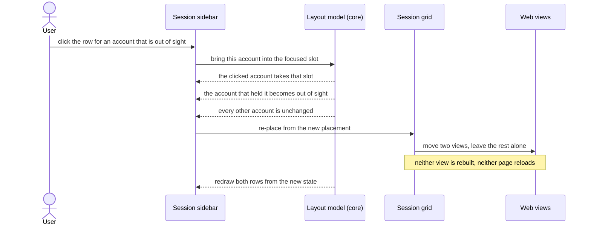
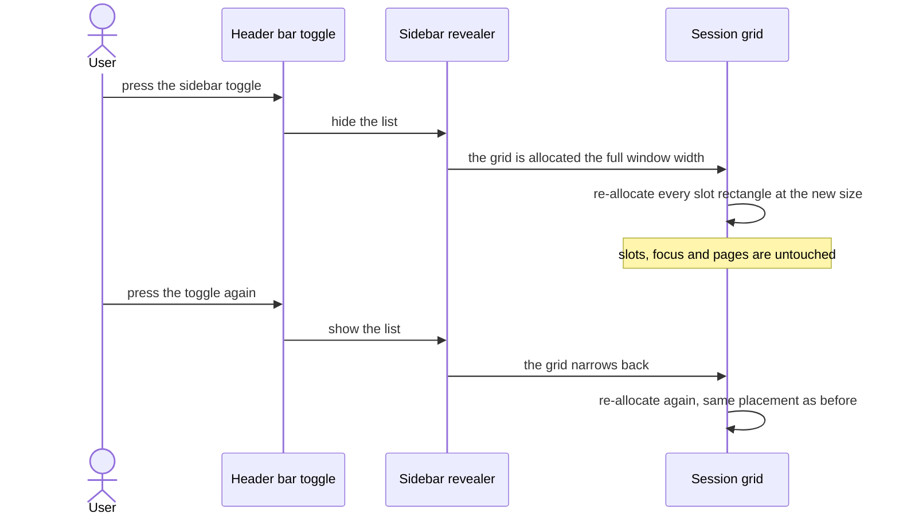

# 02 — The session sidebar

**Depends on:** 01 · **Status:** done · **Estimate:** 5

## Context

The window built by the first item can show at most four accounts at once, and
nothing stops someone from opening ten. The accounts beyond the fourth are still
loaded and still playing, but there is nothing on screen that says so and no way
to bring one back. The first item shipped that gap deliberately. This item
closes it.

The answer is a list down the left-hand side of the window naming every account
the application is holding, whether or not it currently has a place on screen.
The list is the only place where an account that is out of sight exists as far
as the user is concerned, which makes it the application's real index. Each row
shows the account's name and, beside it, a small indication of where that
account currently stands: showing in a particular place on screen, or running
but out of sight. Later items add more to that indication — whether the account
is running at all, and whether it has stopped responding — so the row is built
now with room for state that does not exist yet.

Clicking a row is the one action the list offers, and it does the obvious thing:
it brings that account into view. The place it goes to is whichever place on
screen is currently focused, and whatever was in that place is pushed out of
sight in exchange. That is a swap, not a shuffle: only two accounts change
position, everything else stays where it was, and nothing is restarted or
reloaded on either side of the trade. Someone with ten accounts and a
two-by-two arrangement can therefore reach any of them in one click, from a
list they can read at a glance, without ever losing the arrangement they set up.

A list is the right shape for this rather than a row of tabs, and the reason is that an account here is never closed by looking away from it. Tabs say that one of them is the real one and the rest are put aside; every account in this application is equally real and equally busy whether or not it has a place on screen. A vertical list of names also scales past the point where a row of tabs stops being readable, and ten or fifteen accounts is an ordinary number for someone this application is built for.

The list can also be folded away. Screen space is the reason: with the list
open, four games share the window minus a column, and on a laptop that column is
a real cost. Folding it gives the whole window width back to the games, and
unfolding it brings the list back exactly as it was — same accounts, same
places, same focus. Folding is a view of the state, never a change to it.

The reason this is a separate piece of work rather than part of the first item
is that it introduces the application's second surface. The first item has one
screen with one job. Once there is a list beside the grid, there are two
components that both read the same state and must never disagree about it, and
there is a rule about which of them owns what: the list shows state and asks for
changes, the domain decides, and both surfaces redraw from the answer. Getting
that boundary right once, on the simplest case, is why this comes before the
items that add more state to the same row.

What this item does not do: it does not let you shut an account down, it does
not report memory, it does not remember whether the list was folded when the
application last closed, and it offers no way to remove or rename an account.
Those belong to items that follow.

## User Experience

- **Entry** — a toggle button in the header bar, left of the "Add game" button.
  It is on by default, so the first thing a user sees after item 01 lands is the
  list.
- **Flow** — the list sits to the left of the grid, full window height, one row
  per account in the order the accounts were added.
- **Flow** — each row shows the account's name and, on the trailing edge, its
  place: the number of the slot it occupies, or a marker meaning it is running
  out of sight.
- **Flow** — click a row whose account is out of sight, and it swaps into the
  focused slot; the account that was there takes its turn out of sight. The
  clicked row updates to show its new slot, the displaced row updates to show it
  is out of sight.
- **Flow** — click a row whose account is already in a slot, and that slot
  becomes the focused one. Nothing moves.
- **Flow** — press the toggle to fold the list away. The grid takes the full
  window width and every game keeps its slot, its focus and its page.
- **States** — **empty**: no accounts, so the list area holds one line of text
  instead of rows. **In a slot**: the row's trailing edge names the slot and the
  row of the focused slot is marked as current. **Out of sight**: the row's
  trailing edge says so and the row's name is drawn in the dimmed style.
  **Folded**: the list is not rendered at all and the toggle reads as off.
- **New pattern** — a persistent index list beside a content area, with a
  per-row state marker on the trailing edge. `docs/design.md` has no rules yet,
  so nothing existing covers it; the design doc owes a rule for row state
  markers and for the dimmed style once this ships.
- **New pattern** — a fold-away side panel driven from a header-bar toggle. The
  design doc owes a rule for which side panels fold and what the toggle looks
  like.

### Bringing an out-of-sight account into view

The screen is the main window with the list open. The components are the
sidebar's list of rows and the session grid from item 01. The core returns a
complete placement, not a pair of moves, so the sidebar and the grid are both
redrawn from one answer and cannot end up disagreeing. Two rows change their
state marker; the moved views keep their pages because moving a view between a
slot rectangle and an out-of-bounds rectangle is a re-allocation, never a
rebuild.

### Folding the list away

The screen is the main window. The only components are the header-bar toggle and
the container holding the list. Folding changes no domain state at all — it is a
widget being revealed or not — which is why the grid needs nothing more than a
re-allocation and why nothing about it reaches the core.

## Technical Details

### Back-end

Back-end here is `idle-manager-core` and nothing else; this item adds no
persistence and no `/proc` reading, so `idle-manager-store` and
`idle-manager-metrics` are untouched. Architecture rules 1, 8 and 9 are the ones
that bind: the domain stays free of GTK, state flows intent to transition to
state to render, and everything added here is synchronous and pure.

Extend `layout.rs` in the core with the swap. The existing placement function
from item 01 already answers "where does every session go", so this adds one
more intent into the same answer: bring a named session into the focused slot.
The transition is total — it returns the visibility of every session, not a
delta — because two surfaces now render from it and a delta is how they drift
apart. Three cases have to be right and each is a unit test at the foot of the
file under code standards rules 21 to 24: the named session is out of sight and
the focused slot is occupied, so the two exchange places; the named session is
out of sight and the focused slot is empty, so nothing is displaced; the named
session already holds a slot, so the focus moves to it and no placement changes.

Focus itself already lives in the core's layout model from item 01. Add the
intent that moves it, so clicking a row that is already on screen is a focus
change and not a special case in the widget. Code standards rule 1 applies to
the return type — the result is an enum of what happened, not a boolean plus an
optional displaced identifier — and naming rule 11 names it for that result
rather than for the work it did, so it is `Placement` and never
`calculate_placement`'s output type.

Nothing here needs a new port. Architecture rule 6 is explicit that a trait with
one implementation and no test double is indirection with no reader benefit, and
this item reads and writes only state the core already owns.

### Front-end

Front-end is `idle-manager-shell`. `docs/design.md` still holds no numbered
rules, so both patterns are new and recorded as such in the User Experience
section. The binding rules are architectural: rule 10 for staying on the GTK
main context, rule 12 for the `imp` module beside each widget, and rule 13 for
describing widgets in `.ui` templates compiled into the GResource that item 01
built. Naming rules 1, 2, 4 and 7 fix the spellings — `session-sidebar.ui`
beside `session_sidebar.rs` beside `session_sidebar/imp.rs`.

Add `session_sidebar.rs` with its `imp` module and template. The list is a
`gtk::ListView` over a `gtk::SingleSelection` wrapping a `gio::ListStore` of a
small `glib::Object` subclass carrying an account's identifier, its display name
and its state as properties. A factory binds each row to a `gtk::Box` holding a
name label and a trailing state label. The state property is a string derived
from the domain's `Visibility` in one place, so item 03's liveness and item 08's
failed marker extend that one derivation rather than adding branches to the
factory. Naming rule 6 applies to the row type — it is `sidebar::Row`, not
`SidebarRow`.

Change `window.rs` and `window.ui` to hold a horizontal `gtk::Box` whose first
child is a `gtk::Revealer` containing the sidebar and whose second is the
session grid from item 01, with the header-bar toggle bound to the revealer's
`reveal-child` property. A revealer is the right container here for the reason a
`GtkStack` was wrong for the grid, read the other way round: the sidebar holds
labels, not web views, so unrealising it when folded costs nothing. That
asymmetry is worth a comment under code standards rule 18, because the next
reader will have just finished reading the opposite instruction in
`session_grid.rs`.

The list's empty state is a `gtk::Label` shown in place of the `ListView`
whenever the store holds nothing, bound to the same emptiness the window's own
empty state already watches, so the two can never disagree about whether there
are accounts.

Row activation emits an intent, per architecture rule 8. The handler sends the
account's identifier to the core, receives the new placement, and passes it to
both the grid and the list store — the widget never decides what a click means.

Leave a footer box under the list, empty and hidden. Item 05 fills it with the
memory readout, and building the slot now avoids reopening this template then.

Shell coverage is the item's `test-script.md`, per architecture rule 14 and code
standards rule 25 — no test in this repository may require a display server, and
the swap is only observable with one.

### Technical References

- `gtk::ListView` with `gio::ListStore` and a `SignalListItemFactory` is the GTK
  4 list pattern; `gtk::ListBox` is the GTK 3 one and does not recycle rows.
  Verified present in `gtk4` 0.11.4, `src/auto/list_view.rs`.
- `gtk::Revealer`'s `reveal-child` property drives both the animation and the
  child's visibility, so one property binding covers the whole fold behaviour
  (`gtk4` 0.11.4, `src/auto/revealer.rs`).
- Moving a `WebView` between a slot rectangle and an out-of-bounds rectangle is
  a `size_allocate` on the grid's layout manager, not a re-parent. A re-parent
  would unrealise the view and, per the constraint recorded in item 01, cost the
  page.

## Blockers

- The row's state marker is designed to grow — liveness arrives in item 03, the
  failed state in item 08 — but `docs/design.md` has no rule saying how several
  states share one trailing edge. Whatever this item invents is what those items
  inherit, and there is nowhere to look it up.
- `FR.4.1` in `docs/requirements.md` asks the list to show liveness as well as
  visibility, and liveness does not exist until item 03. This item satisfies the
  visibility half and item 03 completes the row. That split is deliberate and is
  recorded here so the requirement is not read as unmet.
- There is no way to remove or rename an account anywhere in the roadmap, and
  this list is the surface where a user would expect both. No requirement in
  `docs/requirements.md` asks for either, so nothing is planned; if that is
  wrong, it is a new requirement rather than a change to this item.
