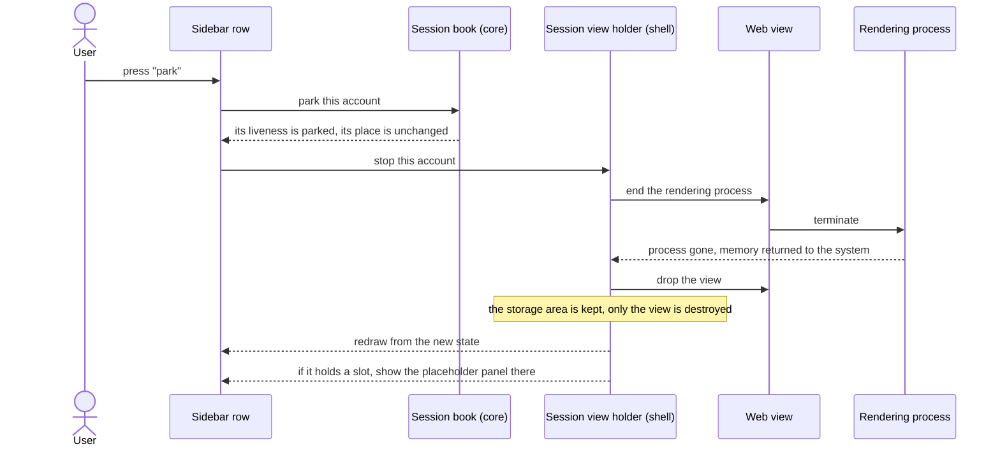
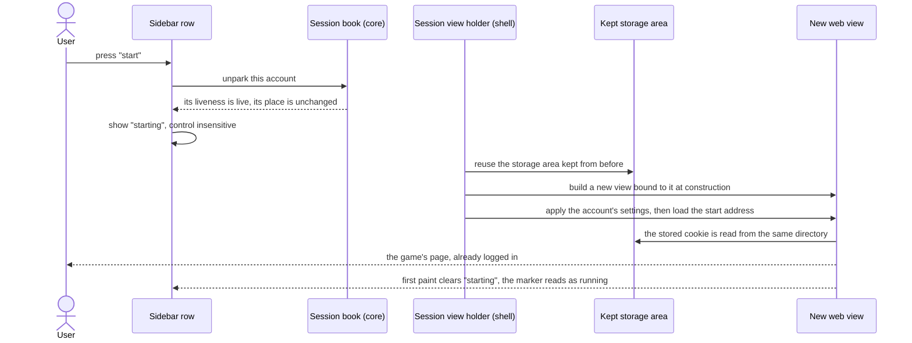

# 03 — Parking and unparking a session

**Depends on:** 02 · **Status:** not-started · **Estimate:** 8

## Context

The whole reason this application exists is that a browser costs too much memory
to run several idle games in. Two items in, it can hold any number of accounts
and show four of them, but every account it holds is running a full rendering
process whether or not anyone can see it. Ten accounts is ten rendering
processes. That is better than ten browser windows, and it is still more than a
laptop wants to give up.

This item adds the control that makes the memory cost the user's choice. An
account can be **parked**: shut down, its rendering process ended and its memory
handed back to the operating system, while everything that makes it an account
stays exactly where it was. Its private area on disk is untouched, so its login
survives. Its name, its place and its settings are untouched, so nothing has to
be set up again. Unparking it starts it back up and the game loads without ever
asking who you are. Parking is a way to stop paying for an account you are not
playing this evening, not a way to close it.

The important design decision is that this is a second, independent switch.
Whether an account is running and whether it has a place on screen are two
different questions with four honest answers, and the application supports all
four. An account can be running and on screen, which is the ordinary case. It
can be running and out of sight, which is the case the first item was built for
— a game earning progress in the background. It can be parked and out of sight,
which is the memory-saving case this item adds. And it can be parked while still
holding a place on screen, which sounds odd until you want to keep a game where
you put it, come back to it in an hour, and not pay for it in the meantime. In
that last case the place it holds shows a plain panel with its name and a way to
start it again, rather than the game.

Getting the memory actually back is harder than it looks, and two details decide
whether this item works or merely appears to. The first is the order of
operations: the rendering process has to be told to end before the view that
owns it is thrown away, because throwing the view away on its own leaves the
engine to decide when — and whether — the process dies. The second is that the
engine keeps a cache of recently used rendering processes so that a page opened
again starts faster. That cache is exactly wrong here: it means a parked account
hands its memory to the engine rather than to the system, and the readout the
user is promised in a later item would show the memory as still gone. So the
application configures the engine to keep no such cache at all, trading a slower
restart for a park that is real.

One constraint from the engine shapes the code. A view is bound to its private
storage area at the moment it is created and can never be re-bound afterwards.
So unparking cannot resurrect the old view; it has to build a brand new one
against the storage area that was kept alive the whole time. That storage area
is the durable thing, the view is disposable, and every later item that destroys
a view for any reason follows the same shape.

What this item does not do: it does not tell you how much memory you saved —
that is the next item, and it is what turns this from a claim into a measurement
— and it does not park anything automatically. Parking is always a decision
somebody made.

## User Experience

- **Entry** — a control on each row of the sidebar list built in item 02, on the
  trailing edge beside the state marker. It reads as "park" for a running
  account and "start" for a parked one.
- **Entry** — the same control appears on the placeholder panel a parked account
  shows when it is holding a place on screen, so an account can be started from
  where it sits.
- **Flow** — press "park" on a running account. Its rendering process ends, its
  view is thrown away, and its row updates to say it is parked. If it held a
  place on screen it keeps that place, now showing a placeholder panel.
- **Flow** — press "start" on a parked account. A new view is built against the
  same storage area and the game loads, already logged in. The row updates to
  say it is running.
- **Flow** — park an account that is out of sight, and nothing on screen changes
  except its row. Park an account in a slot, and only that slot changes.
- **Flow** — move a parked account between slots, or out of sight and back,
  exactly as if it were running. Its liveness is not affected by where it is.
- **States** — **running**: the row's state marker reads as running plus its
  place, unchanged from item 02. **Parked**: the marker reads as parked, and the
  row name is drawn in the dimmed style whether or not the account has a place.
  **Starting**: from pressing "start" until the page first paints, the marker
  reads as starting and the control is insensitive so it cannot be pressed
  twice. **Parked in a slot**: the slot holds a panel with the account's name, a
  line saying it is parked, and the "start" control.
- **New pattern** — a two-state action control on a list row, whose label and
  meaning invert with the row's state. `docs/design.md` has no rules yet, so
  nothing existing covers it; the design doc owes a rule for row actions that
  toggle, and for what "dimmed" means now that two different states use it.
- **New pattern** — the placeholder panel that stands in for a game in a slot.
  The design doc owes a rule for slot placeholders, which item 08 will reuse for
  its error panel.

### Parking a running account

The screen is the main window with the sidebar open. The components are the
sidebar row, the grid slot the account may hold, and the shell's holder for that
account's engine objects. Termination is asked for before the view is dropped
and that order is the whole point of the interaction. The holder survives the
view: it keeps the storage area and the account's settings so the next start
does not have to rebuild them.

### Starting a parked account

The screen is the same. A new view is built rather than an old one revived,
because the binding between a view and its storage area is fixed when the view
is created. The slot's placeholder panel is replaced by the new view once it
exists. No login prompt appears, and that absence is the observable proof that
parking did not touch the account's data.

## Technical Details

### Back-end

Back-end here is `idle-manager-core` only. Nothing is written to disk by this
item and nothing is read from `/proc`, so `idle-manager-store` and
`idle-manager-metrics` are untouched.

Extend `session.rs` with `Liveness`, an enum of `Live` and `Parked`, as a field
on `Session` beside the existing `Visibility`. Code standards rule 1 is what
forces two enums rather than one combined state: the requirements say the two
attributes are independent, so all four combinations are legal and any type that
cannot express one of them is wrong. Naming rule 9 keeps it named
for the thing rather than the pattern: `Liveness`, not `SessionLivenessState`.
Add a third value to the domain's view of a starting session — `Live` covers
running, and `Starting` is the interval between the intent and the first
paint. Modelling that in the domain rather than as a
widget flag is what makes the double-press impossible everywhere at once rather
than in one handler.

Add the two transitions beside it: park a named session and unpark a named
session, each returning the session's new state. Neither touches visibility, and
a unit test for exactly that is the one that stops the two switches from being
quietly welded together later (code standards rules 21 to 24). Park a parked
session and unpark a live one are no-ops that return the state unchanged rather
than an error — a repeated click is not a failure.

Architecture rule 9 keeps this synchronous and clock-free; there is no timing in
parking, and the retry timing that does exist belongs to item 08. Architecture
rule 8 puts the shell on the receiving end: it says the user pressed park, the
core says what the session now is, and the shell makes the engine match.

No new port. Architecture rule 6 — the domain needs nothing here it must not
know how to do.

### Front-end

Front-end is `idle-manager-shell`. `docs/design.md` still has no numbered rules,
so both patterns are new and recorded as such above. Architecture rules 10, 12
and 13 bind as before, and naming rules 1, 2, 4 and 7 fix every spelling.

Restructure `web_view.rs` around the constraint that outlives every view. Today
it builds a network session and a view together; it becomes a holder type that
owns the `webkit6::NetworkSession`, the account's settings and an
`Option<WebView>`. Stopping sets that option to `None`; starting fills it again
from the same network session. Naming rule 9 applies — the type is named for
what it owns, not for the pattern, so it is `SessionView` and never
`SessionViewManager`.

Stopping is two calls in a fixed order: `terminate_web_process()` on the view,
then drop it. Reversing them leaves the engine to decide when the process dies,
which is the difference between memory returned and memory merely promised. That
order earns a comment under code standards rule 18, naming the constraint rather
than restating the calls. Termination raises the view's `web-process-terminated`
signal with the reason "terminated by API"; item 08 attaches a crash handler to
that same signal, so the handler this item installs must ignore that reason and
the two items must agree on it — the branch belongs here, written first, so item
08 inherits it rather than discovering it.

Set the cache model once, at shell start-up, on the shared web context:
`WebContext::set_cache_model(CacheModel::DocumentViewer)`. That is the engine's
lowest cache setting and the one the requirements rely on to keep no cache of
terminated rendering processes. It is a global, not per-session, so it belongs
in the shell's initialisation beside the GResource registration rather than in
the per-session holder.

Add `slot_placeholder.rs` with its `imp` module and
`resources/ui/slot-placeholder.ui`: a centred box with the account's name, a
line of state text and one action button. Item 08 renders its error panel from
the same widget with different text and a different action, so the state text
and the button label are properties rather than markup.

Extend `session_sidebar.rs` with the row action. The row's state property
derivation added in item 02 is where liveness joins visibility, per that item's
design — one function turning domain state into the row's marker text, extended
rather than branched.

Shell coverage is `test-script.md` per architecture rule 14, and it is unusually
load-bearing here: the runbook must record the resident memory of the rendering
processes before and after a park, read with `ps`, because "the process is gone"
is the entire claim of the item and no unit test can see it.

### Technical References

- `WebViewExt::terminate_web_process()` exists on the view, not the context
  (`webkit6` 0.6.1, `src/auto/web_view.rs:1590`), so termination is inherently
  per-session and needs no process bookkeeping of our own.
- `WebProcessTerminationReason` has three variants — `Crashed`,
  `ExceededMemoryLimit` and `TerminatedByApi` (`src/auto/enums.rs:4677`). The
  third is what a park raises, and telling it from the first two is what keeps
  item 08's automatic reload from fighting a deliberate park.
- `WebContext::set_cache_model(CacheModel::DocumentViewer)`
  (`src/auto/web_context.rs:207`, `src/auto/enums.rs:350`) is the lowest of the
  three cache models. `DocumentViewer` is the setting WebKit associates with
  keeping no cached processes; the other two keep some.
- `NetworkSession` is a construct-only property of `WebView`
  (`src/auto/web_view.rs:141`), first recorded in item 01. It is the reason
  unparking builds a new view rather than reviving one, and the reason the
  holder must outlive the view it holds.

## Blockers

- That `CacheModel::DocumentViewer` really sets the rendering-process cache
  capacity to zero is a WebKit internal, not something the `webkit6` crate
  states. `src/auto/enums.rs:350` gives the three values and no semantics. It has
  to be measured — park an account, watch the process count and the memory with
  `ps` — and if it does not hold, `FR.5.3` in `docs/requirements.md` needs a
  different mechanism, possibly an environment variable set before the engine
  starts, and this item grows a slice.
- Whether the engine flushes an account's stored data to disk when its last view
  is destroyed, or only on some later schedule, is unknown. `FR.2.3` in
  `docs/requirements.md` promises the data directory survives destroying and
  recreating a view, which is a promise about the directory and not about
  unwritten data. If the flush is lazy, parking risks losing progress a game had
  saved into browser storage but the engine had not yet written, and the fix is
  not in this item's current shape.
- `DocumentViewer` disables more than the process cache: it is the engine's
  smallest memory-cache setting overall, so every page load in the application
  gets slower, not just a start after a park. Nothing in `docs/requirements.md`
  says how much slower is acceptable, and no measurement exists.
- The "starting" state ends at first paint, and no signal named "first paint" is
  cited anywhere in `docs/requirements.md`. Which of the engine's load-state
  changes is close enough has to be chosen against a real game rather than from
  the API list.
