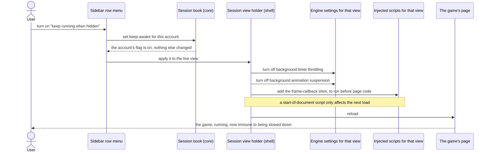
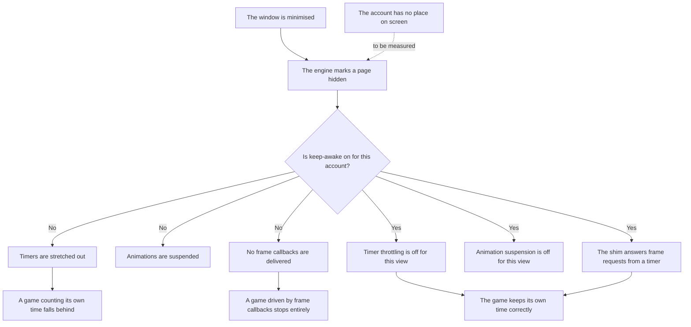

# 04 — Keep-awake for hidden games

**Depends on:** 02 · **Status:** not-started · **Estimate:** 5

## Context

Web browsers slow down pages nobody is looking at. It is the right default:
a page in a background tab has no business burning a laptop's battery on
animations nobody can see, so browsers stretch its timers out, freeze its
animations and stop handing it the rapid callbacks that drive smooth motion. For
almost every page on the web this is invisible and welcome.

For an idle game it can be the difference between a night of progress and
nothing. Some of these games count time on the player's own machine and advance
their world from a timer that ticks while the page is open. Slow that timer down
and the game genuinely earns less. Others are worse: they drive their whole game
loop from the callback a browser hands out once per drawn frame, and a browser
that is not drawing the page hands it out never, so the game simply stops until
you look at it again. Neither kind announces the problem. The player finds out
in the morning.

The behaviour is not uniform, either. Plenty of idle games keep their real state
on their own servers and calculate what you earned from the clock when you come
back, and those games do not care at all whether the page was slowed down. So
this cannot be a setting that applies to everything: forcing every game to run
at full speed in the background would spend memory and processor time to protect
games that were never at risk. It has to be per account, and it has to default
to whatever is right for the game that account plays.

This item adds that switch. Each account carries a flag saying whether it must
keep running at full speed even when the application believes nobody is looking
at it. Turning it on does two separate things, because there are two separate
mechanisms slowing the page down and only one of them can be turned off through
a setting. The first is the engine's own throttling of background timers and
animations, which the engine exposes as switches the application can flip per
account. The second is the frame callback, which the engine stops handing out to
a page it considers hidden with no setting anywhere to prevent it. The only way
past that one is to give the page a small piece of script, running before the
game's own code loads, that quietly replaces the frame callback with a plain
timer whenever the page reports itself as hidden. The game asks for its next
frame exactly as it always did; something answers.

That script is a workaround for an engine limitation rather than a feature, and
it is the kind of code that becomes a mystery in a year, so it carries the
constraint that forced it in a comment beside it.

There is a limit worth being honest about. When the whole window is minimised,
the engine marks every page it holds as hidden, and no per-account flag changes
that. Keep-awake makes an account immune to being slowed down, but it cannot
make the operating system believe a minimised window is on screen. The flag
protects the case that matters most — a game with no place on the screen while
the application is open and other games are being played — and the runbook for
this item says plainly what happens when the window is minimised, so nobody
discovers it the hard way.

What this item does not do: it does not choose the flag's value for you. The
default comes from the account's game, and the catalogue of games that supplies
that default is item 06. Until then every account starts with the flag off and
the user turns it on.

## User Experience

- **Entry** — a switch on each row of the sidebar list, reached from the row's
  menu rather than sitting on the row itself, because it is set once per account
  and then forgotten.
- **Flow** — open the row menu for an account and turn "keep running when
  hidden" on. The account's page reloads once, and from then on it runs at full
  speed whether or not it has a place on screen.
- **Flow** — turn it off again and the page reloads once more, back to the
  engine's ordinary background behaviour.
- **Flow** — the flag stays with the account. Moving it between slots, pushing
  it out of sight and bringing it back never changes it.
- **Flow** — parking an account with the flag on and starting it again keeps the
  flag on; the new view is built with the same settings and the same script.
- **States** — **off**: the menu item reads as off and nothing is injected into
  the page. **On**: the menu item reads as on, and the row's state marker gains
  a small indication so the setting is visible without opening the menu.
  **Reloading**: from toggling until the page paints again, the row's marker
  reads as reloading — the same treatment the starting state gets in item 03.
- **New pattern** — a per-row settings menu, which no earlier item needed
  because every earlier control was a single action. `docs/design.md` has no
  rules yet; the design doc owes a rule for where a row's settings live and how
  they differ from a row's actions.
- **New pattern** — an always-visible indication that a background setting is
  on. The design doc owes a rule for that too, since the row's trailing edge now
  carries three things at once.

### Turning keep-awake on for an account

The screen is the main window with the sidebar open. The components are the row
menu, the shell's holder for that account's engine objects, and the page itself.
The two settings take effect immediately; the script does not, because it is
defined to run before a document's own code and the current document has already
run. That is why the interaction ends in a reload, and why the reload is
something the user is told about rather than a surprise.

### What a hidden page does, with the flag and without

This is not a screen; it is the behaviour the two settings and the script exist
to produce, drawn once so the runbook has something to check against. The dotted
edge is the open question this item has to answer with a measurement: whether an
account with no place on screen is marked hidden at all, given that its view is
deliberately kept laid out rather than removed. The solid edge from minimising
is not in question — the engine marks every page hidden then, flag or no flag.

## Technical Details

### Back-end

Back-end here is `idle-manager-core` alone. Add the flag to `Session` in
`session.rs` as a boolean named in the shape of a question per naming rule 12 —
`is_kept_awake` — and the transition that sets it. A boolean is right here and
an enum is not: there are exactly two states with no third ever possible, so
code standards rule 1 is satisfied rather than violated.

The transition returns whether the flag actually changed, because the shell's
response is expensive — it reloads the page — and doing that for a set that set
nothing is a bug the domain can prevent rather than the widget. Unit tests at
the foot of the file per code standards rules 21 to 24 cover the flag surviving
every other transition the core already has: moving between slots, going out of
sight, parking and unparking. Those four tests are the whole point of putting
the flag in the domain rather than on the widget.

The default is off for every account created by item 01's dialog. Item 06 adds
the catalogue that supplies a per-game default, and it sets the flag at creation
through this same transition rather than reaching into the field.

No new port and nothing written to disk, so `idle-manager-store` and
`idle-manager-metrics` are untouched by this item. Architecture rules 1, 8 and 9
hold unchanged.

### Front-end

Front-end is `idle-manager-shell`. `docs/design.md` still has no numbered rules,
so both patterns above are new. Architecture rules 10, 12 and 13 bind, and
naming rules 1 and 2 fix the file spellings — the script is
`resources/js/keep-awake.js`, kebab-case like every non-Rust file.

Extend the session view holder in `web_view.rs` with the two mechanisms. The
first is the engine's feature list: `Settings::all_features()` returns every
feature the build exposes, each with an identifier, and
`Settings::set_feature_enabled` turns one off for that view's settings object.
The two identifiers are hidden-page timer throttling and hidden-page CSS
animation suspension. They are looked up by identifier once at start-up and held
in a lazily-initialised list rather than searched per view, because the feature
list is a build-time property of the engine and cannot change while the
application runs. A feature that is not present in this build is a warning
logged with `tracing` and a session that runs without it, not a panic — code
standards rules 14 and 15, and the reason is that the feature list is not a
stable API and a future engine may rename or remove either.

The second is the script. Add `resources/js/keep-awake.js` to the GResource that
item 01 built, holding the smallest possible shim: while the document reports
itself hidden, answer frame-callback requests from a timer at a fixed interval;
while it reports itself visible, hand every request straight back to the
engine's own implementation. Both the interval and the identifier bookkeeping
that lets a cancelled request actually cancel are named constants per code
standards rule 5. The file opens with a comment naming the constraint that
forced it, per rule 18 — the engine suspends scripted animations for a hidden
page with no setting to prevent it — because without that line the file reads as
a performance hack somebody should delete.

The script is installed through the view's user content manager as a script that
runs at the start of a document, in all frames. That timing is what makes it
work: the game's own code must find the replacement already in place. Because of
it, adding the script to a page that has already loaded does nothing until the
next load, which is why the toggle reloads and why the reload is in the User
Experience section rather than hidden in the code. Turning the flag off removes
every script from that view's content manager and reloads for the same reason.

Extend `session_sidebar.rs` with the row menu — a `gtk::MenuButton` on the row
opening a `gio::Menu` with the toggle as a stateful action — and extend the
row's state derivation, added in item 02 and extended in item 03, so the flag
shows on the trailing edge. The reloading state reuses item 03's
starting wording rather than adding a fourth word, because it is the same
situation to the user and the same interval to the code — from the intent until
the page paints. That derivation function is now handling three inputs and is
the right size to be worth its own unit-free test in the runbook rather than
growing branches inside the list factory.

Shell coverage is `test-script.md` per architecture rule 14. It has to include
the measurement the flowchart's dotted edge names: with the application open and
an account out of sight, read whether that page considers itself hidden, and
record the answer. That answer decides whether this item protects the common
case or only the minimised one.

### Technical References

- `Settings::all_features()` returns a `FeatureList` and
  `Settings::set_feature_enabled(&Feature, bool)` sets one per settings object
  (`webkit6` 0.6.1, `src/auto/settings.rs:1383` and `:1157`). `Feature` exposes
  `identifier()`, `name()`, `category()` and `is_default_value()`
  (`src/auto/feature.rs`), so a missing feature is detectable rather than silent.
- `UserScript::new(source, injected_frames, injection_time, allow_list,
  block_list)` (`src/auto/user_script.rs:22`) is where the start-of-document
  timing is chosen, and `UserContentManager::add_script` /
  `remove_all_scripts` (`src/auto/user_content_manager.rs:42` and `:99`) install
  and remove it. There is no API to apply a start-of-document script to a
  document already loaded, which is the reason the toggle reloads.
- The user content manager is a construct property of the view
  (`src/auto/web_view.rs:163`), so every view is built with one from item 01
  onwards even when it holds no scripts. Retrofitting one would mean rebuilding
  the view.
- Settings are per view, not per context (`src/auto/web_view.rs:157`), which is
  what makes keep-awake a per-account setting rather than an application-wide
  one.

## Blockers

- Whether the engine marks an out-of-sight account's page as hidden is unknown
  and decides how much this item is worth. Item 01 keeps those views laid out
  precisely so the engine does not treat them as hidden; if that succeeds, this
  item only matters while the window is minimised, and `FR.6.4` in
  `docs/requirements.md` reads two ways on the point. It is measurable in an
  afternoon and nothing else in the item can be judged until it is measured.
- The exact identifiers for hidden-page timer throttling and hidden-page
  animation suspension are not in the `webkit6` crate — `src/auto/feature.rs`
  exposes only the accessors, and the values come from the engine build. They
  have to be read from a running build by listing every feature, and they may
  differ between the versions `docs/stack.md` allows.
- Replacing the frame-callback API is visible to any game that inspects it, and
  nothing in `docs/requirements.md` says whether a game rejecting a patched
  browser is acceptable. No game has been tested.
- A fixed timer interval in the shim is a guess at what a game needs. Too slow
  loses progress in a game that counts frames; too fast spends processor time on
  every hidden account at once, which is the cost item 05's readout exists to
  show. `FR.6.3` in `docs/requirements.md` asks for the shim and names no rate,
  and the constant lands in `crates/idle-manager-shell/resources/js/keep-awake.js`
  with no measurement behind it.
