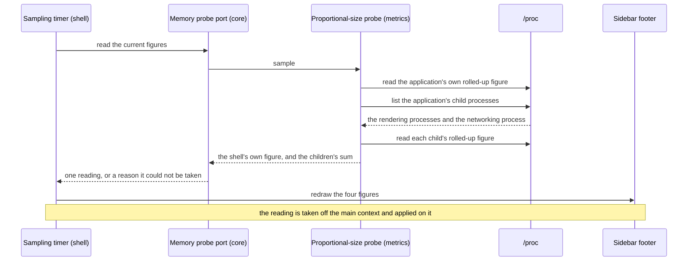
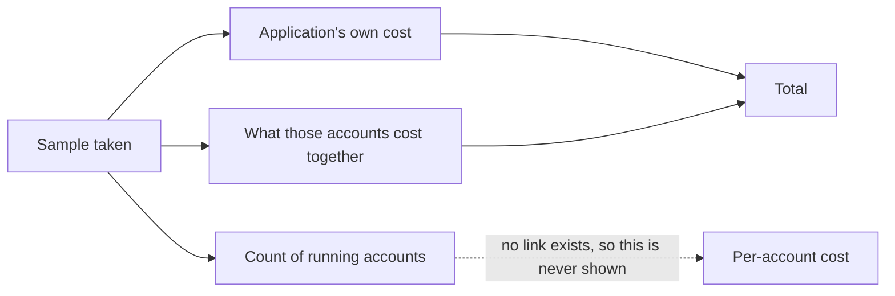

# 05 — Memory accounting

**Depends on:** 02, 03 · **Status:** not-started · **Estimate:** 5

## Context

Every claim this application makes is a claim about memory. It exists because
running several idle games in a browser costs too much of it; the ability to
shut an account down without losing its login exists to give some of it back.
Three items in, all of that is asserted and none of it is measured. A user has
no way to know whether the application is saving them anything, and neither does
anyone changing the code.

This item makes the cost visible. A small readout at the bottom of the account
list shows four numbers, refreshed as they change: what the application's own
window and controls cost, how many accounts are currently running, what those
running accounts cost between them, and the total. That is enough to answer the
questions a user actually has — is this cheaper than the browser I replaced, and
did parking that account get me anything — without pretending to more precision
than the measurement can support.

Measuring a program's memory is easier to get wrong than right, and the choice
made here matters. The obvious number, the one most tools show first, counts
every page of memory a process has in physical memory. Add that up across
several processes and the answer is badly too large, because these processes
share a great deal: the rendering engine is an enormous library, and every
account's process maps the same copy of it. Counted the naive way, that library
is charged once per account, and an application whose whole purpose is to be
cheap would report itself as expensive. The number used here instead divides
each shared page among the processes sharing it, so a library mapped by five
processes contributes a fifth of itself to each. Add those up and the total is
honest.

There is a deliberate gap. The readout says what all the running accounts cost
together and never what any one of them costs, because the engine gives no way
to tell which of its processes belongs to which account. The processes are
there, they can be found and measured, but nothing connects one to the account
whose game it is running. Rather than invent an attribution that would be wrong
in ways nobody could see, the readout reports the aggregate and says so. If that
becomes the thing people most want, it is a separate piece of work that starts
with finding a way to make the connection at all.

The same figures are also available outside the application, from a small script
kept in the repository. That exists for the times the readout cannot help: when
the numbers themselves look wrong, when something needs measuring before and
after a change, and when the question is which process grew rather than by how
much the total did. The script breaks the same total down process by process,
and it is what the runbooks in the other items call when they need to prove a
claim about memory.

Finally, this item is where the project stops guessing what it should cost. The
budget it holds itself to is written down only after several real games have
been loaded and measured — not chosen in advance from an idea of what sounds
reasonable. A budget picked before the measurement would either be met trivially
or missed permanently, and in both cases it would tell nobody anything.

## User Experience

- **Entry** — the footer of the account list, in the space item 02 left empty
  for it. It is visible whenever the list is, and folding the list away hides it
  along with everything else.
- **Flow** — read the four figures without doing anything: the application's own
  cost, the number of running accounts, what they cost together, and the total.
- **Flow** — park an account and watch the running count fall by one and both
  memory figures fall with it. That is the readout's main job: making an earlier
  item's promise checkable in the moment it is made.
- **Flow** — hover the readout for a line saying the figures are proportional
  and that per-account figures are not available.
- **States** — **measured**: four figures, refreshed on a fixed interval.
  **Not yet measured**: at start-up, before the first sample, the figures read
  as dashes rather than as zeroes, because zero is a lie and a dash is not.
  **Unavailable**: if the system cannot supply the measurement at all, the
  readout says so once and stops trying, rather than showing stale numbers.
- **New pattern** — a passive numeric readout pinned to the foot of a panel.
  `docs/design.md` has no rules yet; the design doc owes a rule for how figures
  are formatted and aligned, since this is the first place the application shows
  a number at all.

### Sampling the application's memory

This is the sidebar footer and nothing else. The sample runs on a timer rather
than in response to anything the user does, because memory changes without the
user acting — a game loading a new area costs memory nobody asked for. Reading
the kernel's files is file work and is done away from the interface, and only
the finished reading crosses back to redraw the labels.

### Reading the footer

The footer's four figures and the one it deliberately does not have. The count
of running accounts comes from the domain, not from the kernel — it is how many
accounts are live, which is a fact the application already knows — while the two
memory figures come from the kernel. Putting them side by side is what lets a
reader divide one by the other and get a rough per-account figure themselves,
which is as close to attribution as this item goes.

## Technical Details

### Back-end

Back-end here spans all three non-widget crates, and the split between them is
the item's main architectural work.

In `idle-manager-core`, add to `ports.rs` a trait named for the capability the
domain needs, `MemoryProbe`, returning a reading: the application's own
proportional figure, the summed figure for its child processes, and how many
processes contributed. Architecture rule 5 names this port and its adapter
explicitly as the example the whole rule exists for, so the naming is settled
before the code is written, and naming rule 10 says the same thing from the
other side. Architecture rule 6 is satisfied for a second reason as well: the
domain needs a fake here, because the figures feed a readout whose formatting
deserves a test that does not read `/proc`.

Add the reading type itself to the core as a small record with named fields
carrying units in their names, per code standards rule 5 — kibibytes throughout,
converted for display and never in storage. The core also owns the count of live
accounts the footer shows, which it already knows from item 03's liveness, so
the footer's four figures come from exactly two sources and the widget joins
them rather than computing anything.

In `idle-manager-metrics`, implement that port as `ProcPssProbe` in
`proc_pss.rs`. It reads the rolled-up proportional figure for a process from the
kernel's per-process summary file, falling back to summing the per-mapping file
when the summary is not available on the running kernel. It finds the
application's children by walking the process table and matching the parent
process identifier against our own, then classifies each child by its command
name into a rendering process, the networking process, or something else. That
classification is the fragile part and it is the reason the crate's failure type
distinguishes "the kernel gave us nothing" from "the kernel gave us something we
could not parse" — a `thiserror` enum per architecture rule 11 and code
standards rule 12.

Its tests are integration tests over captured kernel output under
`tests/fixtures/`, exactly as `docs/architecture.md`'s folder structure already
anticipates, per architecture rule 14. Capturing a real summary file from a real
run and committing it is what makes the parser testable on a machine with no
games running.

The binary constructs the probe and hands it to the shell, per architecture
rule 3 — the shell must not depend on the metrics crate and
`scripts/arch-check.sh` already forbids that edge.

Add `scripts/memory-report.sh`, called from a new Makefile target beside the
existing ones, printing the same figures broken down per process with the
command name of each. Every developer command is a Makefile target, and this one
is what the other items' runbooks invoke when they need to prove something about
memory rather than read a rounded figure off a label.

Record the budget in a new `docs/memory-budget.md`, written from a real
measurement of at least three games rather than in advance. It states what was
measured, on which machine, with which games, and the figures that came out —
because a threshold without its measurement is a number nobody can re-derive.

### Front-end

Front-end is `idle-manager-shell`. `docs/design.md` still has no numbered rules,
so the readout's pattern is new. Architecture rules 10, 12 and 13 bind, and
naming rules 1, 2 and 4 fix the spellings.

Add `memory_footer.rs` with its `imp` module and
`resources/ui/memory-footer.ui`: four labels in a grid, each with a fixed-width
numeric style so the figures do not jitter as they change, plus a tooltip
carrying the note about proportional figures and the absence of per-account
ones. Fill the footer box item 02 left empty rather than changing the sidebar's
structure.

The labels start showing a dash rather
than a zero, because the reading is an `Option` until the first sample lands and
the formatter renders the empty case as a dash — a zero would be a measurement
nobody took.

Drive it from a `glib::timeout_add_local` on a named interval constant. Each
tick moves the actual reading off the main context with `gio::spawn_blocking`
and comes back with `glib::spawn_future_local` to touch the labels, per
architecture rule 10 — reading the kernel's files for a dozen processes is file
work, and doing it inline is how an interface starts stuttering under exactly
the conditions this application is meant to survive. A tick that fails is logged
with `tracing` in fields and switches the readout to its unavailable state; it
is never discarded with `let _ =`, per code standards rules 14 and 15.

Shell coverage is `test-script.md` per architecture rule 14, and it is where
this item's real proof lives: park an account, and record that the footer's
running count and both figures fall, cross-checked against the script's
per-process breakdown taken at the same moment. That cross-check is what turns
item 03's claim about parking into a measurement.

### Technical References

- The kernel's rolled-up per-process summary gives a single proportional figure
  per process in one short read, where the per-mapping file requires summing
  hundreds of entries. The summary has been available since Linux 4.14, well
  below anything `docs/stack.md` targets, but the fallback is written anyway
  because a container or a hardened kernel can withhold it.
- Proportional rather than resident size is not a preference here but a
  correctness requirement: the shell and every rendering process map the same
  engine library, and resident size charges that library once per process. The
  crate documentation for `idle-manager-metrics` already states this in
  `crates/idle-manager-metrics/src/lib.rs`.
- The `webkit6` API exposes no process identifier for a view — there is no
  accessor for it anywhere in `src/auto/web_view.rs` — which is why child
  processes are found through the process table and why per-account attribution
  is out of scope rather than merely unimplemented.
- `gio::spawn_blocking` paired with `glib::spawn_future_local` is the pattern
  `docs/architecture.md` rule 10 names for moving work off the main context, so
  no second runtime is introduced for a job that runs a few times a minute.

## Blockers

- Classifying a child process as a rendering process depends on its command
  name, which the engine chooses and no API documents. If a future engine
  renames them, `crates/idle-manager-metrics/src/proc_pss.rs` silently drops a
  process rather than failing, and `FR.7.1` in `docs/requirements.md` would be
  quietly unmet. The probe needs a way to notice that its classification matched
  nothing — and what it should do then is not decided.
- `FR.7.3` in `docs/requirements.md` asks for a budget set from a real
  measurement of at least three games, and no game has been loaded yet in this
  repository. `presets/` does not exist and item 06 has not run. Three real
  games and a machine to measure them on are a prerequisite for finishing this
  item, not part of writing it.
- The sampling interval is unchosen and `FR.7.1` in `docs/requirements.md`
  names none. Too frequent spends processor time on an application whose selling
  point is frugality; too rare makes the park-and-watch interaction feel broken.
  `docs/code-standards.md` rule 5 says it is a named constant carrying its unit,
  which settles how it is written and not what it should be — that needs a real
  measurement of what one sample costs.
- Whether the networking process should be counted in the accounts' figure or
  the application's own is not settled by `docs/requirements.md`. It is one
  process shared by every account, so either choice is defensible and the two
  give different totals; whichever is picked has to be stated in the tooltip and
  in `docs/memory-budget.md`.
