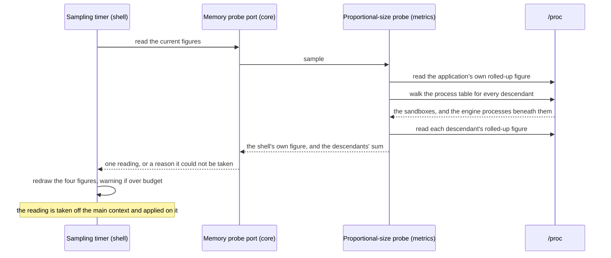
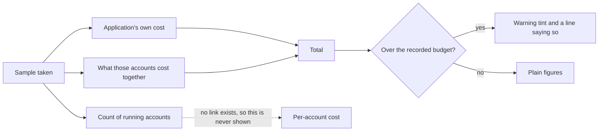

# 05 — Memory accounting and performance

**Depends on:** 02, 03 · **Status:** in-progress · **Estimate:** 8

## Context

Every claim this application makes is a claim about memory. It exists because
running several idle games in a browser costs too much of it; the ability to
shut an account down without losing its login exists to give some of it back.
Three items in, all of that is asserted and none of it is measured. A user has
no way to know whether the application is saving them anything, and neither does
anyone changing the code.

Measured for the first time, on 2026-09-08, the claim does not hold. One live
account with every other account parked cost **884 MiB** — 751 MiB in the single
rendering process, 91 MiB in the application's own process, 40 MiB in the
networking process. The same game in the browser this application is meant to
replace cost less. That is the item's second half and the reason its estimate
moved from 5 to 8: a readout that only confirmed the number would tell the user
something true and useless.

The measurement did settle one thing in the project's favour. There was exactly
one rendering process for the one live account, so parking really does return
the memory — item 03's promise holds, and the cost is not parked accounts
lingering. The cost is what a single live game is charged.

So this item does two things, in that order. First it makes the cost visible: a
small readout at the bottom of the account list showing what the application's
own window and controls cost, how many accounts are currently running, what
those running accounts cost between them, and the total. That is enough to
answer the questions a user actually has — is this cheaper than the browser I
replaced, and did parking that account get me anything. Then it uses that
instrument to bring the number down, which is work that cannot honestly start
before the instrument exists.

Measuring a program's memory is easier to get wrong than right, and the choice
made here matters. The obvious number, the one most tools show first, counts
every page of memory a process has in physical memory. Add that up across
several processes and the answer is badly too large, because these processes
share a great deal: the rendering engine is an enormous library, and every
account's process maps the same copy of it. Counted the naive way, that library
is charged once per account, and an application whose whole purpose is to be
cheap would report itself as expensive. The number used here instead divides
each shared page among the processes sharing it, so a library mapped by five
processes contributes a fifth of itself to each. Add those up and the total is
honest.

The processes are also harder to find than they look. The engine does not start
a rendering process as a child of the application: it starts it inside two
nested sandbox processes, so the process holding 751 of the 884 MiB is the
application's *grandchild*. A probe that walked direct children — which is what
this item's plan said before the measurement — would have found the networking
process, missed the rendering process entirely, and reported an application
costing 130 MiB. The probe walks the whole descendant tree (`FR.19.1`).

There is a deliberate gap. The readout says what all the running accounts cost
together and never what any one of them costs, because the engine gives no way
to tell which of its processes belongs to which account. The processes are
there, they can be found and measured, but nothing connects one to the account
whose game it is running. Rather than invent an attribution that would be wrong
in ways nobody could see, the readout reports the aggregate and says so. If that
becomes the thing people most want, it is a separate piece of work that starts
with finding a way to make the connection at all.

The same figures are also available outside the application, from a small script
kept in the repository. That exists for the times the readout cannot help: when
the numbers themselves look wrong, when something needs measuring before and
after a change, and when the question is which process grew rather than by how
much the total did. The script breaks the same total down process by process,
and it is what the runbooks in the other items call when they need to prove a
claim about memory. It is also what runs the soak.

### Where the memory goes, and what can be done about it

The 751 MiB is not the engine's code. Every shared library mapped into the
rendering process comes to about 90 MiB of it; the rest is 515 MiB of anonymous
memory and 138 MiB of allocator heap — the page's own objects, its script
engine's regions and its graphics buffers. Sampled every thirty seconds for
twenty minutes, the allocator heap never moved from 138,616 KiB at all, while
the rendering process's total swung between 715 and 787 MiB with a mean of
741 MiB over the first third of the run and 749 MiB over the last. Eight
mebibytes of drift across twenty minutes, under a seventy-mebibyte
garbage-collection sawtooth, is not a measurement that can be called either way:
it is consistent with a stable working set and equally consistent with a leak
too slow to see yet. That is why a soak is a requirement (`FR.19.3`) rather than
an afterthought. Unbounded growth is a defect and a stable 750 MiB is a budget
problem, they have opposite fixes, and twenty minutes cannot choose between
them.

Three levers are already known to be sitting unused, and none of them needs the
soak's answer first.

The engine is never told it has a memory limit. `WebKitMemoryPressureSettings`
exists on both the web context and the network session and this application sets
neither, so the rendering process grows until the operating system objects
rather than until the engine does. Given a limit and thresholds, the engine
sheds its caches and collects harder as it approaches one. It will also *kill* a
process at a third threshold, and this item deliberately does not set that one
(`FR.19.5`): a killed rendering process discards whatever the game has not sent
to its own server, which is precisely the loss `UN.9` exists to prevent. A
runaway is reported to the user and never killed on the application's own
initiative.

Diagnostics are charged to every account in every build. The web inspector
backend is switched on unconditionally, and every resource a page loads gets two
signal handlers attached to log a failure that almost never comes. A game that
polls its server loads resources for as long as it runs. Neither is worth
carrying in a release run nobody is debugging (`FR.19.6`).

Rendering settings are global when they should be per game. WebGL is enabled for
every account whether its game draws with it or not, and a graphics context is
not free. It becomes a preset field defaulting to what the application does
today, so a game measured not to need it stops paying and no game regresses
(`FR.19.7`). Hardware acceleration is explicitly *not* touched: WebKitGTK 6.0
removed the on-demand policy and leaves only always and never, always is the
default, and the measured process has the Mesa driver mapped into it — so the
application is already accelerating wherever the machine allows it, which is
what the browser it is compared against does too.

Finally, this item is where the project stops guessing what it should cost. The
budget it holds itself to is written down only after several real games have
been loaded and measured — not chosen in advance from an idea of what sounds
reasonable. A budget picked before the measurement would either be met trivially
or missed permanently, and in both cases it would tell nobody anything. It is
also written as a comparison: the same three games, on the same machine, in this
application and in the browser it replaces (`FR.19.2`). An absolute figure would
be a number nobody could argue with because nobody could reproduce the
conditions that produced it.

## User Experience

- **Entry** — the footer of the account list, in the space item 02 left empty
  for it. It is visible whenever the list is, and folding the list away hides it
  along with everything else.
- **Flow** — read the four figures without doing anything: the application's own
  cost, the number of running accounts, what they cost together, and the total.
- **Flow** — park an account and watch the running count fall by one and both
  memory figures fall with it. That is the readout's main job: making an earlier
  item's promise checkable in the moment it is made.
- **Flow** — hover the readout for a line saying the figures are proportional
  and that per-account figures are not available.
- **Flow** — leave the application running past its budget and find the footer
  wearing a warning tint and saying so. Nothing has been parked, nothing has
  been reloaded, and no dialog has interrupted anything: the application has
  told the user a fact and left the decision with them (`FR.20.2`).
- **States** — **measured**: four figures, refreshed on a fixed interval.
  **Not yet measured**: at start-up, before the first sample, the figures read
  as dashes rather than as zeroes, because zero is a lie and a dash is not.
  **Over budget**: the same four figures in a warning tint with one line naming
  the budget; it clears itself the moment a sample comes back under
  (`FR.20.3`), because it reports a measurement rather than an event.
  **Unavailable**: if the system cannot supply the measurement at all, the
  readout says so once and stops trying, rather than showing stale numbers.
- **New pattern** — a passive numeric readout pinned to the foot of a panel,
  and with it the first thing in this application that changes appearance
  because a measurement crossed a line rather than because someone acted.
  `docs/design.md` has no rule for either; the design doc owes one for how
  figures are formatted and aligned, since this is the first place the
  application shows a number at all, and one for a self-clearing warning that
  states a condition — which is the opposite of design rule 9's strip, and the
  contrast is the rule's point.

### Sampling the application's memory

This is the sidebar footer and nothing else. The sample runs on a timer rather
than in response to anything the user does, because memory changes without the
user acting — a game loading a new area costs memory nobody asked for. Reading
the kernel's files is file work and is done away from the interface, and only
the finished reading crosses back to redraw the labels.

The walk is a walk, not a scan of direct children. Every process on the machine
is read once into a child-to-parent map and the application's own identifier is
followed down it, which is what reaches a rendering process two sandbox
processes below the application (`FR.19.1`).

### Reading the footer

The footer's four figures, the one it deliberately does not have, and the one
comparison it makes. The count of running accounts comes from the domain, not
from the kernel — it is how many accounts are live, which is a fact the
application already knows — while the two memory figures come from the kernel.
Putting them side by side is what lets a reader divide one by the other and get
a rough per-account figure themselves, which is as close to attribution as this
item goes.

## Technical Details

### Back-end

Back-end here spans all three non-widget crates, and the split between them is
the item's main architectural work.

In `idle-manager-core`, add to `ports.rs` a trait named for the capability the
domain needs, `MemoryProbe`, returning a reading: the application's own
proportional figure, the summed figure for its descendant processes, and how
many processes contributed. Architecture rule 5 names this port and its adapter
explicitly as the example the whole rule exists for, so the naming is settled
before the code is written, and naming rule 10 says the same thing from the
other side. Architecture rule 6 is satisfied for a second reason as well: the
domain needs a fake here, because the figures feed a readout whose formatting
and over-budget decision deserve a test that does not read `/proc`.

Add the reading type itself to the core as a small record with named fields
carrying units in their names, per code standards rule 5 — kibibytes throughout,
converted for display and never in storage. The core also owns the count of live
accounts the footer shows, which it already knows from item 03's liveness, and
it owns the comparison against the budget, which is a rule and therefore not the
shell's to make (architecture rule 8). The footer's figures come from exactly
two sources and the widget joins them rather than computing anything.

In `idle-manager-metrics`, implement that port as `ProcPssProbe` in
`proc_pss.rs`. It reads the rolled-up proportional figure for a process from the
kernel's per-process summary file, falling back to summing the per-mapping file
when the summary is not available on the running kernel. It finds the
application's processes by reading every entry in the process table once,
building a parent-to-children map, and walking it down from our own identifier —
not by matching direct children, which the measurement proved reaches neither
rendering process nor anything else behind the sandboxes (`FR.19.1`). Each
descendant is then classified by command name into a rendering process, the
networking process, a sandbox helper, or something else. That classification is
the fragile part and it is the reason the crate's failure type distinguishes
"the kernel gave us nothing" from "the kernel gave us something we could not
parse" — a `thiserror` enum per architecture rule 11 and code standards rule 12.

Its tests are integration tests over captured kernel output under
`tests/fixtures/`, exactly as `docs/architecture.md`'s folder structure already
anticipates, per architecture rule 14. The fixture is captured from a real run
with a real game loaded, sandboxes and all, which is what makes both the parser
and the tree walk testable on a machine with no games running.

The binary constructs the probe and hands it to the shell, per architecture
rule 3 — the shell must not depend on the metrics crate and
`scripts/arch-check.sh` already forbids that edge.

Add `scripts/memory-report.sh`, called from a new Makefile target beside the
existing ones, printing the same figures broken down per process with the
command name of each, and a soak mode that samples on an interval to a file for
the duration `FR.19.3` requires. Every developer command is a Makefile target,
and this one is what the other items' runbooks invoke when they need to prove
something about memory rather than read a rounded figure off a label.

Record the budget in a new `docs/memory-budget.md`, written from a real
measurement of at least three games rather than in advance, each measured twice
— once here and once in the browser being replaced, on the same machine
(`FR.19.2`). It states what was measured, on which machine, with which games,
and the figures that came out — because a threshold without its measurement is a
number nobody can re-derive.

### Front-end

Front-end is `idle-manager-shell`. `docs/design.md` still owes both of this
item's rules, so the readout's pattern and its warning are new. Architecture
rules 10, 12 and 13 bind, and naming rules 1, 2 and 4 fix the spellings.

Add `memory_footer.rs` with its `imp` module and
`resources/ui/memory-footer.ui`: four labels in a grid, each with a fixed-width
numeric style so the figures do not jitter as they change, plus a tooltip
carrying the note about proportional figures and the absence of per-account
ones. Fill the footer box item 02 left empty rather than changing the sidebar's
structure. The over-budget appearance is one CSS class toggled on the widget
from the core's verdict, never a second widget and never a colour decided in
Rust.

The labels start showing a dash rather
than a zero, because the reading is an `Option` until the first sample lands and
the formatter renders the empty case as a dash — a zero would be a measurement
nobody took.

Drive it from a `glib::timeout_add_local` on a named interval constant. Each
tick moves the actual reading off the main context with `gio::spawn_blocking`
and comes back with `glib::spawn_future_local` to touch the labels, per
architecture rule 10 — reading the kernel's files for a dozen processes is file
work, and doing it inline is how an interface starts stuttering under exactly
the conditions this application is meant to survive. A tick that fails is logged
with `tracing` in fields and switches the readout to its unavailable state; it
is never discarded with `let _ =`, per code standards rules 14 and 15.

The engine settings change here too, in `web_view.rs` and `lib.rs`.
`configure_web_engine` gains the memory-pressure settings beside the cache model
it already sets, since both are engine-wide and set once (`FR.19.4`). `configure`
stops enabling the inspector and the per-resource handlers unconditionally and
reads a switch instead (`FR.19.6`), and `apply_account_settings` gains WebGL
from the preset beside the zoom and identity it already applies (`FR.19.7`).

Shell coverage is `test-script.md` per architecture rule 14, and it is where
this item's real proof lives: park an account, and record that the footer's
running count and both figures fall, cross-checked against the script's
per-process breakdown taken at the same moment. That cross-check is what turns
item 03's claim about parking into a measurement. The performance slices are
proved the same way and only that way — a before figure, a change, an after
figure, both from the script, both written into the runbook.

### Technical References

- The kernel's rolled-up per-process summary gives a single proportional figure
  per process in one short read, where the per-mapping file requires summing
  hundreds of entries. The summary has been available since Linux 4.14, well
  below anything `docs/stack.md` targets, but the fallback is written anyway
  because a container or a hardened kernel can withhold it.
- Proportional rather than resident size is not a preference here but a
  correctness requirement: the shell and every rendering process map the same
  engine library, and resident size charges that library once per process. The
  crate documentation for `idle-manager-metrics` already states this in
  `crates/idle-manager-metrics/src/lib.rs`.
- The measured tree on 2026-09-08 was `idle-manager` → `WebKitNetworkProcess`,
  and `idle-manager` → `bwrap` → `bwrap` → `WebKitWebProcess`, with a third
  branch through `bwrap` to `xdg-dbus-proxy`. The rendering process is two
  levels down, which is the whole of `FR.19.1`.
- The `webkit6` API exposes no process identifier for a view — there is no
  accessor for it anywhere in `src/auto/web_view.rs` — which is why child
  processes are found through the process table and why per-account attribution
  is out of scope rather than merely unimplemented.
- `MemoryPressureSettings` in `webkit6` 0.6.1 carries a memory limit, a poll
  interval, and conservative, strict and kill thresholds
  (`src/auto/memory_pressure_settings.rs`). It reaches the engine two ways: as
  the `memory-pressure-settings` construct property on `WebContext`, which
  governs rendering processes, and through
  `NetworkSession::set_memory_pressure_settings`, a static call governing the
  one networking process. Being a construct property means the web context can
  no longer be `WebContext::default()`.
- `HardwareAccelerationPolicy` in `webkit6` 0.6.1 has only `Always` and `Never`
  (`src/auto/enums.rs:1440`); the on-demand value the 4.x API had is gone.
  `Always` is the default and the measured rendering process maps
  `libgallium` and the Mesa shader cache, so acceleration is already in use and
  this item changes nothing about it.
- `gio::spawn_blocking` paired with `glib::spawn_future_local` is the pattern
  `docs/architecture.md` rule 10 names for moving work off the main context, so
  no second runtime is introduced for a job that runs a few times a minute.

## Blockers

- Classifying a descendant as a rendering process depends on its command name,
  which the engine chooses and no API documents. If a future engine renames
  them, `crates/idle-manager-metrics/src/proc_pss.rs` silently drops a process
  rather than failing, and `FR.7.1` in `docs/requirements.md` would be quietly
  unmet. The probe needs a way to notice that its classification matched
  nothing — and what it should do then is not decided. The tree walk narrows
  this: a descendant that matches nothing is still counted in the total, so a
  rename costs the breakdown rather than the figure.
- `FR.7.3` and `FR.19.2` in `docs/requirements.md` ask for a budget set from a
  real measurement of at least three games in two applications, and only one
  game has been loaded so far. Item 06 shipped the catalogue, so this is now a
  matter of loading two more games and finding time for the soak rather than a
  missing mechanism — but it is still a prerequisite for finishing the item, not
  part of writing it.
- The sampling interval is unchosen and `FR.7.1` in `docs/requirements.md`
  names none. Too frequent spends processor time on an application whose selling
  point is frugality; too rare makes the park-and-watch interaction feel broken.
  `docs/code-standards.md` rule 5 says it is a named constant carrying its unit,
  which settles how it is written and not what it should be — that needs a real
  measurement of what one sample costs. The walk added to it makes this sharper:
  the sample now reads every process on the machine, not a dozen.
- Whether the networking process should be counted in the accounts' figure or
  the application's own is not settled by `docs/requirements.md`. It is one
  process shared by every account, so either choice is defensible and the two
  give different totals; whichever is picked has to be stated in the tooltip and
  in `docs/memory-budget.md`. The sandbox helpers raise the same question and
  answer it more easily — five processes at about 2 MiB between them, counted
  with the application's own.
- The memory-pressure limit is a number, and `FR.19.4` names none. Set too low
  the engine thrashes its caches on a game that legitimately needs the memory;
  set too high it never engages. It cannot be chosen before the soak says what
  a healthy game's curve looks like, which orders the slices.
- Whether the 751 MiB is a leak or a working set is unknown and only the soak
  answers it. If it is a working set, this item ends with a budget the
  application meets and a comparison it may still lose, and beating the browser
  becomes another item with a different subject — the game's own page, not the
  engine's settings. That possibility is why the budget and the reductions are
  separate slices.
