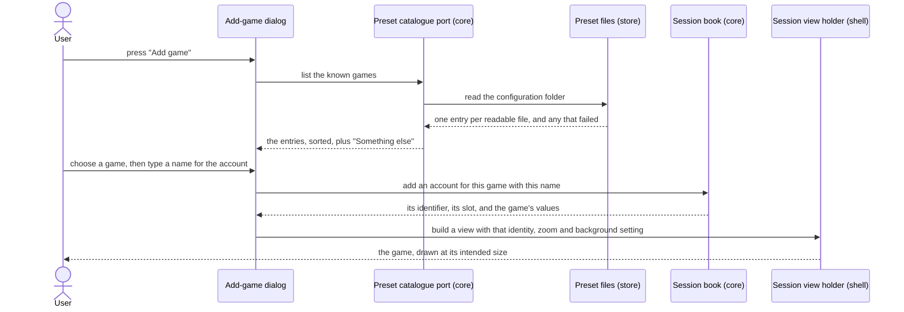
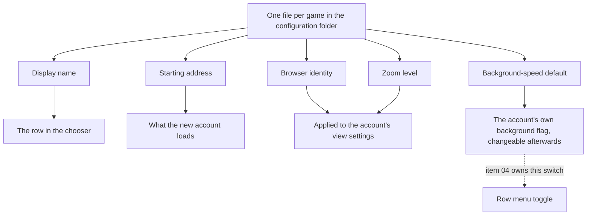

# 06 — Presets and adding an account

**Depends on:** 01, 04 · **Status:** done · **Estimate:** 5

## Context

Adding an account today means knowing things a player should not have to know.
The dialog asks for a web address, so you have to find the right one and type it
correctly. It says nothing about how the application should introduce itself to
that particular game, even though some games refuse to load for a browser they
do not recognise. It says nothing about how large the page should be drawn,
though several of these games are built for a full screen and are unreadable in
a quarter of one. And it leaves the background-speed setting off, though for
some games that setting is the difference between progress and none.

Every one of those answers is a property of the game, not of the account. Two
accounts on the same game want the same address, the same browser introduction,
the same zoom and the same background behaviour. Asking for them once per
account is asking the user to be the memory the application should have.

The browser introduction needs one correction to what this item first assumed.
Item 01 planned to present every game with a current desktop browser's name and
measured the result: the engine cannot back that claim up, and a game's sign-in
and bot check both reject the mismatch outright — a worse failure than being an
unrecognised browser. So the field here is an override, not a default. A game
file that says nothing about the browser gets the engine's own name, which is
what works for every game tested so far; a game that actually turns the engine
away gets a string of its own, chosen by trying it against that game.
`FR.10.5` supersedes `FR.10.4` and records why.

This item gives the application that memory, in the plainest possible form:
one small text file per game, kept in the project and copied into the user's own
configuration folder the first time the application runs. Each file names the
game, the address it starts at, the browser identity to present, how large to
draw the page, and whether that game needs to be kept running at full speed in
the background. Adding an account becomes choosing a game from a list and giving
the account a name — two decisions, both of which the user actually has an
opinion about. Everything else comes from the file.

Keeping those files as plain text in a folder, rather than as a list built into
the program, is the important decision. Idle games are a long tail: whatever
handful ships with the application, the games somebody actually plays will be a
different handful. A user who plays something nobody has heard of should be able
to add it by copying a file and editing five lines, without waiting for anyone
and without touching the program. The same property makes the shipped entries
maintainable: a browser identity string goes out of date every few months, and
fixing one should be an edit rather than a release.

The direct entry the earlier item introduced does not go away. It becomes the
escape hatch: a game with no file yet is added by giving a name and an address
exactly as before, and the sensible defaults apply. That path stays because it
is the one that works on the day someone discovers a new game, and because the
file format should be something a user reaches for after the application has
already proved useful, not before.

One consequence is worth stating plainly. Because these values are read when an
account's page is built, editing a game's file does not change accounts that are
already running. The change takes effect the next time such an account starts —
which is immediate for a parked account and one restart away for a running one.
That is a simpler rule than watching the folder for changes, and it is the rule
the application states rather than one the user has to infer.

## User Experience

- **Entry** — the same "Add game" button from item 01. The dialog behind it
  changes shape; nothing else moves.
- **Flow** — the dialog opens with a list of games read from the configuration
  folder, each showing its display name, plus a "Something else" entry at the
  bottom of the list.
- **Flow** — choose a game and the dialog asks for one more thing: a name for
  this account, so two accounts on the same game can be told apart. Confirming
  creates it and loads the game.
- **Flow** — choose "Something else" and the dialog reveals the name and address
  fields from item 01, unchanged. Confirming creates an account with default
  values for everything the file would have supplied.
- **Flow** — the created account carries the game's browser identity, its zoom
  and its background-speed setting from the moment it first loads. The
  background-speed setting can still be changed per account afterwards, exactly
  as item 04 describes.
- **States** — **catalogue present**: the list shows one row per file, sorted by
  display name. **Catalogue empty**: the list area says no games are configured
  and names the folder to put files in, with "Something else" still available so
  the dialog is never a dead end. **A file that will not parse**: the list omits
  it and shows one line naming the file and the problem, rather than failing to
  open the dialog.
- **New pattern** — a chooser whose last entry reveals a different form. Nothing
  in `docs/design.md` covers it: every one of its six rules is about a sidebar
  row or the panel standing in for an absent game. The design doc owes a rule
  for an escape-hatch option inside a chooser, and for how a partial failure
  like an unparseable file is reported inside a form.

### Adding an account from the catalogue

The screen is the add-game dialog over the main window. Its components are the
list of games, the account-name field, and the hidden address field the escape
hatch reveals. The catalogue is read when the dialog opens rather than held from
start-up, so a file added by hand shows up on the next press of the button
without restarting the application. The account's values are copied into the
account at creation, which is what makes an account independent of the file
afterwards.

### Where a game's values end up

Not a screen — the mapping from the five fields in a file to the four places
they end up, drawn once so the breakdown does not have to rediscover it. Four of
the five are consumed at creation and never read again. The fifth, the
background-speed default, is only a default: it sets the account's own flag once,
after which the account owns it and the file has no further say.

## Technical Details

### Back-end

In `idle-manager-core`, add a `PresetId` newtype and a `Preset` record holding
the five values, per code standards rules 1 and 2 — the identifier is a newtype
so it can never be passed where a `SessionId` belongs, and the zoom level is a
named type rather than a bare float so an invalid value cannot be constructed.
Add to `ports.rs` a `PresetCatalogue` trait returning the readable presets and,
separately, the entries that failed to read: naming rule 10 names the port for
the capability, and returning both lists rather than a single result is what
lets the dialog show a partial catalogue instead of nothing. The domain also
gains the creation transition's second form — create an account from a preset —
which copies the preset's values onto the new `Session`, including calling item
04's keep-awake transition rather than writing that field directly, so there is
one path that sets it.

In `idle-manager-store`, add `preset.rs` implementing that port as
`TomlPresetCatalogue`. Architecture rule 7 is the rule that shapes this file:
the on-disk shape gets its own serde types and is mapped to and from the domain
types, because these files are a contract with a folder users are invited to
edit by hand and deriving serialisation on a domain type would turn every later
domain rename into a broken configuration. Extend `paths.rs` with the presets
directory under the XDG configuration directory, beside the profile directories
item 01 put under the XDG data directory — `FR.8.3` in `docs/requirements.md`
asks for exactly that split and item 07 completes it with the session file.

Seeding is part of this crate too. The files under `presets/` at the repository
root are embedded into the binary and written into the configuration folder the
first time it is found missing; after that the folder is the user's and is never
overwritten. That keeps `idle-manager-store` the only crate touching the disk
and avoids an installation step `make dev` would have to grow. Cover it with
integration tests under `tests/` against a temporary directory, per architecture
rule 14, and snapshot the file format with `insta` as `docs/stack.md` already
anticipates for exactly this kind of contract.

Naming rule 1 fixes the files: `presets/melvor-idle.toml`, kebab-case like every
other non-Rust file in the repository.

### Front-end

Front-end is `idle-manager-shell`. `docs/design.md` has six numbered rules and
none of them reaches a dialog, so the chooser pattern is new. Architecture rules
10, 12 and 13 bind, and naming rules 1, 2, 4 and 7 fix the spellings.

Rework `add_game_dialog.rs` and `add-game-dialog.ui` from item 01 into two
stages inside one dialog: a `gtk::ListView` of catalogue entries plus the escape
hatch, and a second page holding the account-name field, with the address field
revealed only on the escape-hatch path. The failure line for an unreadable file
is a `gtk::Label` under the list, populated from the second list the port
returns, so a bad file degrades the dialog by one row rather than closing it.
When the port returns nothing readable at all, the list is replaced by a label
naming the presets directory the store crate resolved — the escape-hatch row
stays, so the dialog is never a dead end.

Extend the session view holder in `web_view.rs` to take the browser identity and
the zoom from the account: `set_zoom_level` on the view itself, and
`set_user_agent` on the view's settings **only when the preset carries one**,
both applied before the first load so the page is never drawn at the wrong size
and then resized. Item 01 left no constant to fall back to and that is
deliberate — it measured a Chrome string to be what breaks a real login — so the
field is `Option`-shaped in the domain and absent from a preset means the engine's
own identity, not a default this crate supplies. The comment item 01 left in
`web_view.rs` carries the measurement and stays, per code standards rule 18.

The shell reaches the catalogue through the port the binary hands it, per
architecture rule 3 — `scripts/arch-check.sh` forbids the shell from depending
on the store crate, so the dialog receives a `&dyn PresetCatalogue` and never
learns that the entries are files.

Shell coverage is `test-script.md` per architecture rule 14: add an account from
a shipped entry and confirm the game loads at its intended zoom and is not
rejected as an unknown browser, then add one through the escape hatch and
confirm the defaults apply.

### Technical References

- `WebViewExt::set_zoom_level` is per view (`webkit6` 0.6.1,
  `src/auto/web_view.rs:1577`) and `Settings::set_user_agent` is per settings
  object (`src/auto/settings.rs:1322`), so both preset values are naturally
  per-account and need no shared state.
- `Settings::set_user_agent_with_application_details`
  (`src/auto/settings.rs:1329`) appends to the engine's own identity rather than
  replacing it. Item 01's measurement makes that the *safer* of the two calls,
  not the wrong one — it cannot produce a string the engine contradicts — but it
  is still not what an override is for, since a game that turns the engine away
  turns away an engine with a suffix too. Use the plain setter for an override,
  and neither when the preset names no identity.
- `toml` 1.1 and `serde` 1.0 are already workspace dependencies of the store
  crate in `Cargo.toml`, and `insta` is already a development dependency there,
  so the format work adds no new dependency and no `deny.toml` change.
- Architecture rule 7's separation is not theoretical for this file: the preset
  format gains fields over time and the domain `Preset` will not match it
  one-for-one for long.

## Blockers

- ~~Which games ship as presets is undecided.~~ **Settled at breakdown, 2026-09-07:**
  Huntera (`https://huntera.com.br/`), Baiaki Idle (`https://baiakidle.com/`)
  and Lorvath (`https://lorvath.com/`). All three ship with no browser identity,
  per `FR.10.5`; one is added only if that game is measured turning the engine
  away. Item 05's memory budget uses the same three.
- Browser identity strings go stale every few months and nothing here updates
  them, and item 01's measurement makes a stale one worse than it looked: a
  string that has aged out is not merely unrecognised, it is a claim the engine
  visibly cannot back, which is exactly what a bot check refuses. `FR.10.5`
  reduces the blast radius by making the field an override that ships empty, so
  a stale string can only exist where somebody deliberately put one — but for
  that game it still looks like the game has broken, and the only mitigation is
  that the file is editable by a user who already knows why.
- ~~The zoom value's meaning is not specified anywhere.~~ **Settled at breakdown,
  2026-09-07:** a plain multiplier, `zoom = 0.8`, exactly what the engine's
  `set_zoom_level` takes. A screen-relative value would have to be recomputed
  every time the layout changes the size of the slot an account sits in, which
  contradicts this item's own rule that a preset's values are consumed once at
  creation and never read again; making zoom follow the slot is a separate item
  if it is ever wanted.
- Editing a game's file has no effect on accounts already running, by the design
  stated above. Nothing in `docs/requirements.md` says whether that is
  acceptable, and the alternative — watching the folder and restarting affected
  accounts — is a materially larger item.
