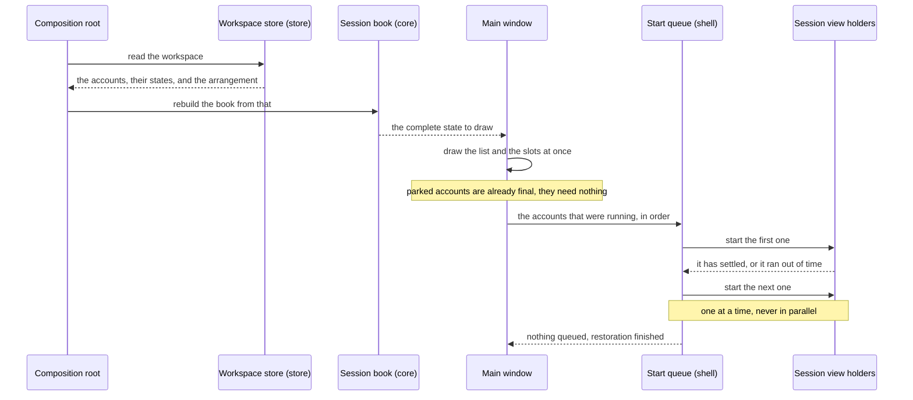
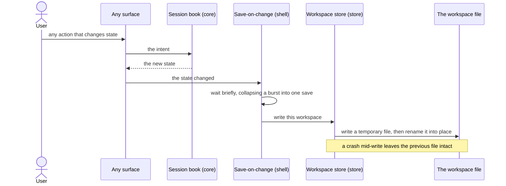

# 07 — Restoring the workspace on launch

**Depends on:** 03, 04, 06 · **Status:** in-progress · **Estimate:** 8

## Context

Six items in, the application is worth setting up and forgets everything the
moment it closes. Every account has to be added again, given a name again,
arranged again, and switched to the right background behaviour again. The logins
survive, because those live in each account's own storage area on disk, so the
one thing the user would most fear losing is already safe — but everything
around it is gone. In practice that makes the application unusable for its
actual purpose, which is to be left running for days and reopened without
thought.

This item makes the arrangement durable. The application keeps one small text
file describing its workspace: which accounts exist, what each is called, which
game each plays, whether it was running or parked, where on screen it sat, and
whether it was set to keep going at full speed in the background — plus which of
the three arrangements was in use. Reopening the application reads that file and
puts everything back. Nothing about the games' own data is in it; that has been
on disk since the first item and is untouched here.

The interesting part is not writing the file but coming back. An account that
was running when the application closed should be running when it opens, and if
there are six of those, starting all six at once is a bad idea. Six rendering
engines starting together spike memory, six games fetching their assets together
saturate a connection, and the window is unusable for as long as it takes. So
the accounts come back one at a time: the first one starts, and only once it has
settled does the next one begin. Someone reopening the application sees their
arrangement immediately, with the games filling in one after another, which is
both gentler on the machine and easier to understand than everything appearing
at once after a long freeze.

Accounts that were parked come back parked. That is the point of parking being a
saved property rather than a temporary state: the memory choice a user made
survives the restart just as the arrangement does, and a parked account costs
nothing at start-up beyond its row in the list.

Two failure cases need answers rather than crashes. On the very first run there
is no file, which is not an error — the application opens empty, exactly as it
does today. And a file that cannot be read is a real possibility for any
hand-editable format: a bad edit, a half-written file from a machine that lost
power. In that case the application refuses to guess. It keeps the unreadable
file under a different name so nothing is destroyed, opens as if it were a first
run, and says what happened, so a user who cares can go and look at what they
broke.

Where these files live follows a convention rather than a preference. The
workspace file and the game files are configuration and go where configuration
goes on a Linux desktop; the accounts' storage areas are data and go where data
goes. Nothing hardcodes a path, which is what makes the application behave for a
user whose home directory is arranged unusually.

## User Experience

- **Entry** — none. This item adds no control. It is what happens when the
  application is opened and what happens quietly after every change.
- **Flow** — open the application and the window appears already arranged: the
  right accounts in the list, the right arrangement selected, the right slots
  filled, the parked ones parked.
- **Flow** — the accounts that were running load one after another rather than
  together. Each row shows that it is starting, then that it is running, in
  order.
- **Flow** — change anything — add an account, move one, park one, change a
  background setting, switch the arrangement — and the change is saved without
  any action from the user and without any confirmation.
- **Flow** — close and reopen at any point and find that same state.
- **States** — **first run**: no file, so the window opens empty exactly as item
  01 leaves it. **Restoring**: the arrangement is complete and correct
  immediately; the rows that are still waiting their turn read as queued, and
  the one in progress reads as starting. **Restored**: every row reads as
  running or parked, nothing is queued. **Unreadable file**: a message strip
  across the top of the window saying the workspace could not be read, naming
  where the old file was kept, and dismissible; the window below it is a first
  run.
- **New pattern** — a queued state on a list row, distinct from the starting
  state item 03 introduced. `docs/design.md` has no rules yet; the design doc
  owes a rule for the row's state vocabulary now that it has five values.
- **New pattern** — a dismissible message strip across the top of the window for
  something that happened before the user did anything. The design doc owes a
  rule for where such a message goes and how long it stays.

### Restoring on launch

The screen is the main window at start-up. The components are the sidebar list
from item 02, the grid from item 01, and a queue that exists only during
restoration. The whole arrangement is drawn before any game loads, so the window
is immediately truthful about what the user has; only the contents of the slots
arrive gradually. The queue advances on either of two signals — the game settled
or it took too long — because a game that never finishes loading must not stop
the ones behind it.

### Saving after a change

Not a screen. This is the path every user action in every earlier item now ends
in. Saving is never something the user asks for, so it must never be something
they can get wrong: the brief wait collapses a drag through three arrangements
into one write, and the write-then-rename means the file on disk is always a
complete one, never a half-written one.

## Technical Details

### Back-end

In `idle-manager-core`, add to `ports.rs` a `WorkspaceStore` trait with a read
and a write over a workspace value the core owns — the accounts and the active
layout. Naming rules 9 and 10 apply: the port is named for the capability, its
adapter for the technology, and neither carries "Manager". The core also gains
the restore transition that turns a read workspace back into its session book,
and the start order the queue consumes: which accounts were running, in the
order they should come back. That ordering is policy, so it belongs in the
domain and gets unit tests at the foot of the file per code standards rules 21
to 24, including the case that matters most — a parked account is not in the
queue at all.

Architecture rule 9 keeps this clock-free. The queue's waiting is the shell's;
the core says only what the order is.

In `idle-manager-store`, add `session_file.rs`. Architecture rule 7 is the rule
that governs it: the file gets its own serde types, mapped to and from the
domain types, because it is a contract with files users already have. Every
field named in `FR.8.1` of `docs/requirements.md` is carried — name, game,
liveness, visibility, slot, background flag, and the active layout — and each
one maps from a domain enum rather than from a raw string, so a value the domain
cannot represent cannot be written and an unknown value read back is a parse
failure rather than a silent default.

The write is atomic: a temporary file in the same directory, then a rename over
the target. Anything else risks a truncated file, and the whole item exists to
make state durable. The read distinguishes "no file yet" from "a file that will
not parse" in its `thiserror` enum, per architecture rule 11 and code standards
rule 12, because the two have completely different answers — one is a first run
and the other keeps the bad file aside and reports itself. Extend `paths.rs`
with the workspace file's location under the XDG configuration directory, beside
the presets item 06 put there, completing `FR.8.3`'s split against the profile
directories item 01 put under the XDG data directory.

Snapshot the format with `insta`, already a development dependency of the crate
per `docs/stack.md`, and cover the round trip and both failure paths with
integration tests under `tests/` per architecture rule 14.

The binary constructs the store, reads the workspace before building the window,
and hands both the state and the port to the shell, per architecture rule 3.

### Front-end

Front-end is `idle-manager-shell`. `docs/design.md` still has no numbered rules,
so both patterns above are new. Architecture rules 10, 12 and 13 bind.

Add `start_queue.rs`: a small type holding the identifiers the core gave it and
starting exactly one at a time. It advances on the view's load-finished signal
or on a named timeout constant, whichever comes first, per code standards rule
5 — a game that hangs must not strand the queue. Each start is item 03's unpark
path unchanged, so restoration adds no second way to bring an account up.

Add the save-on-change path. Every place that already sends an intent to the
core now also asks for a save, and the saver collapses a burst using a single
`glib::timeout` rearmed on each request. The write itself moves off the main
context with `gio::spawn_blocking` and returns with `glib::spawn_future_local`,
per architecture rule 10. A failed save is logged with `tracing` in fields and
surfaced in the message strip; it is never dropped with `let _ =`, per code
standards rules 14 and 15 — a silently failed save is precisely the bug that
takes a night of progress with it.

Add `message_strip.rs` with its `imp` module and `resources/ui/message-strip.ui`
for the unreadable-file case and for a failed save — naming rules 1, 2 and 4 fix
that pair of spellings, kebab-case for the template and snake_case for the
module it names. Extend the sidebar row's
state derivation — added in item 02, extended in 03 and 04 — with the queued
state, keeping that one function the only place a domain state becomes row text.

Shell coverage is `test-script.md` per architecture rule 14: set up three
accounts in a two-by-two arrangement with one parked, close, reopen, and record
that the arrangement is drawn before the games load, that the games load one
after another, and that the parked one stays parked.

### Technical References

- Writing to a temporary file in the target directory and renaming over the
  target is atomic on the same filesystem, which is why the temporary must not
  go to a system temporary directory. `directories` 6.0 already supplies the
  configuration directory in `crates/idle-manager-store/src/paths.rs`.
- `toml` 1.1 and `insta` 1.48 are already dependencies of the store crate per
  `Cargo.toml`, so the format work adds nothing to `deny.toml`.
- Restoration reuses item 03's unpark path, which builds a new view against a
  kept storage area. The storage area itself is created by item 01's profile
  locator, so a restored account finds its cookie exactly where it left it and
  no login is needed — the same property parking already relies on.
- `FR.8.2` in `docs/requirements.md` asks for one-at-a-time reloading and gives
  no criterion for when one is finished. The engine's load-finished signal plus
  a timeout is the pair that covers both a game that loads and a game that does
  not.

## Blockers

- Nothing in the repository stops two copies of the application running at once,
  and two copies would both write this file and, worse, both open the same
  accounts' storage areas. `crates/idle-manager/src/main.rs` is a placeholder and
  no single-instance behaviour is specified in `docs/requirements.md`. Either
  the application becomes single-instance here or this item ships a known way to
  corrupt a profile.
- The file format has no version field in `FR.8.1`'s list, and the format will
  change — item 08 alone may want to persist a failed state. Adding versioning
  later means reading files that predate it, so the decision belongs in this
  item and is not made.
- What "settled" means for a game is unresolved. The engine's load-finished
  signal fires when the document finishes, and an idle game typically keeps
  fetching afterwards, so the queue may advance while the previous game is still
  at its most expensive — which is the exact spike `FR.8.2` exists to avoid. It
  needs measuring against a real game.
- Whether a slot assignment should be restored when the saved arrangement had
  more slots than the restored one is not covered by `FR.3.2` or `FR.8.1`. The
  placement function from item 01 has an answer for shrinking a live layout; it
  has never been asked about a layout that was never shown.
