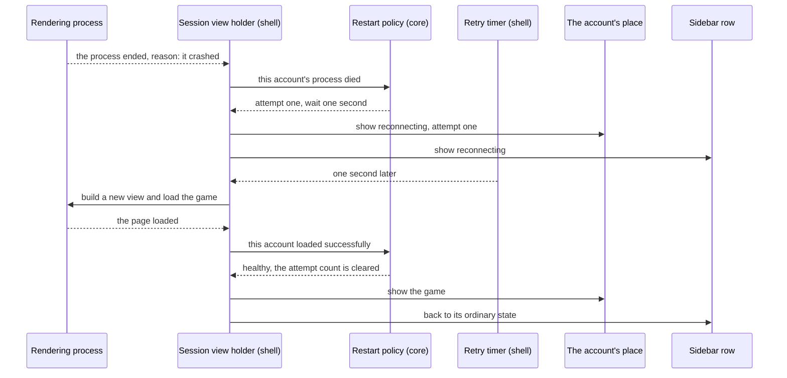
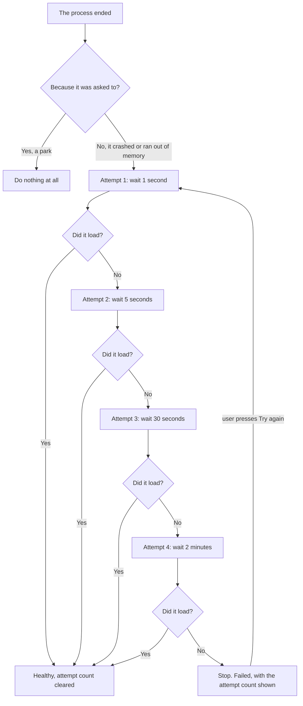

# 08 — Surviving a crashed game

**Depends on:** 03 · **Status:** not-started · **Estimate:** 5

## Context

The whole value of an idle game is that it runs while you are not there. This
application is built so several of them can do that at once, unattended,
overnight. Which means the failure that matters most is the one nobody is
present to see: a game's rendering process dies at two in the morning, its slot
goes blank, and eight hours of progress that should have accumulated does not.
Everything else in the application can be recovered by a user who is looking at
it. This cannot, because the point is that nobody is looking.

Rendering processes do die. A page with a memory leak eventually exceeds what
the engine will let it have and is killed. A bug in the engine takes a process
down. A game that has been running for fourteen hours is a much better test of
both than anything its developers ran. The application already learns about each
of these the moment it happens — the engine tells it, and it says which of the
reasons it was — so the information needed to react is there and is currently
thrown away.

This item reacts. When a game's process dies, the application brings it straight
back, and the game reloads into the account it was already logged into, losing
whatever the game had not saved and nothing else. If it dies again it waits a
few seconds before trying, then half a minute, then two minutes. The widening
gaps are the difference between recovering from a one-off and hammering a
failing game once a second all night: the first attempt is immediate because
most crashes are one-offs and an immediate retry costs nothing, and the later
ones are patient because a game failing repeatedly is failing for a reason that
a fifth attempt in ten seconds will not fix.

After the fourth attempt it stops, and stopping is a deliberate decision rather
than an omission. A game that has crashed four times over roughly three minutes
is broken in a way this application cannot fix, and an application that keeps
trying forever burns a processor overnight and hides the problem. Instead the
account's place on screen shows what happened, how many times it was tried, and
a button to try again, and its row in the list is marked so it is visible
without hunting for it. The user comes back in the morning to a plain
explanation rather than a blank rectangle.

Pressing that button starts over from the beginning: one attempt, and if that
fails, the same widening gaps again. And an account that comes back on its own,
at any point in the sequence, quietly returns to normal — no marker, no message,
nothing to dismiss. A recovery that requires acknowledgement is a recovery that
interrupts, and the entire premise is that this happens while nobody is there.

One case has to be excluded carefully. The application deliberately kills a
rendering process every time a user parks an account, and that arrives through
exactly the same channel as a crash. The engine distinguishes them, so the
application must too: a process that ended because it was asked to is not a
crash, and restarting a game the user just parked would make parking useless.

## User Experience

- **Entry** — none by choice. This item's entry point is a game failing, which
  nobody chooses.
- **Flow** — a game's process dies while it holds a place on screen. Its place
  shows that it is reconnecting, with the attempt number, and the game reloads
  by itself.
- **Flow** — a game's process dies while it is out of sight. Nothing on screen
  changes except its row in the list, which shows the same reconnecting state.
- **Flow** — after four failed attempts the application stops. The place on
  screen shows what happened, how many attempts were made, and a "Try again"
  button; the row in the list is marked as failed.
- **Flow** — press "Try again" and the sequence starts from the beginning, one
  immediate attempt first.
- **Flow** — a game that recovers, whether on the first attempt or the fourth,
  goes back to normal with nothing to dismiss.
- **Flow** — park an account and nothing here reacts, even though its process is
  ended in the same way.
- **States** — **healthy**: nothing added to any surface; the row and the slot
  are as earlier items left them. **Reconnecting**: the row's state marker and,
  if it has a place, that place's panel both show the attempt number and that
  another attempt is coming. **Failed**: the panel names the failure, gives the
  attempt count and offers the button; the row is marked, and its marker takes
  precedence over every other state it could show. **Recovered**: both surfaces
  return silently to healthy.
- **Pattern** — the failure panel is the slot placeholder item 03 introduced,
  with different text and a different action. It was built with its text and
  button as properties for exactly this.
- **New pattern** — a failed state that outranks every other state a row can
  show. `docs/design.md` has no rules yet; the design doc owes a rule for state
  precedence on a row, now that a row can be parked and failed and out of sight
  at once.

### A game crashes and comes back

The screen is the main window, and the components are the slot placeholder from
item 03 and the sidebar row from item 02. The reload path is item 03's unpark
path unchanged — a new view against the storage area that was kept — which is
why the game comes back logged in. The core decides both the delay and whether
there should be another attempt at all; the shell only waits and obeys.

### Four attempts, then it stops

Not a screen — the policy, drawn once so the runbook and the unit tests agree on
it. The first branch is the one that must never be got wrong: a park ends a
process exactly as a crash does, and only the reason the engine reports tells
them apart. Everything below that branch is pure decision-making with no
knowledge of views, which is why it lives in the domain and is tested there.

## Technical Details

### Back-end

Back-end here is `idle-manager-core` alone; nothing is persisted and nothing is
read from `/proc`.

Add `restart.rs`, the file `docs/architecture.md`'s folder structure already
reserves for this. It holds the delay sequence as a named constant with its unit
in the name — `RESTART_DELAYS_SECS`, per code standards rule 5 and naming rule 8
— and the policy itself: given an account's current health and the fact that its process died,
say whether to try again and after how long. Architecture rule 9 is what makes
this testable: the policy takes elapsed time as an argument and owns no clock,
so the entire four-step sequence is a unit test that runs in microseconds rather
than three minutes.

Add health to `Session` in `session.rs` as a third enum beside liveness and
visibility: healthy, reconnecting with the attempt number, or failed with the
final count. Code standards rule 1 forbids the alternative of a boolean and a
counter, which would let "failed with zero attempts" typecheck. The transitions
are the four the requirements describe — the process died, the load succeeded,
the user asked to retry, and the account was parked — and each has a unit test
at the foot of the file per rules 21 to 24. The retry transition resets the
count rather than continuing it, and the success transition clears the state
with no user action, which are `FR.9.3`'s two halves.

The park transition matters as much as the crash one: parking sets health back
to healthy, so an account that failed, was parked and is later started again
begins with a clean sequence rather than resuming a dead one.

No new port. Architecture rule 6 — the policy needs nothing the domain must not
know, and the timer that waits belongs to the shell.

### Front-end

Front-end is `idle-manager-shell`. `docs/design.md` still has no numbered rules,
so the precedence pattern is new; the failure panel is not new and reuses item
03's placeholder. Architecture rules 10, 12 and 13 bind.

Extend the session view holder in `web_view.rs` with a handler for the view's
process-terminated signal. The branch item 03 already installed is the one that
matters — the reason "terminated by API" is a park and returns immediately —
and the other two reasons, a crash and exceeding the memory limit, both go to
the core. The handler carries the account's identifier rather than reading it
back from the widget, so a terminated view that is already being torn down
cannot send a stale identifier.

The wait is a one-shot `glib::timeout_add_local_once` for the delay the core
returned, cancelled if the account is parked or the user retries in the
meantime — an uncancelled timer firing after a park would restart a game the
user just stopped, which is the same failure as mishandling the reason. Rebuild
through item 03's start path so there is exactly one way a view comes into
existence.

Extend `slot_placeholder.rs` and its `slot-placeholder.ui` template with the
reconnecting and failed presentations — naming rules 2 and 4 keep that pair of
spellings, and no new file is added because no new widget is —
setting its text and action properties rather than adding a second widget. The
button's action is the retry intent, not a direct reload — architecture rule 8,
the shell says what the user did and the core decides what it means.

Extend the sidebar row's state derivation once more. It now folds four inputs
into one marker — visibility, liveness, the background flag and health — and
health outranks the rest. That precedence is the item's one piece of pure
presentation logic and the reason the derivation has been kept in one function
since item 02.

Shell coverage is `test-script.md` per architecture rule 14, and it needs a real
crash rather than a simulated one: `kill` a rendering process found through item
05's memory script, then record that the game came back, that the attempt
counter behaved, and — the case most easily broken — that parking an account
still parks it.

### Technical References

- `WebViewExt::connect_web_process_terminated` delivers a
  `WebProcessTerminationReason` with the signal (`webkit6` 0.6.1,
  `src/auto/web_view.rs:2478`), and the enum's three variants are `Crashed`,
  `ExceededMemoryLimit` and `TerminatedByApi` (`src/auto/enums.rs:4677`). The
  third is a park; without that branch this item would fight item 03.
- `WebViewExt::is_web_process_responsive` and its notify signal
  (`src/auto/web_view.rs:854` and `:2763`) report a hung process that has not
  died. Nothing in `docs/requirements.md` asks for that case and this item does
  not handle it, but it is the obvious next thing and is recorded here so the
  next person does not have to find it.
- Rebuilding after a crash is item 03's unpark path against a kept network
  session, which is construct-only on the view (`src/auto/web_view.rs:141`).
  That is why a crashed account comes back logged in.
- `glib::timeout_add_local_once` runs on the GTK main context and returns a
  handle that can be cancelled, which architecture rule 10 requires and the park
  interaction depends on.

## Blockers

- Exceeding the memory limit and crashing are treated identically here, and they
  are not the same failure. A game killed for using too much memory will very
  likely be killed again on reload, so four attempts may be four repetitions of
  the same expensive failure. Nothing in `docs/requirements.md` distinguishes
  them and no measurement exists of how often either happens.
- The sequence in `FR.9.1` totals about two and a half minutes and then gives
  up. A game whose servers are down for an hour is indistinguishable from a
  broken one and ends the night failed, having lost exactly the progress this
  item exists to protect. No requirement covers a slow retry after the fast ones
  are exhausted.
- Whether the failed state should survive a restart is unresolved. `FR.8.1` in
  `docs/requirements.md` lists what the workspace file persists and health is
  not on the list, so item 07 does not carry it. Restoring an account as failed
  means showing an error nobody caused this session; not restoring it means a
  game that failed overnight looks fine until it fails again.
- A crash during item 07's start-up queue is not covered by either item.
  `FR.8.2` in `docs/requirements.md` says restored accounts load one at a time
  and `FR.9.1` says a dead one is reloaded after a second; the queue advances on
  load-finished or a timeout, and a crash is neither. The interaction between
  the retry timer and the queue has to be decided by whichever of the two is
  built second.
