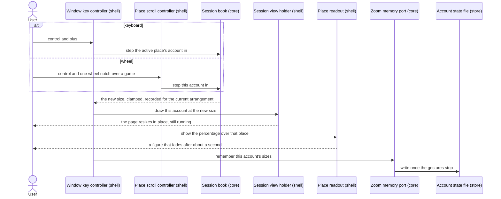
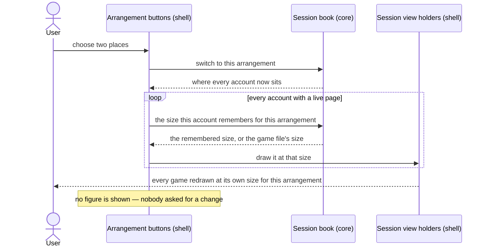
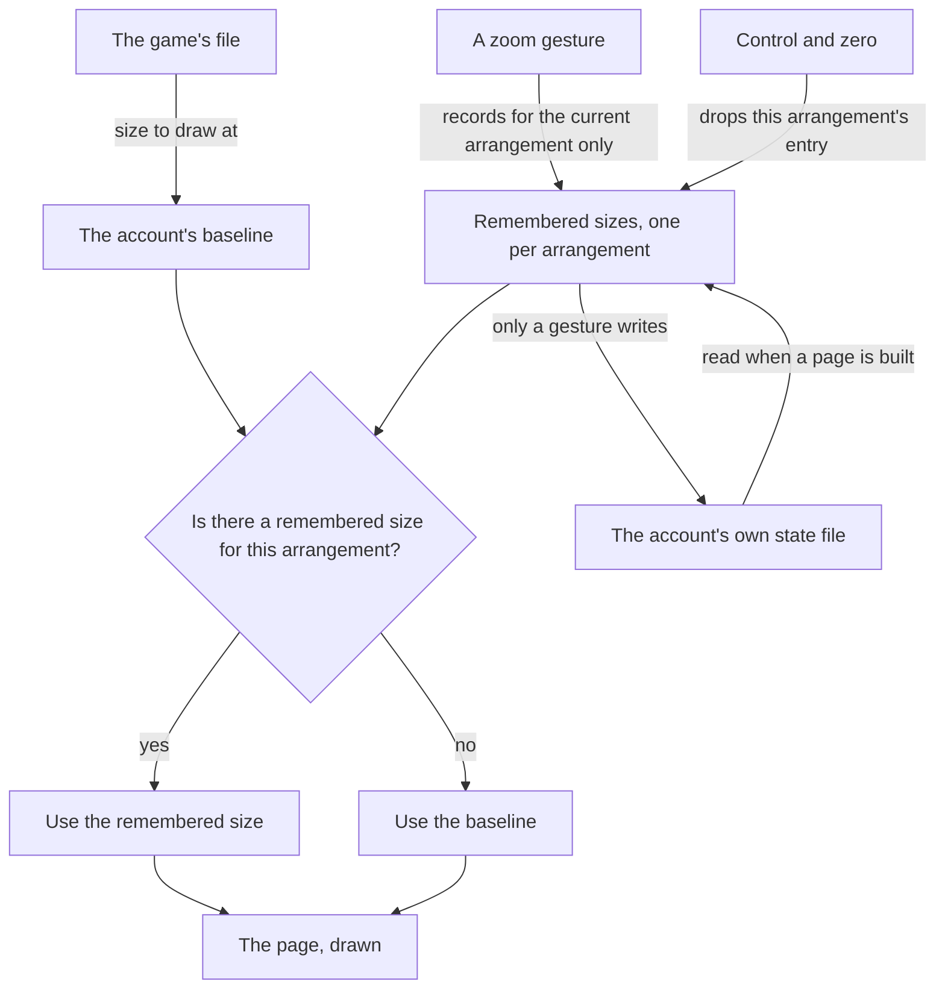

# 09 — Interactive zoom, remembered per arrangement

**Depends on:** 03, 06 · **Status:** done · **Estimate:** 5 · **Merged:** 2026-09-08

## Context

How large a game's page is drawn is currently decided once, by a file, and never
again. Each game has a small text file naming the size to draw it at, that number
is read when an account's page is first built, and from then on there is no way
to change it. If the page is too small to read, the only remedy is to quit the
application, edit the game's file by hand, and start over — and the edit applies
to every account playing that game, not the one that was uncomfortable to look
at.

That would be tolerable if one size were right. It is not, for two reasons that
compound. The first is the arrangement: this application divides its window into
one, two or four places, and a game that reads well filling the whole window is
half or a quarter of that size in the other arrangements. The second is the games
themselves. They are built by different people to different assumptions, and two
of them at the same place-size want different sizes to be comfortable — one draws
a wide board that needs to be pulled back to fit, another draws small text that
needs to be pushed forward to be read. Multiply those together and a single
number per game cannot be right; what is wanted is a number per account per
arrangement, chosen by the person looking at the screen.

This item gives them that, using the gesture every browser has trained them to
expect. Holding the control key and pressing plus or minus makes the game in the
active place one step bigger or smaller. Holding control and turning the mouse
wheel over a game does the same to that game, without the page underneath also
scrolling. Control and zero puts a game back to the size its file asks for. Each
step is about ten percent, and the range is bounded at both ends by the same
limits the game files are already checked against, so no gesture can shrink a
page to something unreadable or blow it up past the point of being playable.

The change happens on the page that is already running. Nothing reloads, nothing
restarts, and the account does not stop being live for even a moment — which
matters here more than it would in a browser, because these are games that lose
progress when interrupted and the whole point of the application is to leave them
running. Each gesture also puts a small percentage figure over the game it
affected, which fades after about a second, so the reader can see where they have
got to without a permanent fixture taking up space.

The second half is remembering. A size chosen while the window is showing four
games is remembered as the size for four games; the same account may have a
different remembered size for two, and another for one. Switching arrangement
therefore snaps every game to whatever it was last set to for the arrangement
being switched to, silently and immediately, falling back to the size its game
file asks for wherever nothing has been chosen yet. Someone who spends an evening
getting four games comfortable, switches to one game full-window, and switches
back gets their four sizes returned to them rather than having to redo the work.

Remembering means writing something down, and this is the first thing the
application has ever written on an account's behalf. Everything it keeps until
now is either the game's own storage, written by the browser engine, or the game
files, written by hand. So this item opens a small file of its own beside each
account's storage, holding only the sizes that account's owner has actually
chosen. It is deliberately modest: only a zoom gesture writes it, it holds
nothing for an arrangement never adjusted, and reading it can never stop the
application from starting. A file that is missing means "no choice has been
made", which is the normal state of a fresh account. A file with a value that
makes no sense loses that one value and keeps the rest, the same tolerance the
game files already get. A write that fails is written to the log and otherwise
ignored, because losing a remembered zoom is a small annoyance and refusing to
run is not.

## User Experience

- **Entry** — no new control anywhere. Two gestures on the main window: the
  control key with plus, minus or zero, and the control key with the mouse wheel
  over a game. The header bar, the sidebar and the row menu are untouched.
- **Flow** — press control and plus (or control and equals) and the game in the
  active place grows one step, about ten percent. Control and minus shrinks it
  the same amount. The keys work whenever the window has focus, whether or not
  the game itself is where typing would go.
- **Flow** — hold control and turn the wheel over a game and that game — the one
  the pointer is on, which is always one that is on screen — grows or shrinks a
  step per notch. The page underneath does not scroll while control is held.
- **Flow** — press control and zero and the game in the active place goes back to
  the size its game file asks for, and forgets the size that was chosen for the
  current arrangement.
- **Flow** — every gesture puts a percentage figure over the affected place. It
  fades after about a second and leaves nothing behind.
- **Flow** — switch arrangement and every game already on screen snaps to the
  size last chosen for it in that arrangement, with no figure shown, because
  nobody asked for a change — the arrangement did.
- **States** — **nothing on screen**: the keys do nothing at all rather than
  reaching for a game that is not there. **At the limit**: a further step in the
  same direction leaves the size where it is and still shows the figure, so the
  gesture is visibly received rather than silently dropped. **Parked account in
  the active place**: there is no page to resize, so the remembered size changes
  and takes effect the next time that account starts; the figure still appears
  over the panel standing in for it, because a keypress that shows nothing reads
  as a keypress that was lost. **Out of sight**: an account with no place on
  screen cannot be reached by either gesture and takes its remembered size for
  the current arrangement when it is next brought into a place.
- **Pattern** — the figure is drawn as one more layer over the same per-place
  stack that already carries the name cover and the parked panel
  (`crates/idle-manager-shell/src/session_grid/imp.rs:137`), so nothing about how
  a place is built or allocated changes.
- **Pattern** — the parked panel it may appear over is design rule 4's plain
  centred panel, unchanged: the figure sits above it and neither one is
  restyled.
- **New pattern** — a transient readout over a place, shown on a gesture and
  faded out on a timer. Nothing in `docs/design.md` covers it: rules 1, 2, 3, 5
  and 6 are about a sidebar row, rule 4 is the panel that stands in for an absent
  game, and rules 7 and 8 are about a chooser. The design doc owes a rule for a
  transient acknowledgement over live content — where it sits, how long it lasts,
  and why it is never a permanent fixture — once this ships.

### Zooming the account in the active place

The screen is the main window. The components are the window-level key
controller, one scroll controller per place, the holder that owns the account's
live page, and the readout layer over the place. Both entry points produce the
same intent and the domain decides what a step means, so the two can never
disagree about the size or about which arrangement it was recorded for. The write
is the last thing to happen and the only one that is delayed: the page and the
figure update immediately, and the file is written once after a short quiet
period, so a run of wheel notches costs one write rather than twenty.

### Switching arrangement snaps every account to its remembered size

The screen is the main window's three arrangement buttons. Every account holding
a live page is snapped, not only the ones on screen, which is what makes an
account that was out of sight already correct at the moment it is brought into a
place. Nothing is written: an arrangement switch consumes remembered sizes and
never records one.

### Where an account's size comes from

Not a screen — the rule that decides what size a page is drawn at, drawn once so
the breakdown does not have to rediscover it. The game file's value never
changes and is never written back; it is the baseline and what control and zero
returns to. The remembered sizes are the only writable part, they are per account
and per arrangement, and they are consulted every time a page is built as well as
on every arrangement switch.

## Technical Details

### Back-end

Back-end here is the non-widget crates, per `docs/roadmap/README.md`:
`idle-manager-core`, `idle-manager-store`, and the composition root. The rules
that bind are `docs/architecture.md` rules 1, 3, 5, 6, 7, 8, 9 and 14,
`docs/code-standards.md` rules 1, 2, 5, 12, 14, 17, 21 and 24, and
`docs/naming.md` rules 2, 6, 8, 10 and 11.

In `idle-manager-core`, `preset.rs` gains the stepping arithmetic on the existing
`ZoomLevel` newtype: `stepped_in` and `stepped_out`, each returning a new
`ZoomLevel` one step away, clamped into the existing `MIN` and `MAX` bounds at
`crates/idle-manager-core/src/preset.rs:50` rather than failing. The factor is a
named constant with its unit stated — a ratio of 1.1, per code standards rule 5 —
never a literal at the call site. Clamping rather than erroring is the difference
between a gesture at the limit being received and being dropped, which the
`**States**` bullet requires. `ZoomLevel::new` keeps its fallible shape, because
a value arriving from a file still has to be rejected.

Also in the core, `layout.rs`'s `Layout` enum at
`crates/idle-manager-core/src/layout.rs:10` gains `Hash` alongside its existing
derives, so it can key a map. That is the only change that file needs.

`session.rs` is where the domain shape changes. `Session`'s single `zoom` field
splits in two: a baseline copied from the game's file at creation, read through a
renamed `preset_zoom` accessor, and a map from `Layout` to `ZoomLevel` holding
only the arrangements whose size the user has actually changed. A new
`zoom_for(Layout)` returns the map's entry when there is one and the baseline
otherwise, which is the whole of the resolution rule and the only place it is
written. Every existing caller of `Session::zoom` — there is one, in the shell —
moves to one of the two, so no caller can accidentally read a baseline where a
resolved size belongs (code standards rule 1 applied to accessors: the two are
different things and should not share a name).

`SessionBook` gains three transitions in the style `park` and `set_keep_awake`
already set: `zoom_in` and `zoom_out`, which step the named account's size for
the book's **current** layout, record it, and return the new `ZoomLevel`; and
`reset_zoom`, which removes the current layout's entry and returns the baseline.
All three take no layout argument — the book already knows its own layout at
`crates/idle-manager-core/src/session.rs:172`, which is what makes "records for
the current arrangement only" impossible to get wrong at a call site. All three
return `Option<ZoomLevel>` so an id not in the book is a `None` the caller can
skip on, matching the no-op-on-missing-id style of the existing transitions. None
of them touches liveness or visibility: a zoom is not a reload, so nothing moves
to `Starting`. A fourth method, `restore_zoom`, takes a whole remembered map and
installs it, for the one caller that has just read one off disk.

The book also gains `focused_session`, returning the account whose visibility is
the focused slot, or `None`. The keyboard gestures need exactly that account and
the shell has no way to ask for it today; putting the lookup in the core keeps
the "which account is active" rule in one place, where the sidebar's current-row
marking can later share it.

`ports.rs` gains the port `FR.12.8` asks for, named for the capability rather
than the technology per naming rule 10: `ZoomMemory`, with a `read` that returns
an account's remembered sizes and a `write` that stores them. `read` never fails
— a missing file and an unreadable one both mean "nothing remembered", which is
the normal state of a fresh account — so it returns the map directly, exactly as
`PresetCatalogue::read` returns a reading rather than a `Result`. `write` returns
a `thiserror` enum in the core beside `ProfileError` (architecture rule 11, code
standards rule 12), so the caller logs the failure with a reason rather than the
adapter swallowing it; discarding it silently would break code standards rule 14.
The remembered map itself is a small core-side type wrapping `Layout` to
`ZoomLevel`, not a bare `HashMap`, so the port's signature says what it carries.

In `idle-manager-store`, add `account_state.rs` implementing that port as
`TomlZoomMemory`. Architecture rule 7 shapes the file exactly as it shaped
`preset.rs`: the on-disk shape is its own serde record mapped to and from the
domain type, with the three arrangements spelled as kebab-case string keys
(`single`, `side-by-side`, `grid`) under a `zoom` table, so a later domain rename
cannot break a file already on somebody's disk. Only the arrangements that have
been changed appear, per `FR.12.4`. Mapping back in is per key and tolerant, per
`FR.12.6`: a value that `ZoomLevel::new` rejects is dropped with a warning naming
the key and the other entries still apply, the same tolerance
`crates/idle-manager-store/src/preset.rs:230` already gives a bad zoom in a game
file; an unrecognised key is ignored the same way. A file that is absent, or that
will not parse at all, is an empty map and a warning — never a startup failure.

The file is `state.toml` at the root of the account's profile folder, a sibling
of the `data` and `cache` directories `XdgProfileLocator` creates at
`crates/idle-manager-store/src/paths.rs:76`. That root is not on
`ProfileDirectories`, so `paths.rs` grows one small helper resolving an account's
profile root from the data directory, and both `XdgProfileLocator` and
`TomlZoomMemory` derive their paths through it — the derivation is written once
rather than spelled twice in one crate. `TomlZoomMemory` mirrors the locator's
pair of constructors: one reading the XDG data directory from the environment,
one rooted at an explicit directory for tests. Writing is a plain whole-file
write of the settled map, not an edit in place, which is what keeps a partial
write from producing a half-valid file.

Cover the adapter with integration tests under
`crates/idle-manager-store/tests/`, per architecture rule 14 and naming rule 3:
a round trip, a missing file reading as empty, a malformed value dropped while
its siblings survive, an unknown key ignored, and a snapshot of the written file
with `insta`, which `docs/stack.md` already lists as a development dependency of
this crate for exactly this kind of format contract. The core's own coverage is
unit tests at the foot of `preset.rs` and `session.rs` per code standards rule
24: the step factor and both clamps, `zoom_for` falling back to the baseline,
a step recording an entry for the current arrangement and no other, a reset
removing that entry, an unknown id changing nothing, and a layout switch changing
what `zoom_for` answers without touching what is stored.

The composition root at `crates/idle-manager/src/main.rs:37` builds
`TomlZoomMemory` beside the locator and the catalogue and hands it to the window
as a third `Rc<dyn ...>` port, per architecture rule 3 — the shell must not learn
that remembered sizes are a TOML file, and `scripts/arch-check.sh` already
forbids it from depending on the store crate at all.

### Front-end

Front-end is `idle-manager-shell`. `docs/design.md` rule 4 binds where the figure
appears over a parked account's panel, and the readout itself is the item's one
new pattern. `docs/architecture.md` rules 8, 10, 12 and 13 bind, and
`docs/naming.md` rules 1, 2, 4 and 7 fix the spellings.

`web_view.rs` gains `SessionView::set_zoom`, shaped on `set_keep_awake` at
`crates/idle-manager-shell/src/web_view.rs:176`: it remembers the value on the
holder whether or not a view exists, and applies it to the live view when there
is one. It differs in the one way that matters — no reload, because
`set_zoom_level` at `crates/idle-manager-shell/src/web_view.rs:267` takes effect
on the running page, so the account never leaves `Live` (`FR.11.5`). Remembering
it on the holder is what makes a parked account start again at the size chosen
while it was parked.

`window/imp.rs` grows the keyboard half. The window already carries a
capture-phase key controller at
`crates/idle-manager-shell/src/window/imp.rs:168`, added so a page that binds
keys on its own canvas cannot swallow the reload accelerator first; the zoom keys
have the same requirement — `FR.11.1` says they are never gated on a web view
holding keyboard focus — so they join that one controller rather than adding a
second, keeping one place that decides what a keypress means. It matches the
control modifier with the plus, equals and keypad-add keys for a step in, minus
and keypad-subtract for a step out, and zero and keypad-zero for a reset, because
which of those a keyboard actually delivers depends on its layout. Each match
asks the book for the focused account, calls the matching transition, hands the
returned size to that account's holder, asks the grid to show the figure, and
schedules the write. An empty grid, or a focused place holding nothing, returns
`None` from the book and stops there.

The wheel half belongs to the grid, because it has to act on the account the
pointer is over rather than the focused one. `session_grid/imp.rs` adds a
vertical `EventControllerScroll` to each `SlotEntry`'s existing `gtk::Overlay` —
the overlay, not the view, because the overlay lives for the account's whole life
while the view is destroyed and rebuilt on every park and start, and the
controller must survive that. It runs in the capture phase for the same reason
the grid's own click gesture does at
`crates/idle-manager-shell/src/session_grid/imp.rs:92`: the web view would
otherwise consume the event on the way down. When the control modifier is held it
emits the step intent carrying the entry's `SessionId` and stops propagation, so
the page does not also scroll (`FR.11.3`); otherwise it proceeds untouched and
the page scrolls as normal. The intent reaches the window through a handler
registered exactly like `connect_start_requested`, so both halves of the gesture
end up in the same window method and the domain is the only thing that decides
what a step means (architecture rule 8).

The readout is a third overlay child per place, built with the entry in
`add_session` beside the name cover and the parked panel, hidden by default. The
grid gains a method that sets its text to the percentage, shows it, and arms a
`glib::timeout_add_local_once` to hide it again after about a second, cancelling
and rearming any timer already running for that place so a run of gestures shows
one figure rather than a queue of them. The duration is a named constant with its
unit in the name. It is styled from a new `session-grid.css` registered in
`resources/idle-manager.gresource.xml` and installed on the default display once,
the same way `sidebar.css` is installed at
`crates/idle-manager-shell/src/session_sidebar/imp.rs:172` — naming rule 4 puts
it beside `session-grid.ui` under the same stem.

The arrangement switch is the last piece. `connect_layout_toggle` at
`crates/idle-manager-shell/src/window/imp.rs:210` already tells the book to
switch and then redraws; after the switch it now walks every account that has a
holder with a live view and calls `set_zoom` with that account's `zoom_for` the
new layout, showing no figure. Doing it for every live account rather than only
the visible ones is what satisfies `FR.11.7` for free: an account out of sight is
already at the right size for the arrangement when it is next brought into a
place, and there is no second code path to keep in step.

Persistence is scheduled, not immediate (`FR.12.5`). The window holds one
settle-timer per account id; a zoom change cancels that account's pending timer
and arms a new one for a short interval, and the timer's callback reads the
account's remembered map off the book and calls the port's `write`, logging a
failure with the account id and a reason rather than surfacing it. The interval
is a named constant in milliseconds. Reading is the mirror: `realise_account` at
`crates/idle-manager-shell/src/window/imp.rs:264` asks the port for the account's
remembered sizes, installs them on the book with `restore_zoom`, and then passes
`zoom_for` the current layout — not the baseline — into `SessionView::new` at
`crates/idle-manager-shell/src/window/imp.rs:294`, which is what makes a page
open at the chosen size (`FR.12.7`).

Shell coverage is `test-script.md`, per architecture rule 14: the file does not
exist yet for this item and this item's first accepted slice writes its `Setup`
and `Teardown` sections. The steps it needs are each gesture producing a visible
size change and a figure that fades, control and zero returning to the game
file's size, a run of wheel notches leaving exactly one file on disk with the
settled value, an arrangement round trip restoring two different sizes, and a
relaunch reopening an account at its chosen size.

### Technical References

- `WebViewExt::set_zoom_level` is a per-view property (`webkit6` 0.6.1,
  `src/auto/web_view.rs:1577`), already called once before the first load at
  `crates/idle-manager-shell/src/web_view.rs:267`. Nothing about it is
  construct-only, which is what makes a no-reload change possible and
  `FR.11.5` achievable; contrast the network session and the content manager,
  both construct-only, which is why parking has to rebuild a view at all.
- `EventControllerScroll` needs explicit flags to receive anything; vertical is
  the only axis a zoom step reads, and the handler returns `glib::Propagation` so
  consuming the event when the control modifier is held is the same mechanism the
  window's key controller already uses at
  `crates/idle-manager-shell/src/window/imp.rs:174`. The modifier state comes
  from the controller's current event rather than from a tracked key.
- `toml` 1.1, `serde` 1.0 and `insta` are already dependencies of
  `idle-manager-store` per `docs/stack.md`, so the state file adds no dependency
  and no `deny.toml` change. `idle-manager-core` may not have either
  (`scripts/arch-check.sh` forbids `serde` and `toml` there), which is the whole
  reason the port exists.
- Item 06's third blocker settled that a preset's zoom is a plain multiplier and
  explicitly deferred making zoom follow the slot to "a separate item if it is
  ever wanted" (`docs/roadmap/06-presets-and-adding-accounts/README.md:284`).
  This is that item, and it answers the question the other way round: the size is
  not computed from the slot, it is chosen by the user and remembered per
  arrangement.

## As built

- The wheel gesture as first built resized whichever view the pointer crossed
  and took one step per smooth-delta event, so a touchpad or a high-resolution
  wheel turned a single physical notch into two or three steps. A follow-up
  narrowed it to fire **only over the focused slot** — recorded as a new
  requirement, `FR.11.8`, because a window here holds up to four live games
  where a browser holds one tab and a pointer resting over a neighbour must not
  resize a game nobody is watching — and added
  `EventControllerScrollFlags::DISCRETE` so GTK accumulates the deltas and emits
  one ±1 per notch.
- The second blocker resolved the easy way: a capture-phase
  `EventControllerScroll` on the slot **overlay** does see the wheel event
  before the WebKit view consumes it in its own process. The controller stays on
  the overlay — which outlives the view across every park and start — and never
  had to move onto the view with re-attachment on each rebuild.
- `Ctrl`+`+` reaches the key controller as `plus`, `equal` **or** `KP_Add`
  depending on keyboard layout; all three are matched for a step in,
  `minus`/`KP_Subtract` for out, `_0`/`KP_0` for reset. Changing
  `set_zoom_level` on an already-loaded page reflows the three shipped games
  cleanly with no reload — the mid-life-resize blocker was unfounded.
- `docs/design.md` gained **rule 10** for the transient readout: a figure drawn
  low and centred over the affected place on its own opaque ground, one that
  keeps updating rather than queueing (timer cancelled and rearmed per gesture),
  fades after `ZOOM_READOUT_FADE_MILLIS`, and is shown only for a change the
  user directly asked for — never on an arrangement switch.
- `paths.rs` grew `profiles_root` / `account_profile_dir` / `xdg_profiles_root`
  helpers so `XdgProfileLocator` and `TomlZoomMemory` derive `state.toml`'s
  location from one place rather than spelling the profile-root layout twice in
  the crate.

## Blockers

- Identifiers are minted from a counter that restarts at one on every launch
  (`crates/idle-manager-core/src/session.rs:249`), so the first account added
  after a relaunch is `session-0001` and inherits whatever that folder already
  holds — its remembered sizes, and today already its cookies and storage. This
  item does not make that worse and `FR.12.7` names item 07 as the fix, but until
  item 07 lands a remembered size can attach to an account that never chose it.
- Whether a capture-phase `EventControllerScroll` on the slot overlay actually
  sees a wheel event bound for the web view underneath is unverified. The two
  capture-phase precedents in the repo are a `GestureClick` on the grid
  (`crates/idle-manager-shell/src/session_grid/imp.rs:92`) and a key controller
  on the window (`crates/idle-manager-shell/src/window/imp.rs:168`); neither is a
  scroll over a `WebKitGTK` view, which handles scrolling inside its own process.
  If the view wins, the controller has to move onto the view itself and be
  re-attached by `SessionView::start` on every rebuild.
- Which key values a keyboard delivers for the control-plus gesture depends on
  its layout, and nothing in the repo settles it — the existing key controller at
  `crates/idle-manager-shell/src/window/imp.rs:170` only ever matched a letter
  and a function key. The plus, equals and keypad variants have to be checked on
  a real keyboard before the `(manual)` step can claim the gesture works.
- Changing zoom on a page that has already loaded is untested here: the only
  existing call happens before the first `load_uri`
  (`crates/idle-manager-shell/src/web_view.rs:267`). A canvas-drawn game may
  reflow badly, or not at all, when resized mid-life, and only a measurement
  against one of the three shipped games can say which.
- The design doc owes a rule for the transient readout and cannot get one until
  the widget exists — `docs/design.md` has eight rules and none covers a
  temporary acknowledgement drawn over live content, so this item's
  `**New pattern**` bullet is a debt in the same series as items 02, 03, 04 and
  06 recorded and paid.
