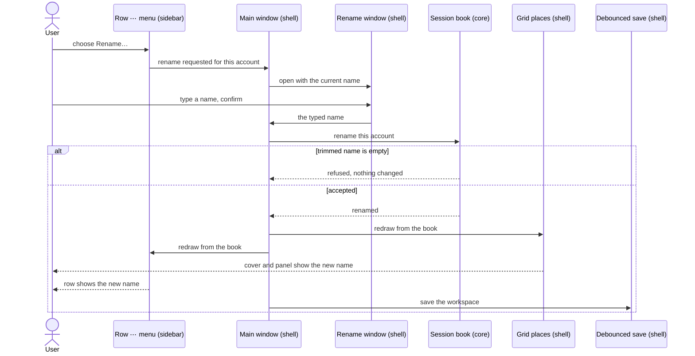
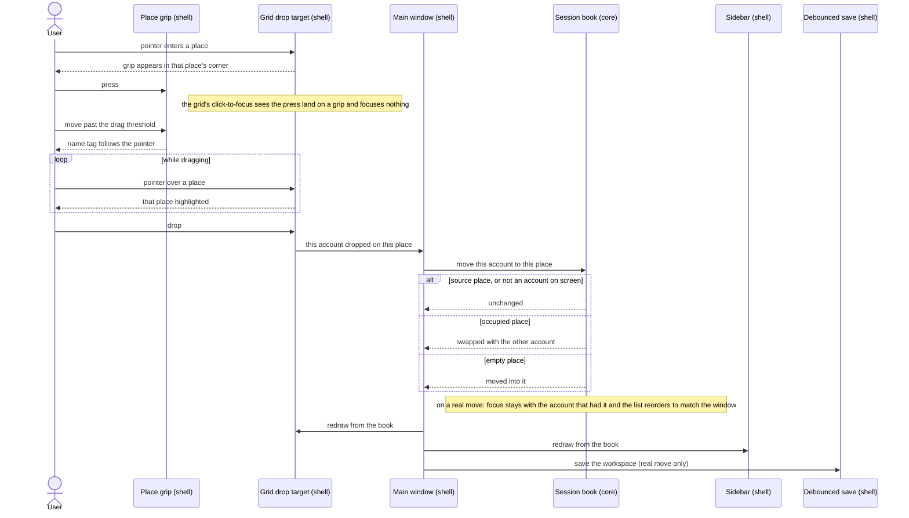
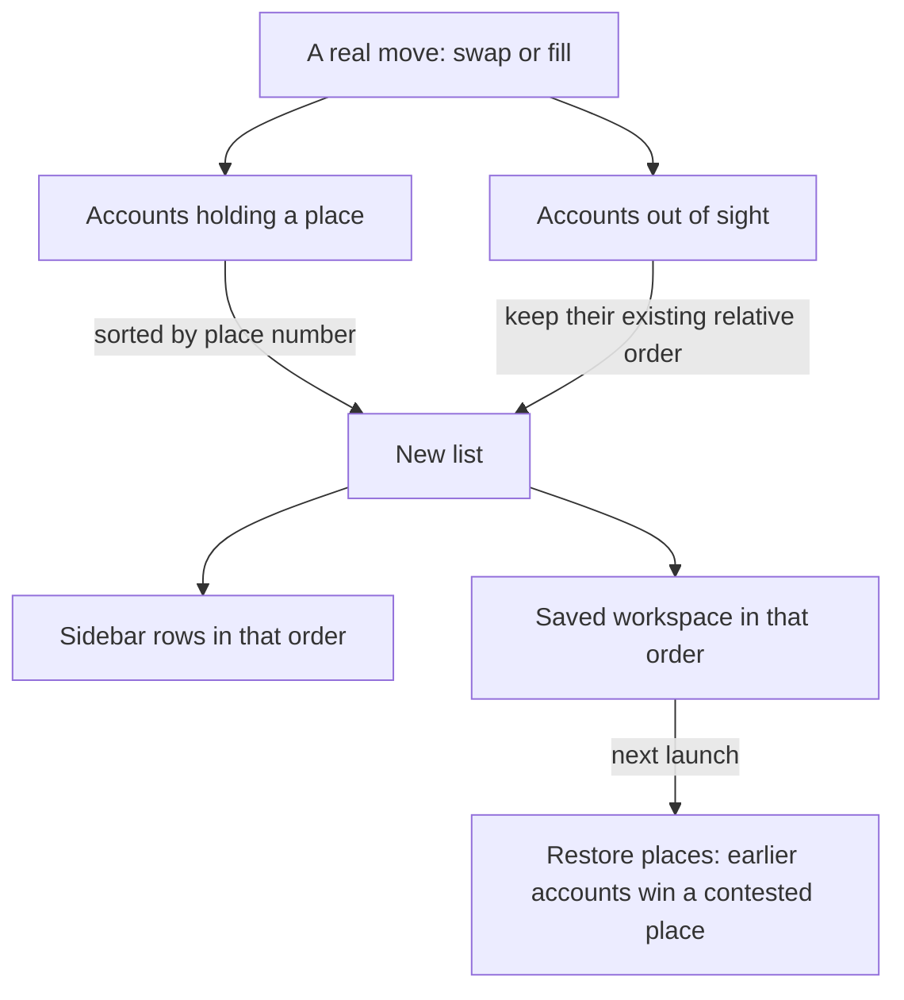

# 10 — Renaming and rearranging accounts

**Depends on:** 03, 07 · **Status:** in-progress · **Estimate:** 8

## Context

This application runs several accounts of browser idle games side by side in one
window. Each account has a name the user types when they create it, and a place
on screen: the window is split into one, two or four places, and every account
either sits in one of them or waits out of sight. Today both of those are fixed
at the moment the account is created, and neither can be changed afterwards
without losing something.

The name is the smaller problem, but it comes up first. A typo, a placeholder
like "alt", or an account that has since changed what it is used for all leave a
wrong label in the sidebar list for good. The only remedy today is to delete the
account and add it again. That throws away the game's own storage on disk, which
is where its login lives, so the user has to sign in to the game again and may
lose whatever the game kept locally. A label should not cost a login.

So this item adds a rename. Each account's row in the sidebar already has a small
menu holding its settings; that menu gains "Rename…", which opens a small window
with the current name filled in. Confirming changes the name and nothing else.
The folder on disk that holds the account's login and saved sizes is named after
a hidden identifier, not after the name, so it is untouched. Nothing reloads, a
running game keeps running, and a parked one stays parked. The new name shows at
once in the sidebar and on the plain panel the window draws over a place before a
game's page has appeared, and it is saved the same way every other change is. A
name is checked exactly as it is when an account is created: surrounding spaces
are trimmed and an empty name cannot be confirmed. Two accounts may share a name,
because creating one already allows that.

The bigger problem is where accounts sit. When an account is added, or a saved
arrangement is restored, a simple rule seats it in the lowest free place. That
rule is predictable, but it is not the user's choice. Someone playing four
accounts of the same game wants the main account top left and the others in a
particular order, and today the only way to get there is to add them in that
order or to shuffle accounts off screen and back until the rule happens to
produce it. The sidebar list has the same flaw: it shows accounts in the order
they were created, which after a few moves no longer resembles the window at all.

This item lets the user put an account where it belongs by dragging it. Hovering
over a place reveals a small grip in its top-right corner. Pressing that grip and
dropping on another occupied place swaps the two accounts, with nothing else
moving, so dragging back undoes it. Dropping on an empty place moves the account
there. Dropping on the place it came from, or outside every place, does nothing.
The place under the pointer is highlighted during the drag, and the pointer
carries a small tag with the account's name. When the window shows only one
place there is nowhere to drop, so no grip is drawn. Picking an account up does
not make it the active one — the account the keyboard shortcuts and the zoom
wheel act on. Arranging accounts and looking at one are separate acts, so
whichever account was active before a drag is still active after it, wherever it
now sits.

After every drop the sidebar list is rewritten to read like the window: the
accounts on screen first, in the order of their places, then any accounts out of
sight in the order they already had. The new places and the new order are saved,
so the arrangement comes back on the next launch.

Two things make the drag harder than it sounds. Each place is filled by a live
web page, and a web page is built to accept things dropped on it. A drag that
carried plain text could be pasted into a game, so the drag carries a private
type only this application understands, and the window intercepts it before the
page can see it. The grip also sits over the page, so it has to be the only thing
there that takes clicks. Anything around it that took them would stop every click
in that corner reaching the game.

A drag changes where accounts sit and nothing else. No game reloads, none stops
or starts, and none changes size, because the size of a game is remembered per
arrangement and the arrangement has not changed.

## User Experience

- **Entry** — rename: a new `Rename…` item in an account row's existing ⋯ menu
  in the sidebar, below the Park/Start action and the keep-awake setting.
- **Entry** — rearrange: a drag grip in the top-right corner of any occupied
  place, shown only while the pointer is inside that place, and never in the
  one-place arrangement.
- **Flow** — rename: open the row's ⋯ menu and choose `Rename…`. A small modal
  window opens titled "Rename account", with one text field holding the current
  name, fully selected, and `Cancel` / `Rename` buttons.
- **Flow** — type a new name. `Rename` is insensitive while the trimmed text is
  empty. Enter confirms, Escape cancels.
- **Flow** — confirm. The window closes, and the row and that account's place
  cover and panel show the new name immediately. Nothing reloads.
- **Flow** — rearrange: move the pointer into a place. The grip appears in its
  top-right corner and disappears when the pointer leaves.
- **Flow** — press the grip. Focus does not move: unlike a click anywhere else in
  the place, a press on the grip does not make it active. A press and release
  with no movement does nothing at all.
- **Flow** — drag. A small tag carrying the account's name follows the pointer,
  and whichever place is under the pointer is highlighted, including the source
  place.
- **Flow** — drop on another occupied place: the two accounts trade places.
  Drop on an empty place: the account moves there and its old place is left
  empty. Either way the account that was active before the drag is still
  active, in whatever place it now sits, and the sidebar list reorders to match
  the window.
- **Flow** — drop on the source place, outside the grid, or press Escape
  mid-drag: nothing changes and nothing is saved.
- **States** — **rename, empty name**: `Rename` insensitive, no error text; the
  empty field says it. **Rename, same name**: accepted, and nothing visible
  changes. **Rename of a parked, starting or queued account**: identical to a
  live one; there is no state in which rename is unavailable.
- **States** — **drag over a place showing a parked or queued panel**: a valid
  drop, highlighted like any other; the panel moves with its account. **Drag
  over the web page of a game**: the page shows no drop cursor and receives
  nothing. **One-place arrangement**: no grip anywhere. **Empty grid**: no
  places, so no grip.
- **Pattern** — `Rename…` joins the row's ⋯ menu per `docs/design.md` rule 5
  (settings live behind one menu button, action first, settings below), built in
  `bind_row_menu` at `crates/idle-manager-shell/src/session_sidebar/imp.rs:335`.
  The trailing edge gains no widget, so rule 6's width check has nothing to
  re-derive.
- **Pattern** — the rename window is the add-game dialog's details stage cut
  down to one field: a modal `gtk::Window` with a default button whose
  sensitivity follows a trimmed-non-empty check
  (`crates/idle-manager-shell/src/add_game_dialog/imp.rs:246`).
- **Pattern** — a place holding a parked or queued account keeps design rule 4's
  plain panel unchanged; the grip sits over it the same way it sits over a page.
- **New pattern** — a hover-revealed drag grip in a place's corner. Nothing in
  `docs/design.md` covers a control that appears over live content on hover:
  rule 10's readout is transient on a gesture and takes no input. The design doc
  owes a rule once this ships.
- **New pattern** — a drop highlight over a place. No rule covers indicating a
  drop target; the design doc owes a rule once this ships, and it should say
  whether the highlight shares a colour with the focused place's outline.

### Renaming an account

The screen is the main window with the sidebar open, plus one small modal window.
The components are the row's ⋯ menu, which only reports which account was
chosen; the rename window, which owns the text field and the button's
sensitivity; the session book, which applies the name and is the last word on
whether it is valid; and the grid and sidebar, which both redraw from the book.
The dialog's check exists so the button can be greyed out; the book checks
again, so no other caller can store an empty name. Liveness, place and the
account's folder on disk are never touched.

### Dragging an account to another place

The screen is the main window's grid of places. Each place has a grip, which
alone takes the press and starts the drag; the grid has one drop target and one
drop-motion controller covering every place, occupied or empty, both running
before the web pages underneath. The grid only reports which account landed on
which place. The book decides whether that is a swap, a move or nothing,
keeps the focus on the account that had it, and rewrites the order. A drop outside the grid never reaches
the drop target, and the drag is cancelled with nothing to report.

### How the list order follows a drop

Not a screen: the rule that turns a drop into a list order, drawn once. Only a
drop that moved something rewrites the order; an unchanged drop, a rename, a
layout switch and a sidebar click leave it alone. Putting on-screen accounts
first has a second effect worth keeping: when the workspace is restored, the
placement pass gives earlier accounts first claim on a remembered place, so the
accounts the user just arranged keep their places.

## Technical Details

### Back-end

Back-end is `idle-manager-core`; this item needs no change in
`idle-manager-store` or the composition root. The rules that bind are
`docs/architecture.md` rules 1, 7, 8, 9 and 14, `docs/code-standards.md` rules 1,
3, 17, 21, 23 and 24, and `docs/naming.md` rules 6, 9, 11 and 12.

**Rename.** Add one pure function to `session.rs`, `account_name(raw: &str) ->
Option<String>`, returning the trimmed text or `None` when it is empty. It is the
single statement of the rule `FR.13.3` says both dialogs share; today the rule is
spelled inline in the add-game dialog at
`crates/idle-manager-shell/src/add_game_dialog/imp.rs:252` and `:263`, and that
dialog moves to calling it so the two cannot drift. Then add
`SessionBook::rename(&mut self, account: &SessionId, name: &str) -> bool`, which
runs `account_name`, writes the result to the session's `display_name`, and
returns whether it stored anything. It returns `false` for an unknown id or an
empty name and touches no other field — not `id`, not liveness, not visibility —
which is the whole of `FR.13.2` and `FR.13.5`. `display_name` is already carried
by `SessionBook::workspace` at `crates/idle-manager-core/src/session.rs:342`, so
the name reaches the saved file with no store change (`FR.13.4`).

**Moving an account.** `layout.rs` gains a pure function beside
`bring_into_focus` at `crates/idle-manager-core/src/layout.rs:176`, in the same
shape: `move_into_slot(current, layout, account, target) -> Move`, reading every
account's visibility and returning the full visibility map after the call plus a
result. The result is a new enum, `MoveOutcome`, with three variants: `Swapped {
with: SessionId }` when the target held another account, which now sits in the
mover's old place; `Filled` when the target was empty; and `Unchanged` when the
target is the mover's own place, is not a slot the layout has, or the mover is
off-grid or unknown. It is deliberately not the existing `Outcome` at
`crates/idle-manager-core/src/layout.rs:119`: that type's `Swapped` promises the
displaced account goes off-grid, which a place-to-place trade never does, and
reusing it would make one variant mean two things (code standards rule 1). This
departs from `FR.14.2`'s wording, which named the existing variants; the grill
chose a separate type, and the behaviour `FR.14.2` describes is unchanged.

`SessionBook::move_to_slot(&mut self, account: &SessionId, target: SlotId) ->
MoveOutcome` wraps it the way `focus_session` at
`crates/idle-manager-core/src/session.rs:699` wraps `bring_into_focus`. On
`Swapped` or `Filled` it writes both visibilities, records both accounts' places
in `remembered` so a later layout switch returns them there (`FR.3.2`), moves
`focused` with the account that held it, and rewrites the order of `sessions`.
Focus is a slot index, so keeping it on an account means: if the focused slot
was the mover's, `focused` becomes `target`; if the focused slot was the target
and the result is a swap, `focused` becomes the mover's old slot, where the
focused account now sits; otherwise it is unchanged. That is `FR.14.3`: a drag
never changes which account the keyboard shortcuts and the zoom wheel act on. On `Unchanged` it changes nothing at all. The order rewrite
is a private method: a stable sort putting accounts with `Visibility::InSlot`
first by slot index, then off-grid accounts in their existing relative order
(`FR.14.7`). No liveness, keep-awake flag or remembered zoom is read or written,
so nothing reloads and no size is recalculated (`FR.14.8`). The save file writes
accounts in book order at `crates/idle-manager-store/src/session_file.rs:310`,
so the new order persists with no format change; the doc comments on
`SessionBook::sessions`, `SessionBook::workspace` and `Workspace::accounts` that
say "the order they were added" are corrected to "the order they sit in".

Cover it with unit tests at the foot of `layout.rs` and `session.rs` (code
standards rule 24): a swap trading exactly two places and moving nothing else, a
fill leaving the source empty, each `Unchanged` case leaving the book untouched,
focus staying with the account that held it in each of the three focus cases,
remembered places updated for both accounts, the
order rewrite with and without off-grid accounts, a moved-then-restored
workspace reproducing the same places, a rename that changes only the name, an
empty or whitespace name refused, and a rename of a parked account keeping it
parked.

### Front-end

Front-end is `idle-manager-shell`. `docs/design.md` rules 4, 5 and 6 bind, and
the grip and the drop highlight are this item's two new patterns.
`docs/architecture.md` rules 8, 10, 12, 13 and 14 bind, and `docs/naming.md`
rules 1, 2, 4 and 7 fix the spellings.

**The rename menu item.** `bind_row_menu` at
`crates/idle-manager-shell/src/session_sidebar/imp.rs:335` appends `Rename…`
after the keep-awake item and adds a stateless `rename` action to the group it
already builds, beside `PARKING_ACTION` and `KEEP_AWAKE_ACTION`, with its name as
a constant. Its handler carries only the account's id, through a new
`SessionSidebar::connect_rename_requested` registered like
`connect_parking_toggled`. The sidebar decides nothing (architecture rule 8).

**The rename window.** Add a `RenameDialog` widget: `rename_dialog.rs` holding
the public wrapper, `rename_dialog/imp.rs` holding the subclass, and
`resources/ui/rename-dialog.ui` registered in `idle-manager.gresource.xml`
(architecture rules 12 and 13, naming rule 4). It is a modal, non-resizable
`gtk::Window` titled "Rename account", with one `gtk::Entry` and `Cancel` /
`Rename` buttons, `Rename` as the default widget so Enter confirms, and Escape
closing it. It is built with the current name, selects all of it on show, and
keeps `Rename` sensitive only while `account_name` returns `Some`. Confirming
emits the entry's text through `connect_confirmed` and closes. The window opens
it transient for itself from the new handler, as `present_add_game_dialog` does
at `crates/idle-manager-shell/src/window/imp.rs:466`, and on confirm calls
`SessionBook::rename`; when that returns `true` it calls `redraw` and
`request_save`.

**Names in the grid.** Today the cover's label and the placeholder's name are set
once, when a place is registered, at
`crates/idle-manager-shell/src/session_grid/imp.rs:173` and `:177`, so a rename
would never reach them. `SlotEntry` keeps the cover's `gtk::Label`, and
`SessionGrid::sync` sets both it and the placeholder's name from each session's
`display_name` on every pass, the same way it already refreshes the placeholder
panel. That makes the grid's names follow the book like everything else it draws
(`FR.13.4`).

**The grip.** Each `SlotEntry` gains a grip: a `gtk::Image` showing
`list-drag-handle-symbolic`, added as another overlay child of the place's
`gtk::Overlay`, aligned top-end with a small margin and styled from
`session-grid.css`. It is the overlay child itself, not wrapped in a positioning
box; if a wrapper is ever needed it must set `can-target` to false, per
`FR.14.4`, or it takes every click in that corner away from the game. An
`EventControllerMotion` on the overlay shows the grip on enter and hides it on
leave (`FR.14.1`). `sync` also hides it for an off-grid entry and in the `Single`
layout. A hidden widget is never picked, so a hidden grip cannot take a press.

The grip carries two controllers grouped together, per the recipe in
`docs/research/gtk4-drag-and-accordion.md:35`. A `GestureClick` claims the
sequence in `pressed`, so no ancestor gesture can also act on the press. A
`DragSource` with `DragAction::MOVE` provides the dragged account as a
registered private boxed type — a small `DraggedAccount` wrapping the id — never
a string (`FR.14.5`). In `drag-begin` it sets a `gtk::DragIcon` child: a label
holding the account's name, styled as a small chip in `session-grid.css`. The
grid's own click-to-focus gesture stays in the capture phase at
`crates/idle-manager-shell/src/session_grid/imp.rs:120`, because a web page
would otherwise swallow the click. It therefore runs before the grip's gesture,
and the grip's claim cannot stop it. Instead `focus_slot_at` at
`crates/idle-manager-shell/src/session_grid/imp.rs:434` first calls
`pick(x, y, PickFlags::DEFAULT)` on the grid and returns without focusing when
the picked widget is a grip, which carries a `slot-grip` CSS class for exactly
this test. That is how `FR.14.3` is met. The requirement's own last sentence
says the grid's gesture must move to the bubble phase, but the gesture has run
in the capture phase since the grid was built, and moving it would break
click-to-focus over every page. The pick check was measured to work (Technical
References).

**The drop.** One `gtk::DropTarget` for `DraggedAccount` with `DragAction::MOVE`
goes on the grid itself, in the capture phase, so it runs before
`WebKitWebViewBase`'s own drop target on the pages below (`FR.14.5`). A target on
the grid rather than per place is what lets an **empty** place accept a drop,
since an empty place has no overlay of its own. The slot arithmetic in
`focus_slot_at` at `crates/idle-manager-shell/src/session_grid/imp.rs:434` is
split out into a `slot_at(x, y) -> Option<SlotId>` both callers use. On `drop`
the grid resolves the slot and emits the account and the slot through a new
`SessionGrid::connect_account_dropped`, registered like `connect_slot_focused`.
It returns `true` when a slot was resolved, and `false` otherwise so GTK plays
the cancel animation. Escape mid-drag and a release outside the grid are
cancelled by GTK's own drag handling and never reach the drop handler, so the
window has nothing to undo; the `test-script.md` step for both confirms no save
is written.

A `gtk::DropControllerMotion` on the grid tracks the pointer during a drag. Its
pointer test includes descendants, which is what `FR.14.6` needs, since the
pointer is over a web page the whole time. On `motion` it stores the slot under
the pointer and queues a redraw. On `leave` it clears the slot. The grid's
`snapshot` draws a tinted rectangle over the stored slot after the children and
before `draw_slot_lines` at
`crates/idle-manager-shell/src/session_grid/imp.rs:457`, with its colour and
alpha as named constants.

**The window.** `window/imp.rs` registers `connect_account_dropped`. The handler
calls `SessionBook::move_to_slot`. On `Swapped` or `Filled` it calls `redraw`,
which moves the places and rebuilds the sidebar in the new order, then
`request_save` (`FR.14.7`). On `Unchanged` it does nothing. It never touches a
`SessionView` holder or a zoom, so no page reloads or resizes (`FR.14.8`).

**Coverage** is this item's `test-script.md`, per architecture rule 14. The
first slice to reach acceptance writes its `Setup` and `Teardown`. The steps it
needs: a rename seen in the row and the place with the page not reloading; a
rename surviving a relaunch; an empty rename refused; the grip appearing and
disappearing with the pointer and absent in `Single`; a click in the grip's
corner area but off the grip reaching the game; a swap, a fill, a drop on the
source and a drop outside the grid each producing exactly the described result;
a press and release on the grip leaving focus where it was; focus
staying with the account that had it after a swap; a drag over a text field inside a game
pasting nothing; the sidebar order after a drop; and the arrangement surviving a
relaunch.

No front-end reference was given; this section is built from `docs/design.md`,
the existing sidebar menu and add-game dialog, and the research note.

### Technical References

- `docs/research/gtk4-drag-and-accordion.md` (lines 14–68) is applied whole. A
  drag source on a widget laid over a `WebKitWebView` gets the press, because
  WebKit's own controllers run in the bubble phase. `can-target = false` is GTK
  4's replacement for GTK 3's overlay pass-through. `DragSource` never claims the
  event sequence, so a claiming `GestureClick` grouped with it is what stops
  ancestor gestures without killing the drag. A drag only starts past the drag
  threshold, so a press and release on the grip is never a drag.
- The research says the ancestor click gesture must stay in the bubble phase for
  the grip to beat it. Here it stays in the capture phase and skips focusing
  when a pick under the press lands on a grip instead, so the grip never has to
  beat it.
- **Measured 2026-09-13.** A throwaway GTK 4.22 / WebKitGTK program had two
  places, each an overlay over a live web view holding a full-page text box,
  with the grip recipe above. It ran in three modes, on each of two display
  servers. On X11 it ran under Xvfb with synthetic XTest input. On Wayland it
  ran fullscreen under a headless GNOME Shell 50.1 compositor with its own
  virtual monitor, driven through mutter's remote-desktop D-Bus API. Both display
  servers logged the same results below, and on both the drop's coordinates
  matched the pointer exactly.
  - **Grip, in every mode:** the capture-phase click with the pick check
    focused nothing on a grip press, and focused the place on a press on the
    page. The grip's claiming click, grouped with its `DragSource`, still
    started the drag. A press and release with no movement started none. A
    motion controller on the overlay saw the pointer enter over the page and
    showed the grip; beginning a drag fires its leave, so the grip hides while
    dragging.
  - **Private type, capture-phase drop target on the grid:** the grid received
    the drop over the second page, carrying the dragged account. The page saw
    zero `dragover` and zero `drop` events, and its text box stayed empty.
  - **Private type, bubble-phase drop target on the grid:** the grid never
    received the drop. WebKit's own drop target consumed it first, and the drag
    ended as accepted, even though the page saw no events. The capture phase is
    therefore required (`FR.14.5`), not a precaution.
  - **Text payload, no grid target:** the page saw 22 `dragover` events on X11
    and 24 on Wayland, then one `drop`, and `PASTED-TEXT` landed in its text
    box. The private type is
    required too.
  - `DropControllerMotion` on the grid reported the slot under the pointer
    throughout, while the pointer was over the page.
- Payloads: `gdk::ContentProvider::for_value` with a registered `glib::Boxed`
  type, never a string.
- `DropControllerMotion`'s pointer test includes descendants, so it tracks a drag
  across a place filled by a web page. It accepts no drops, so it sits beside the
  drop target without competing with it.
- The drag icon is a `gtk::DragIcon` child rather than the research's
  `WidgetPaintable` of the place. A paintable of a quarter-window page would hide
  the places being dropped on, and a paintable of a label that was never shown
  draws nothing.
- `list-drag-handle-symbolic` ships in the Adwaita icon theme
  (`/usr/share/icons/Adwaita/symbolic/ui/`); the machine runs GTK 4.22, above
  the 4.10 floor in `docs/stack.md`, and every API above is older than that.

## Blockers

- None open. The last one was whether the drag measurements, first taken on X11,
  hold on Wayland, which `docs/stack.md:12` also supports and where a drag goes
  through the compositor rather than XDND. That was measured on 2026-09-13 under
  a headless GNOME Shell, with identical results (Technical References).
