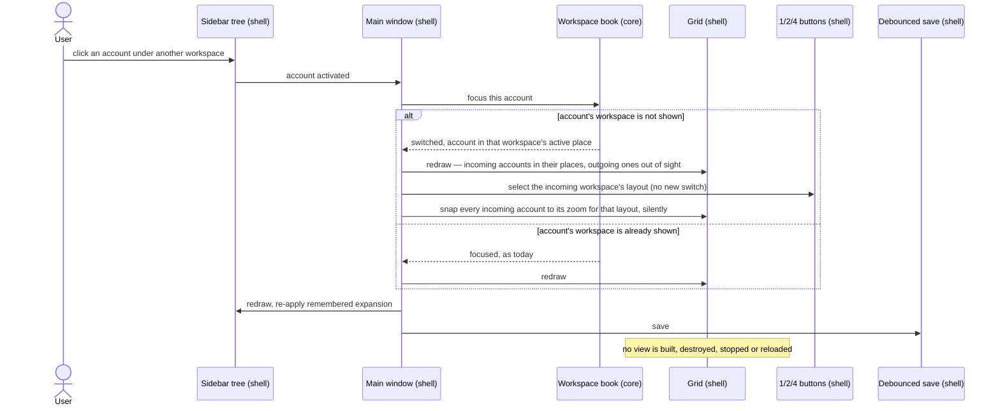
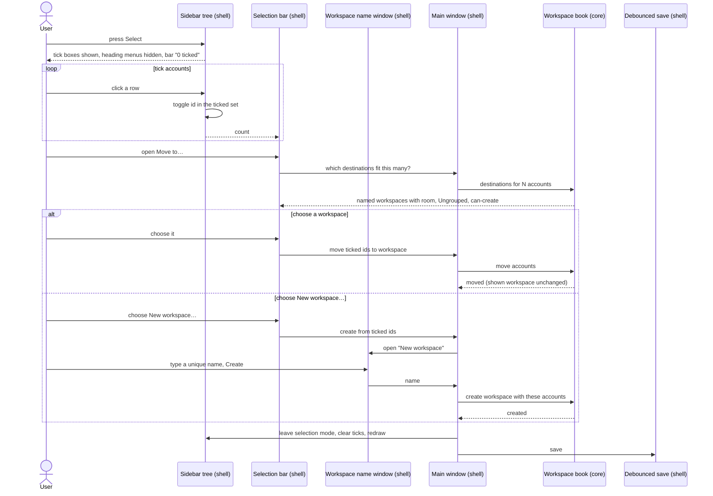
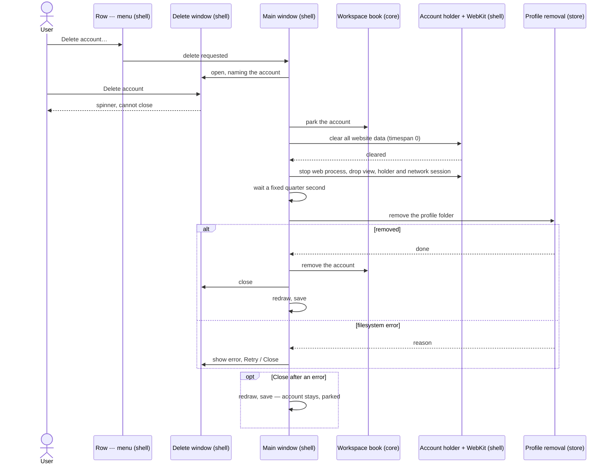
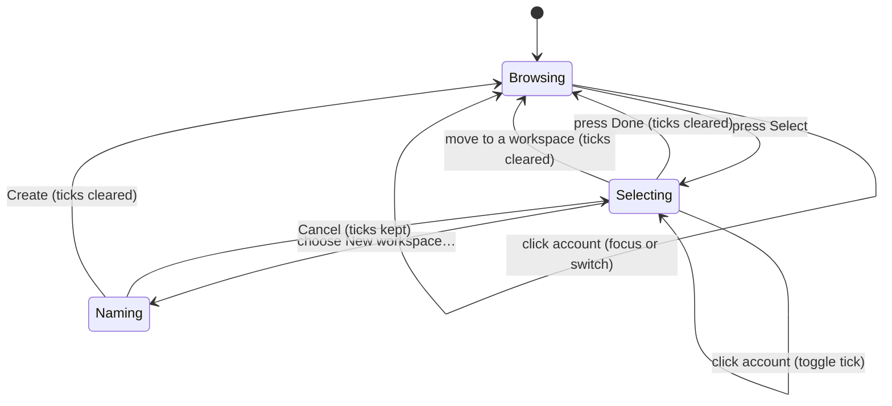

# 11 — Account workspaces, and deleting an account

**Depends on:** 06, 07, 10 · **Status:** done · **Estimate:** 13 · **Merged:** 2026-09-17

## Context

This application runs several accounts of browser idle games side by side in one
window. The window splits into one, two or four places, and every account either
sits in one of them or keeps running out of sight. A sidebar lists every account.
Today that list is flat, and the arrangement of places belongs to the whole
window: there is one choice of one, two or four places, and one set of accounts
filling them.

That stops working once someone plays more accounts than fit on screen. A common
pattern is a party: four accounts of one game played together, arranged in a
particular way. A second party, or a handful of accounts of another game, has to
share the same flat list and the same four places. Going from one set to the
other means dragging accounts in and out of places one at a time, and the first
set's arrangement is lost the moment the second is built.

This item adds workspaces. A workspace is a named set of accounts with its own
arrangement: its own choice of one, two or four places, its own seating, and its
own active place. Every account belongs to exactly one workspace. A built-in
workspace called Ungrouped is where every account starts, and it behaves exactly
like today's flat list. An existing installation opens with all its accounts in
Ungrouped, so nobody loses anything, and someone who never makes a workspace sees
no difference beyond the list's new shape. A named workspace holds at most four
accounts, the number of places in the largest arrangement.

A workspace is purely organisational. It has no running state of its own. Each
account still decides for itself whether it runs, is parked or is waiting to
start. Showing a different workspace only changes what is on screen: the accounts
of the workspace being left go out of sight and keep running, nothing reloads,
and no game needs a login. Every running account costs memory whichever
workspace is showing, so the memory figures at the foot of the sidebar count all
of them. On launch every account that was running comes back, the shown
workspace's accounts first, so the window is usable while the rest start one at a
time behind them.

The sidebar becomes a two-level list: a heading per workspace with its accounts
nested beneath, each account appearing once. Headings expand and collapse, and
that choice survives a relaunch. Clicking an account in another workspace
switches to that workspace and brings the account into its active place in one
step. The buttons that choose one, two or four places act on the workspace being
shown.

Arranging accounts into workspaces happens in a selection mode. A Select button
at the top of the sidebar shows a tick box on every account. In this mode a click
ticks an account instead of switching to it, and a bar at the foot offers "Move
to workspace", listing every workspace with room for all the ticked accounts,
plus Ungrouped, plus a way to create a new workspace from them. Moving an account
never changes which workspace is shown; if it leaves the shown one, its place
simply stays empty. A workspace left with no accounts stays until it is removed,
and while it is shown the window says it has no games. A heading's own menu
renames the workspace or removes it, which sends its accounts back to Ungrouped
and deletes nothing from disk. Workspace names must be unique, because they are
picked from lists by name. The add-game window gains a choice of which workspace
the new account goes into, and adding into a workspace that is not shown does not
switch to it.

The second half of this item is deleting an account. Today an account that is no
longer played can only be left in the list forever, together with its login and
saved data on disk. Each account's menu gains "Delete account", which asks for
confirmation by name and says the data cannot be recovered. Once confirmed, the
window stays open until the work is done and cannot be cancelled, because data
already cleared cannot be put back. The account's website data is cleared, its
game is stopped, and after a brief pause its folder is removed. If that last step fails, the window says why and
offers a retry; closing it leaves the account in place, stopped and logged out,
ready to be deleted again. A deleted account's hidden identifier is never handed
to a new account, because a new account on the same folder could inherit leftover
data or crash the engine process that every account shares.

The sidebar widens a little so nested names and tick boxes still read in full.

## User Experience

- **Entry** — the sidebar, now a two-level list: a heading per workspace, its
  accounts nested beneath. `Ungrouped` is always last.
- **Entry** — selection mode: a `Select` toggle in a new title row at the top of
  the sidebar, reading `Done` while the mode is on.
- **Entry** — a workspace heading's ⋯ menu: `Rename…` and `Remove workspace`,
  absent on `Ungrouped`.
- **Entry** — an account row's ⋯ menu gains `Delete account…` as its last item,
  below `Rename…`.
- **Entry** — the add-game window's details form gains a `Workspace` field.
- **Flow** — switching: click an account under a workspace that is not shown. The
  window shows that workspace's arrangement, the header's 1/2/4 buttons flip to
  its layout, and the account takes that workspace's active place. Nothing
  reloads.
- **Flow** — expanding: click a heading or its expander arrow. Its accounts show
  or hide. The shown workspace does not change.
- **Flow** — grouping: press `Select`. Every account row gains a leading tick
  box, heading menus hide, and a bar appears above the memory footer reading
  "0 ticked" beside a `Move to…` button, insensitive at zero.
- **Flow** — click account rows, or their tick boxes, to tick them. A click never
  switches workspace or focus in this mode. The bar's count follows. Ticks
  survive collapsing a heading.
- **Flow** — open `Move to…`. The menu lists every named workspace with room for
  the whole ticked set, then `Ungrouped`, then a separator and `New workspace…`.
  A workspace without room is not listed.
- **Flow** — choose a workspace. The ticked accounts move to the bottom of its
  list, selection mode ends and every tick clears. The shown workspace does not
  change; an account that left it leaves its place empty.
- **Flow** — choose `New workspace…`. A small window titled "New workspace" asks
  for a name. `Create` is insensitive while the trimmed name is empty or matches
  another workspace's, ignoring case, `Ungrouped` included. Confirming creates the
  workspace holding exactly the ticked accounts, expanded, and ends selection
  mode. The shown workspace does not change.
- **Flow** — press `Done` to leave selection mode without moving anything; ticks
  clear.
- **Flow** — renaming a workspace: heading ⋯ → `Rename…` opens the same small
  window titled "Rename workspace", pre-filled and fully selected, with the same
  uniqueness rule.
- **Flow** — removing a workspace: heading ⋯ → `Remove workspace`. The workspace
  disappears and its accounts join the bottom of `Ungrouped`. If it was shown,
  `Ungrouped` is shown. Nothing on disk changes and no confirmation is asked,
  because nothing is lost but the grouping.
- **Flow** — deleting: row ⋯ → `Delete account…`. A modal window titled "Delete
  account?" reads "Delete <name>? Its logins and saved game data will be removed
  from this computer. This cannot be undone.", with `Cancel` and a red
  `Delete account` button.
- **Flow** — confirm. The buttons go and a spinner reads "Deleting <name>…". The
  window cannot be closed or cancelled. On success it closes, and the account is
  gone from the sidebar and the grid; its place stays empty.
- **Flow** — adding: the add-game window's details form shows `Workspace`,
  listing named workspaces with room for one more, then `Ungrouped`. It defaults
  to the shown workspace when that has room, otherwise `Ungrouped`. Adding into a
  workspace that is not shown creates the account running there, out of sight.
- **States** — **shown workspace empty**: the grid area shows "No games in this
  workspace" centred, dim, with no button. **No accounts anywhere**: the existing
  first-run state, "No games yet — add one to get started." plus its button,
  unchanged.
- **States** — **named workspace with no accounts**: its heading stays, and
  expanding it shows one dim line, "No accounts". **Collapsed heading**: its
  accounts' tick state is kept, not dropped.
- **States** — **`Move to…` with nothing ticked**: insensitive. **Ticked set
  larger than four**: no named workspace can hold it, so none is listed,
  `New workspace…` is insensitive, and `Ungrouped` is the only destination.
- **States** — **name taken or empty** (new or rename): the confirm button is
  insensitive, no error text; a second dim line under the field reads "Another
  workspace has this name." only while the name is taken.
- **States** — **delete fails**: the spinner is replaced by "Couldn't finish
  deleting <name>.", the reason on one dim line, and the folder path on a second
  dim, selectable line, with `Retry` and `Close`. `Retry` runs the whole deletion
  again. `Close` leaves the account in its workspace, parked and logged out, with
  its row unchanged in shape — a grey parked dot.
- **States** — **account rows**: status dots, dimming and bold keep design rules
  1 and 3. An account in a workspace that is not shown keys as `background` (or
  its liveness key), never `current` or `visible`. Headings carry no dot, no
  bold and no marker of which workspace is shown — the green dots under it say
  that.
- **Pattern** — the heading's ⋯ menu is the account row's ⋯ menu shape, design
  rule 5, built like `bind_row_menu` at
  `crates/idle-manager-shell/src/session_sidebar/imp.rs:347`.
- **Pattern** — `Delete account…` is one more item in the row's ⋯ menu, design
  rule 5, below `Rename…` added in item 10.
- **Pattern** — the workspace name window is `RenameDialog`
  (`crates/idle-manager-shell/src/rename_dialog.rs`) with a title and a
  name check passed in, reusing its default-button and select-all behaviour.
- **Pattern** — `New workspace…` sits under a separator in the move menu, the
  escape-hatch shape of design rule 7.
- **Pattern** — "Another workspace has this name." is one dim line under the
  field, design rule 8.
- **Pattern** — the shown-workspace-empty state reuses the window's centred empty
  box, `crates/idle-manager-shell/resources/ui/window.ui:73`, with a second label.
- **Pattern** — a parked account left behind by a failed delete uses the existing
  `parked` key and slot panel, design rules 1 and 4; no new state is added.
- **Pattern** — the sidebar's width moves 150 → 200 under design rule 6's own
  re-derivation clause; the rule's record of the width changes gains this step.
- **New pattern** — a list-wide selection mode: a toggle that swaps what a row
  click means and reveals tick boxes plus an action bar. Nothing in
  `docs/design.md` covers a mode; the design doc owes a rule once this ships.
- **New pattern** — a two-level accordion list with headings that carry no state.
  Rule 1 only covers account rows; the design doc owes a rule for headings once
  this ships.
- **New pattern** — a destructive confirmation that becomes a blocking progress
  window and then, on failure, an error with retry. Rule 9's strip is for
  problems the user did not cause; this is the result of an action they are
  watching. The design doc owes a rule once this ships.

### Switching workspace from the sidebar

The screen is the main window with the sidebar open. The sidebar only reports
which account was clicked. The workspace book decides whether that is a switch,
then asks the incoming workspace's own session book to focus the account, so the
existing swap-into-focus rule is unchanged. The grid moves views between places
and out of sight; every view stays mapped, so no game is throttled. The header's
layout buttons are updated to show the incoming workspace's layout without
triggering a layout change of their own. States: a switch into an empty
workspace cannot happen this way, because it needs an account to click.

### Grouping accounts in selection mode

The screen is the sidebar in selection mode, plus the small name window for a
new workspace. The ticked set is a set of account identifiers the sidebar holds,
not the list's own selection, so collapsing a heading or a redraw never loses a
tick. The bar never decides which workspaces have room; it asks the window,
which asks the workspace book. A move is all or nothing: the book refuses a
destination without room for the whole set, which is why the menu never offers
one. Moving is organisational only — no liveness changes and the shown workspace
stays shown.

### Deleting an account

The screen is the main window with one modal delete window. The window drives
the steps in a fixed order. Clearing comes first because it is what empties the
account's storage while the engine can still reach it, and it also closes the
storage files the engine is willing to close; the quarter-second wait lets that
finish. The engine never closes the cookie database or the HSTS store, so the
application does not wait for them: removing the folder succeeds with them open,
and their handles go when the application exits. The account is parked in the
book before anything else, so every outcome leaves it in a real, already-known
state: removed on success, parked otherwise. The book removes the account only
after the folder is gone. `Retry` from the error runs the whole sequence again,
which is safe because each step does nothing when already done.

### Sidebar modes

Not a screen: the sidebar's two modes and what a row click means in each. In
Browsing a click focuses or switches, heading menus show, and there are no tick
boxes. In Selecting a click toggles a tick, heading menus hide and the bar
shows. Cancelling the name window returns to Selecting with the ticks intact,
so a mistyped name never costs the selection.

## Technical Details

### Back-end

Back-end is `idle-manager-core`, `idle-manager-store` and the composition root;
this item needs no change in `idle-manager-metrics`. `docs/architecture.md` rules 1, 2, 3, 5, 6, 7, 8, 9, 11 and
14 bind; `docs/code-standards.md` rules 1, 2, 5, 7, 12, 13, 14, 15, 17, 18, 21,
23 and 24; `docs/naming.md` rules 6, 9, 10, 11 and 12.

**Identifiers.** Add `WorkspaceId(String)` beside `SessionId` (code standards
rule 2). Named workspaces are minted as `workspace-NNNN`; `Ungrouped` has the
fixed id `ungrouped`, exposed as `WorkspaceId::UNGROUPED` via a constructor, so
nothing compares against a display name. Add `workspace_name(raw: &str) ->
Option<String>` beside `account_name` at
`crates/idle-manager-core/src/session.rs:46`: trimmed, `None` when empty.

**Moving minting up.** `SessionBook` loses its `minted` counter
(`crates/idle-manager-core/src/session.rs:260`). `SessionBook::add` and
`add_from_preset` take the `SessionId` to use as their first argument instead of
minting one, so ids are unique across every workspace, not per book. Every
existing placement, focus, zoom, move and rename method on `SessionBook` is left
as it is — each workspace is one `SessionBook`.

**`SessionBook` gains three small operations.** `take(&mut self, id) ->
Option<Session>` removes the session and its remembered slot, leaving its place
empty and moving no other account (`FR.17.8`, `FR.21.5`). `adopt(&mut self,
session: Session)` appends an arriving account to the end of `sessions`, seated
in the lowest free slot of this book's layout if one is free and off-grid
otherwise — never displacing anyone (`FR.17.3`). `session(&self, id) ->
Option<&Session>` replaces the `iter().find` the window repeats at
`crates/idle-manager-shell/src/window/imp.rs:485`, `:624` and `:681`.

**The saved shape.** `workspace.rs` gives `Workspace` an `id: WorkspaceId`, a
`name: String`, a `focused: SlotId` and an `is_expanded: bool` beside `accounts`
and `layout` (`FR.15.2`). `focused` is new to the file — item 07 always restored
focus to the first place (`crates/idle-manager-core/src/session.rs:340`), and a
workspace owning its active place (`FR.15.1`) means it has to be saved.
`is_expanded` is carried here, not invented in the shell, because it must
survive a relaunch (`FR.16.2`) and the saved value is the only thing the store
sees. Add `WorkspaceList { workspaces: Vec<Workspace>, active: WorkspaceId,
next_account_number: u64, next_workspace_number: u64 }` above it — the value
saved and restored as a whole. `next_account_number` is the id high-water mark
of `FR.21.7`: minting reads it, never the highest restored id, so a deleted
newest account's number is never handed out again. `SessionBook::restore` and
`SessionBook::workspace` keep working per workspace, taking and returning the
new fields.

**`WorkspaceBook`.** A new `workspace_book.rs` holds the runtime parent (naming
rule 9: a book of workspaces, as `SessionBook` is a book of sessions). Fields:
an ordered list of entries each holding a `WorkspaceId`, a name, `is_expanded`
and a `SessionBook`; the active `WorkspaceId`; both mint counters. `Ungrouped`
always exists and is always last. Its contract, each method returning an owned
result and never a partial change:

- `restore(WorkspaceList) -> Self` and `saved(&self) -> WorkspaceList`. On
  restore an `active` naming no workspace falls back to `Ungrouped`, a missing
  `Ungrouped` is created empty, and each account's number is checked against
  `next_account_number`, raising it if a hand-edited file left it too low.
- `active(&self) -> &SessionBook`, `workspaces(&self)` for the sidebar, and
  `placement(&self, id) -> Option<Visibility>` returning the account's own
  visibility in the shown workspace and `Visibility::OffGrid` for every account
  elsewhere. That one method is how an inactive book keeps its seating untouched
  while its views are out of sight (`FR.18.1`).
- `add(&mut self, workspace, name, address) -> Result<SessionId,
  WorkspaceRefusal>` and `add_from_preset(...)`, minting from the parent and
  refusing a named workspace with no room (`FR.15.3`, `FR.17.5`). Never switches
  (`FR.17.9`).
- `focus_account(&mut self, id) -> Option<Switch>`: switches to the account's
  workspace when it is not the shown one, then calls that book's
  `focus_session`. `Switch { from, to }` tells the window to snap zoom and flip
  the header buttons (`FR.16.3`).
- `set_layout(&mut self, layout)` on the shown workspace only (`FR.16.4`).
- `set_expanded(&mut self, workspace, bool)`.
- `destinations(&self, count) -> Destinations`: named workspaces with room for
  `count` in list order, whether a new workspace can hold `count` (at most four),
  and `Ungrouped`. The single source for both the move menu and the add-game
  field (`FR.17.2`, `FR.17.5`).
- `move_accounts(&mut self, ids: &[SessionId], to) -> Result<(),
  WorkspaceRefusal>`: all or nothing on room, accounts already in `to` skipped,
  each moved with `take` then `adopt`, shown workspace never changed
  (`FR.17.8`).
- `create_workspace(&mut self, name, ids) -> Result<WorkspaceId,
  WorkspaceRefusal>`: runs `workspace_name`, refuses a name equal to another's
  ignoring case (`FR.15.8`), refuses more than four accounts, inserts before
  `Ungrouped` expanded, then moves `ids` in.
- `rename_workspace(&mut self, id, name) -> Result<(), WorkspaceRefusal>`,
  refusing `Ungrouped` and a taken name.
- `remove_workspace(&mut self, id) -> Result<(), WorkspaceRefusal>`: refuses
  `Ungrouped`; adopts every account into `Ungrouped` in order; shows `Ungrouped`
  if the removed one was shown (`FR.15.4`, `FR.15.11`). Touches no disk.
- `park`, `rename`, `set_keep_awake`, `unpark`, `mark_started`, zoom steps: each
  finds the account's own `SessionBook` and delegates, so the shell calls one
  place. Zoom steps act only on the shown workspace's accounts, because an
  account elsewhere is never visible (`FR.11.7`).
- `remove_account(&mut self, id) -> bool`: `take` from its book; the one call
  that forgets an account, made only after the folder is gone (`FR.21.5`).
- `start_order(&self) -> Vec<SessionId>`: the shown workspace's queued accounts
  first, then every other workspace's in list order (`FR.18.4`).
- `live_session_count(&self) -> usize` summed over every book (`FR.18.2`).

`WorkspaceRefusal` is an enum — `EmptyName`, `NameTaken`, `NoRoom`,
`Ungrouped`, `UnknownWorkspace`, `UnknownAccount` — so the shell can grey out a
button from the same answer the book would give (code standards rules 1, 12).
Named capacity is a constant derived from `Layout::Grid`'s slot count, not a
bare 4 (code standards rule 5).

**Ports.** `WorkspaceStore::read` and `write` at
`crates/idle-manager-core/src/ports.rs:154` carry `WorkspaceList` instead of
`Workspace`. One new port, needed because the domain's deletion flow must not
know about the filesystem and a test needs a fake (architecture rules 5, 6):
`ProfileRemoval` with `remove(&self, id: &SessionId) -> Result<(),
ProfileRemovalError>` and `folder(&self, id) -> PathBuf`. Its error type is a
`thiserror` enum with a one-line reason ready to show (architecture rule 11). It
is `Send + Sync`, because the shell calls it through `gio::spawn_blocking`. There
is no open-file check: the engine never releases a deleted session's cookie and
HSTS files, so there is nothing to wait for (Technical References).

**Store.** `crates/idle-manager-store/src/session_file.rs` moves to
`FORMAT_VERSION = 2`. Keep the version 1 types as `SessionFileV1` and read them
as one `Ungrouped` workspace holding every account in file order, its layout,
focus on the first place, expanded, active, with `next_account_number` one
above the highest id (`FR.15.2`). Version 2 is nested tables: `version`,
`active`, `next_account`, `next_workspace`, then `[[workspace]]` with `id`,
`name`, `layout`, `focused`, `expanded`, and `[[workspace.account]]` entries
exactly as today's `SessionEntry`. The probe at `:211` now dispatches on 1 or
2; anything else is still `UnknownVersion`. Validation keeps the file tolerant:
an account id appearing twice is `Malformed` (quarantined, as today); a named
workspace holding more than four accounts keeps the first four and adopts the
rest into `Ungrouped` with a `tracing::warn`, so a hand edit costs grouping, not
the whole file. The first save over a version 1 file first copies it to
`sessions.v1.toml` beside it, once, so a downgraded build still has its old
arrangement. A new `insta` snapshot pins the version 2 file, and integration
tests under `crates/idle-manager-store/tests/` cover a version 1 migration, a
round trip, a duplicate id, an oversized workspace and an unknown `active`.

`XdgProfileRemoval` in `crates/idle-manager-store/src/paths.rs` implements
`ProfileRemoval` over `account_profile_dir` at `:74`: `folder` returns that path,
`remove` calls `fs::remove_dir_all` and treats an already-missing folder as
success, so `Retry` after a partial removal succeeds (`FR.21.11`). It removes
exactly that one folder — tested against a sibling account's folder surviving
(`FR.21.8`).

**Composition root.** `crates/idle-manager/src/main.rs` builds
`XdgProfileRemoval` and passes it in `WindowPorts` beside the existing five
(architecture rule 3).

**Core tests** at the foot of `workspace_book.rs` and `session.rs` (code
standards rules 21, 23, 24): a saved-then-restored `WorkspaceList` reproducing
field for field;
minting never reusing a removed newest account's number across a
save-and-restore; `placement` reporting off-grid for every inactive account;
switching leaving the outgoing book's seating and focus untouched; a move
refused without room and changing nothing; a move never changing `active`; a
freed place left empty; `adopt` never displacing; create refusing a duplicate
name ignoring case and a name equal to `Ungrouped`; remove refusing `Ungrouped`
and returning accounts in order; removing the shown workspace showing
`Ungrouped`; `start_order` putting the shown workspace first; the live count
summing every workspace; `remove_account` leaving the place empty.

### Front-end

Front-end is `idle-manager-shell`. `docs/design.md` rules 1, 3, 4, 5, 6, 7, 8
and 9 bind, and this item carries three new patterns listed under User
Experience. `docs/architecture.md` rules 8, 10, 12, 13 and 14 bind;
`docs/naming.md` rules 1, 2, 4 and 7 fix the spellings.

**The window.** `window/imp.rs` replaces `book: RefCell<SessionBook>` at `:65`
with `RefCell<WorkspaceBook>`, and every intent method routes to it. Specifically:
`focus_session` at `:668` calls `focus_account` and, on a `Switch`, calls
`select_layout_toggle` for the incoming layout and a new
`snap_zoom_for_active` (the existing `snap_all_zoom` at `:432` narrowed to the
shown workspace's accounts, resolving each against its own workspace's layout);
`connect_layout_toggle` at `:408` returns early when the toggled layout already
equals the shown workspace's, so `select_layout_toggle` never triggers a second
arrangement or a save; `restore_workspace` at `:307` restores a `WorkspaceList`,
builds a dormant holder for every account in every workspace, and begins the
start queue from `WorkspaceBook::start_order`; `request_save` at `:278` hands the
saver `saved()`. `redraw` at `:936` shows the first-run empty state only when no
workspace has any account, and the new "No games in this workspace" label when
only the shown one is empty (`FR.15.10`).

New window methods, each one intent and one book call (architecture rule 8):
`move_ticked(ids, to)`, `present_workspace_name_dialog(purpose)` for create and
rename, `remove_workspace(id)`, `set_expanded(id, bool)`, and
`present_delete_dialog(id)`. `attach_ports` at `:261` stores the new `ProfileRemoval` port.

**Deleting.** A new `account_deletion.rs` holds the async sequence so the window
stays one level of abstraction (code standards rule 6). It runs on the main
context with `glib::spawn_future_local`, every blocking call through
`gio::spawn_blocking` (architecture rule 10), in exactly the order of the
deletion diagram: `WorkspaceBook::park`; `SessionView::clear_data`, a new holder
method calling the network session's `WebsiteDataManager::clear` for all data
types with a zero timespan and awaiting it —
`WebsiteDataManager::clear(WebsiteDataTypes::ALL, glib::TimeSpan(0), None,
callback)`, reached through `NetworkSession::website_data_manager()`, both in
`webkit6` 0.6.1; `SessionView::stop` then dropping the holder from `holders` and
a new `SessionGrid::remove_session` that unparents the account's overlay and
drops its entry; awaiting `glib::timeout_future` for `DELETE_SETTLE_MILLIS`;
then `ProfileRemoval::remove`. Success calls
`WorkspaceBook::remove_account`, cancels any pending zoom-save timer for the id
at `:88`, drops its `load_changed_handlers` entry at `:97`, prunes it from the
sidebar's ticked set, closes the dialog, redraws and saves. Any failure reports
the reason and the folder to the dialog. `DELETE_SETTLE_MILLIS` is a named constant with its
unit, 250, twice the slowest storage close the spike measured (Technical
References). A sign-in popup open at the time is left alone (`FR.21.12`): its
page dies with the web process, and removing the folder does not depend on it. The
start queue already skips an id no longer queued (`start_queue.rs:146`), so a
queued account being deleted needs nothing more there.

**The delete window.** A new `DeleteAccountDialog`: `delete_account_dialog.rs`,
`delete_account_dialog/imp.rs`, `resources/ui/delete-account-dialog.ui`
registered in the gresource (architecture rules 12, 13; naming rules 2, 4, 7).
A modal, non-resizable `gtk::Window` holding a `gtk::Stack` of three pages —
a stack is safe here, it holds labels and buttons, never a web view. `confirm`:
the sentence naming the account, `Cancel`, and `Delete account` carrying
`destructive-action`. `working`: a `gtk::Spinner` and "Deleting <name>…", no
buttons; `deletable` false and a `close-request` handler returning
`Propagation::Stop` while on this page, and Escape does nothing (`FR.21.9`).
`failed`: the sentence, the reason and the folder path in `dim-label` labels
(the path `selectable`), `Retry` and `Close`. It emits `connect_confirmed` and
`connect_retry` and exposes `show_working` and `show_failed(reason, folder)`;
it decides nothing.

**The sidebar tree.** `session_sidebar/imp.rs` replaces the flat `ListStore` of
`Row` at `:124` with a root `gio::ListStore` of a new `WorkspaceRow` object
(`session_sidebar/workspace_row.rs` + `imp`: id, name, is-empty) wrapped in
`gtk::TreeListModel::new(root, false, false, create_model_func)`, where the
function returns a `ListStore` of `Row` for a `WorkspaceRow` and `None` for a
`Row` (passthrough false is required for `TreeExpander`). The model stays behind
`gtk::NoSelection`, for the reason given at `:125`. `sync` takes the
`WorkspaceBook`, rebuilds the root store and each child store, and then walks
the flat model calling `set_expanded` from each workspace's `is_expanded`, with a
guard flag so the re-application does not emit expansion intents
(`FR.16.2`). `Row::refresh` at `row.rs:38` takes the visibility from
`WorkspaceBook::placement` and `current` only for the shown workspace, so
`status_key` at `row.rs:67` and `name_markup` need no new arm (design rules 1,
3).

**One factory, a superset.** `row_factory` at `:212` builds a `gtk::TreeExpander`
whose child box holds both layouts: the heading's name label, the dim "No
accounts" label and its ⋯ `MenuButton`; and the account's tick `CheckButton`,
name, dot, keep-awake mark and ⋯ `MenuButton`. `bind` reads the item type, sets
the expander's list row, and shows one layout; `hide-expander` is set on account
rows and `indent-for-depth` on both. The heading's menu is built by a new
`bind_heading_menu`, the same shape as `bind_row_menu` at `:347`, with `rename`
and `remove` actions under a `heading` group, and no items at all for
`Ungrouped`. Heading rows set `ListItem:activatable` false so a heading click only
expands; the expander's `notify::expanded` reports
`connect_expansion_toggled(WorkspaceId, bool)`.

`bind_row_menu` appends `Delete account…` bound to a stateless `delete` action
reporting `connect_delete_requested(SessionId)`, always sensitive (`FR.21.1`).

**Selection mode.** `session-sidebar.ui` gains a title row above the scroller
with an "Accounts" label and a `Select` `gtk::ToggleButton` whose label follows
its state, and a hidden `selection_bar` box above `footer` holding the count
label and a `Move to…` `gtk::MenuButton`. `width-request` at
`session-sidebar.ui:6` becomes 200 (`FR.16.5`). `SessionSidebar` holds
`is_selecting: Cell<bool>` and `ticked: RefCell<HashSet<SessionId>>`
(`FR.17.4`); `connect_activate` at `:135` toggles the id in `ticked` instead of
emitting activation while selecting, and the check button's `toggled` does the
same. `sync` prunes ids no longer in the book. The move menu is rebuilt when it
opens from a `Destinations` the window supplies through
`set_move_destinations`, with `New workspace…` after a menu section break and
insensitive when `can_create` is false (design rule 7). `Move to…` is insensitive while `ticked` is empty, and
the count label reads from `ticked.len()` on every change. Choosing an entry emits
`connect_move_requested(Vec<SessionId>, MoveTarget)` where `MoveTarget` is
`Existing(WorkspaceId)` or `New`. The window calls back `end_selection`, which
clears `ticked` and leaves the mode, only after a move or a create has actually
been applied; a cancelled name window calls nothing, so the mode and every tick
survive it (`FR.17.7`).

**The name window.** `RenameDialog` at `crates/idle-manager-shell/src/rename_dialog.rs`
gains a constructor taking a title, a confirm label, the starting text and a
check closure returning `Ok`, `Empty` or `Taken`; the account rename keeps
calling it with `account_name`, the workspace dialog with a closure over
`WorkspaceBook`'s name rule. `Taken` shows the dim line (design rule 8).

**The grid.** `SessionGrid::sync` at `session_grid/imp.rs:549` takes the
`WorkspaceBook`: layout and focus from the shown book, each entry's placement
from `WorkspaceBook::placement`, and entries for accounts not in the shown
workspace set to `Visibility::OffGrid` explicitly. Today an entry whose account
is not found keeps its stale placement (`:555`), which with several books would
leave a hidden workspace's view drawn in a place. `remove_session` is new, as
above.

**The add-game window.** `add_game_dialog/imp.rs`'s details stage gains a
`Workspace` `gtk::DropDown` over the `Destinations` for one account, defaulting
per `FR.17.5`. `AddGameDialog::new` at `add_game_dialog.rs:54` takes the
destinations and the default, and both `Confirmed` variants at `:28` gain
`workspace: WorkspaceId`. `create_account` and `create_account_from_preset` at
`window/imp.rs:590` pass it to `WorkspaceBook`, and `realise_account` at `:607`
resolves zoom against that workspace's layout, not the shown one.

**The saver.** `save_on_change.rs` changes `Workspace` to `WorkspaceList` in
`latest` and `request`; nothing else about the debounce moves.

**Coverage** is this item's `test-script.md`, per architecture rule 14; the first
slice to reach acceptance writes `Setup` and `Teardown`. Steps it needs: a
version 1 `sessions.toml` opening as `Ungrouped` with nothing lost and
`sessions.v1.toml` written on first save; creating a workspace from ticked
accounts; a switch by clicking an account with the page not reloading and a
kept-awake game still ticking; each workspace's layout and focus surviving a
switch and a relaunch; expansion surviving a relaunch; the move menu omitting a
full workspace; a move leaving the shown workspace and an empty place behind;
the empty-workspace label; a duplicate name greying `Create`; removing the shown
workspace; adding into a hidden workspace without switching; the memory footer
counting accounts in hidden workspaces; launch order starting the shown
workspace first; a delete removing the folder from disk and a relaunch not
reviving it; a delete that cannot be cancelled mid-way; a forced failure (a
read-only profile folder) producing the error page and `Close` leaving the
account parked; and a new account after deleting the newest getting a new
number.

No front-end reference was given; this section is built from `docs/design.md`,
the existing sidebar, rename and add-game windows, the wireframes chosen during
planning, and the research note.

### Technical References

- `docs/research/gtk4-drag-and-accordion.md` lines 90–133 are applied to the
  sidebar tree, except `ListItem:focusable`, which needs GTK 4.12 (Blockers): `TreeListModel` with passthrough false so `TreeExpander`
  gets its list row; one superset factory switched in `bind`, because `setup`
  cannot know the row type; expansion is destroyed on collapse and must be
  re-applied from held state after each rebuild; selection over a tree is flat
  and collapsed rows leave the model, which is why ticks are a `HashSet` of ids;
  `ListItem:activatable` false keeps a heading click to expand only;
  `hide-expander` and `indent-for-depth` are GTK 4.10+.
- WebKit source, read 2026-09-13, for deleting a profile folder:
  - destroying a network session sends the network process a close and does not
    wait (`UIProcess/WebsiteData/WebsiteDataStore.cpp`, `~WebsiteDataStore`);
    storage files close later on a background queue
    (`NetworkProcess.cpp` `destroySession`,
    `storage/NetworkStorageManager.cpp` `close`). So the folder cannot be removed
    straight after dropping the session.
  - `webkit_website_data_manager_clear` with all types and timespan 0 needs no
    live view and calls back once the network process has deleted the data
    (`glib/WebKitWebsiteDataManager.cpp`, `WebsiteDataStore::removeData`); it
    does not close files. Cookies are only removed with timespan 0.
  - the network process has a release assertion against two live sessions on one
    storage directory (WebKit bug 236844), so reusing a deleted account's
    folder name before its session finishes closing would crash the process every
    account shares. Hence the persisted id high-water mark.
  - Apple's own profile deletion checks the store is no longer in use before
    removing the directory (`Cocoa/WebsiteDataStoreCocoa.mm`). GTK has no such
    check, and the measurement below shows it could never pass here.
- **Measured 2026-09-13** on WebKitGTK 2.52.6 and GTK 4.22.4, with two accounts
  and one deleted; the spike lives outside the repo. After the view and network
  session were dropped, the shared network process still held `cookies.sqlite`
  and `hsts-storage.sqlite` open at 60 s, with or without a prior clear. The
  clear closed the IndexedDB and service-worker databases but itself created
  `ResourceMonitorPersistence.db`, which also stayed open. LocalStorage closed
  within 0.1 s. `remove_dir_all` then succeeded, the open files showed as
  deleted, nothing recreated the folder within 30 s, and the other account still
  loaded with its cookie and localStorage intact. The clear took 6–12 ms. So
  deletion waits a fixed 250 ms instead of polling, accepts a few leaked handles
  until exit, and must never reuse an account id, because the dead session stays
  alive inside the network process.

## Blockers

- None open. The five raised during planning were closed on 2026-09-13:
  - Whether the engine releases a dropped session's files was measured. It never
    releases the cookie and HSTS files opened for the session built at
    `crates/idle-manager-shell/src/web_view.rs:282`, so the open-file wait, its
    timeout and the metrics port were removed from the design (Technical
    References, `FR.21.10`).
  - The settle timeout went with them; the fixed `DELETE_SETTLE_MILLIS`
    replaces it.
  - Sign-in popups built at `crates/idle-manager-shell/src/web_view.rs:638` stay
    untracked. Deletion no longer waits on files, so an open popup blocks
    nothing (`FR.21.12`).
  - `webkit6` 0.6.1 exposes `NetworkSession::website_data_manager` and
    `WebsiteDataTypes::ALL` (`src/auto/network_session.rs:189`,
    `src/auto/flags.rs:612` in the crate), and the spike called
    `WebsiteDataManager::clear` with them.
  - The GTK floor stays at 4.10 (`docs/stack.md:75`). `ListItem:focusable` is not
    used, and each sidebar tree row is accepted as two keyboard focus stops.
