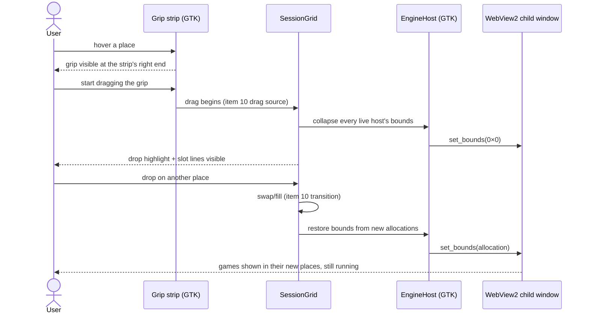
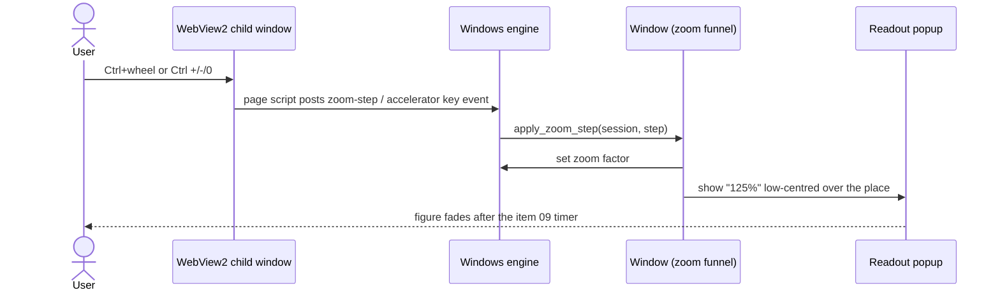
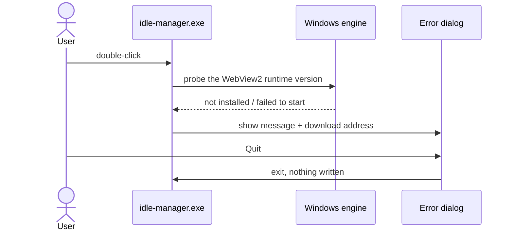

# 12 — Running natively on Windows

**Depends on:** 05, 11 · **Status:** done · **Estimate:** 13 · **Merged:** 2026-09-19

## Context

This application runs several accounts of browser idle games side by side in one
window, each account in its own isolated browser profile, while using as little
memory, processor and graphics power as possible. Until now it has been a Linux
program only. Its window is drawn with GTK 4, a toolkit that also runs on
Windows, but the part that actually shows web pages is WebKitGTK, a web engine
that has no working Windows build today. Nobody packages it for Windows and the
WebKit project's own Windows version cannot be placed inside a GTK window. That
single dependency is what keeps the application off Windows.

This item makes the application run natively on 64-bit Windows 10 and 11. The
approach is the simplest one that keeps the program fast. The window, the
sidebar, the dialogs and every rule about accounts stay exactly as they are,
still drawn with GTK 4. Only the piece that shows a game page changes. On
Windows it is Microsoft Edge WebView2, the browser component every Windows 10
and 11 machine already has installed, so the user installs nothing extra. On
Linux nothing changes at all: the same engine, the same processes and the same
memory figures. Which engine is used is decided when the program is compiled,
not while it runs, so the Linux program carries no Windows code and the Windows
program carries no Linux code.

Two larger alternatives were rejected. Rewriting the whole interface in a
toolkit that wraps each system's own browser would throw away every screen
already built. Asking Windows users to run the Linux program inside the Windows
Subsystem for Linux would work but is not really Windows support: it needs a
separate install, draws the window through a remote-desktop link that costs
processor time, and falls back to software drawing on some graphics chips.

The work comes in four parts. First, the code that talks to the web engine is
gathered behind one small, engine-neutral surface inside the interface layer, on
Linux alone and with no change in behaviour, so the rest of the interface stops
naming WebKit directly. Second, a Windows version of that surface is written on
top of WebView2. All accounts share one engine instance, so they share one
browser process and one graphics process, and each account gets its own named
profile inside it, which keeps logins and storage apart as they are on Linux.
Everything the Linux build already does is carried over: starting and parking
games, the scripts injected into every page, sign-in popups, zoom by keys and by
wheel, noticing when a game's process dies, keeping chosen games awake while the
window is minimised, and deleting an account's data. Third, the memory figure at
the bottom of the sidebar gets a Windows reader, because Linux reads a system
folder Windows does not have. Fourth, the Windows program is built and packaged
as a zip on the Linux development machine, and a check that runs there catches
a change that would break the Windows build.

One difference between the engines shapes the visible work. WebView2 is a
separate native window placed inside the GTK window, and it always draws on top
of anything GTK draws in the same area. The Linux build draws a few small things
over a game: a drag handle in a corner, a short-lived zoom percentage, a cover
showing the account's name until the page first paints, and a highlight where a
dragged account will land. On Windows each of those moves to a spot the game
view does not cover: the handle sits in a thin strip above the game, the
percentage floats in its own small popup, and the cover and the highlight show
while the game view is shrunk out of the way for a moment.

Performance is the constraint that decides every detail. Accounts never get an
engine instance of their own, because each one would add a browser process and
its helpers. Background slowdown is controlled per account exactly as keep-awake
already allows, so a game the user has not asked to keep awake still rests while
the window is minimised. The item ends with a measurement: on Windows, four live
accounts must cost no more than the same four games open as tabs in Microsoft
Edge, measured on the Windows virtual machine described next, and on Linux the
figures must match the ones recorded before this work.

Nobody on the project owns a Windows computer. So the item is developed and
checked against a Windows 11 virtual machine that runs inside a container on
the same Linux computer. The hand-run checks cover only what that machine can
show. It has no graphics card, so hardware drawing and idle processor use are
not measured. Every feature is still built for Windows, and a developer with a
real Windows machine tries the program informally.

## User Experience

- **Entry** — On Windows the user unzips the release (built on Linux by
  `make windows-package`) and double-clicks `idle-manager.exe`. Everything after that is the same window,
  sidebar and dialogs the Linux build shows (items 01–11); nothing new is entered from.
- **Flow** — Launch → the saved workspace restores one account at a time
  exactly as on Linux (item 07); each place shows its game page.
- **Flow** — Point at a place → the drag grip shows in a thin strip above that
  game instead of over its top-right corner; dragging it rearranges accounts as
  on Linux (item 10).
- **Flow** — While dragging, every live game view in the grid is shrunk to
  nothing so the drop highlight and the slot lines show; on drop or cancel the
  views return to their places. The games keep running throughout.
- **Flow** — `Ctrl` `+`/`-`/`0` with a game focused, or `Ctrl`+wheel over a
  game, resizes it and flashes the percentage low and centred over that place,
  in a small popup that takes no focus and fades as on Linux.
- **Flow** — Minimise the window → accounts with keep-awake on stay marked
  visible to the engine and keep running; the others are marked hidden so the
  engine may slow them; restoring shows every game where it was. Toggling
  keep-awake while minimised changes the visibility mark at once, but the
  keep-awake page script is only added or removed when the account is next
  parked and started (WebView2 takes scripts at view creation only).
- **Flow** — A game's "sign in with…" button opens WebView2's own popup window
  on the same account's profile; completing sign-in there leaves that account
  logged in. It is not the fixed-size popup Linux draws.
- **States** — Loading: until a page first paints, its place shows the cover
  with the account's name (the game view is kept at zero size, not hidden).
- **States** — Engine missing: if WebView2 is not installed or cannot start,
  the window is not shown; a plain error dialog says "Microsoft Edge WebView2
  Runtime is required" with the download address and a single `Quit` button.
  No account data is read or written.
- **States** — A game's engine process dies: the failure reaches the same
  `connect_terminated` hook Linux fires, which today only logs at `ERROR` on
  either engine. The stopped panel that reacts to it is item 08's work; until
  then the place keeps whatever the dead view last drew, and `Park` then
  `Start` from the row menu brings the game back.
- **States** — Parked, queued, empty place, empty workspace: unchanged; none of
  them has a game view, so nothing is covered.
- **Pattern** — The absent-game panel (design rule 4, `session_grid/imp.rs`
  `SlotPlaceholder`) is the one item 08 will reuse for a stopped game; this
  item adds no stopped state to it.
- **Pattern** — The zoom acknowledgement keeps its shape, place, timing and
  single-figure behaviour (design rule 10); only its host changes on Windows.
- **Pattern** — The sidebar, its dots, dimming and row menus are unchanged
  (design rules 1–3, 5, 6, 13); popover menus are separate native popups on
  Windows, so they already draw above game views.
- **New pattern** — a per-place grip strip on Windows: a strip of the grip's
  height plus its margins above each live game, carrying the grip at its right
  end, and absent wherever there is no live game or nowhere to drag to. This
  is design rule 14 in `docs/design.md`, added by task 05.
- **New pattern** — the fatal start-up dialog for a missing system component.
  Design rule 9's message strip needs a window to sit in and this failure comes
  before one exists; the design doc owes a rule once this ships.

### Rearranging a place on Windows

Screen: the main window's grid. Components: the per-place grip strip (new on
Windows), `SessionGrid`'s existing drag source and drop target, and the Windows
engine host widget that owns each game view's bounds. States: idle (grip hidden
until hover), dragging (all live views collapsed, highlight drawn), dropped or
cancelled (bounds restored). The user sees the same drag they know from Linux;
the only difference is that the games vanish for the length of the drag and
reappear at once.

### Zoom acknowledgement on Windows

Screen: the main window's grid. Components: the game view, the Windows engine's
key and message forwarding, the window's existing zoom funnel (item 09), and the
readout, hosted in a non-focusable popup on Windows. States: at a size limit the
figure still flashes; over a parked account there is no view, so the key path
comes from the GTK window as on Linux. The user sees exactly what Linux shows.

### Starting without WebView2

Screen: a lone dialog, no main window. Components: the composition root's
start-up probe and a GTK alert dialog. States: only the failure state is new;
the success path goes straight to the normal window. The user reads what is
missing and where to get it.

## Technical Details

### Back-end

The architecture stays the five crates of `docs/architecture.md`, and every rule
there holds on both systems. The web engine becomes a compile-time choice inside
`idle-manager-shell`, the only crate allowed to know about it (architecture
rules 1–3). No new port is added to `idle-manager-core`: the engine is selected
by target, never swapped at run time and never faked in a test, so a trait would
be indirection with no reader benefit (architecture rule 6).

Workspace manifests change first. `webkit6` moves under
`[target.'cfg(target_os = "linux")'.dependencies]` in
`crates/idle-manager-shell/Cargo.toml`. The Windows-only dependencies go under
`[target.'cfg(windows)'.dependencies]` and are declared in the workspace root:
`wry = "0.57"` (used only for creating the view; it must never be compiled on
Linux because it pulls in the GTK 3 `webkit2gtk`), `webview2-com = "0.39"`,
`gdk4-win32 = { version = "0.11", features = ["win32"] }`, `raw-window-handle =
"0.6"`, and `windows = "0.62"` with the features the calls below need.
`idle-manager-metrics` gains the same `windows` dependency, Windows-only.
`scripts/arch-check.sh` adds `wry webview2-com gdk4-win32` to the forbidden
lists of `idle-manager-core`, `idle-manager-store` and `idle-manager-metrics`,
and `windows` to core's and store's (architecture rule 4). Because `cargo tree`
only walks the host target, arch-check runs a second pass with
`--target x86_64-pc-windows-msvc`.

The composition root, `crates/idle-manager/src/main.rs`, gates the
`GSK_RENDERER=opengl` re-exec and its `std::os::unix::process::CommandExt` import
behind `cfg(target_os = "linux")`. On Windows no renderer is forced. GTK's default is kept, because the
development VM cannot measure one against another. It selects the memory probe by target:
`ProcPssProbe` on Linux, the new `ProcessTreeProbe` on Windows. Before building
the window on Windows it calls the shell's runtime probe
(`GetAvailableCoreWebView2BrowserVersionString`). On failure it shows the
start-up dialog described under Front-end and returns an error, before any store
is opened (FR.1.10 in the Platform Support module).

`idle-manager-store` needs no format change (FR.1.4). `directories::ProjectDirs`
already maps to `%APPDATA%` and `%LOCALAPPDATA%` on Windows. One new path helper
is added in `paths.rs`: `engine_data_root()`, which returns
`<data root>/idle-manager/webview2/`, the single WebView2 user data folder every
account shares on Windows. `ProfileDirectories` keeps its fields. On Windows the
shell uses only the session identifier as the profile name and ignores `data`
and `cache`, which stay empty on disk apart from `state.toml` living beside
them. The store's tests that use `std::os::unix` permissions already carry
`#[cfg(unix)]`; any test that assumes `/` separators or deletes an open file is
gated the same way.

`idle-manager-metrics` gains `process_tree.rs`, compiled only on Windows. It
defines `ProcessTreeProbe`, which implements the existing `MemoryProbe` port
(naming rule 10). It takes one `CreateToolhelp32Snapshot` of every process,
builds the parent table, and walks the descendants of the application's own
process id. This reuses the pure `descend_from` walk from `proc_pss.rs`, which
moves into a shared, target-neutral `tree.rs` so both probes call it and its
existing tests keep covering it. WebView2's browser process is a child of the
host, and its renderer, GPU and utility processes are children of that browser
process, so the walk finds them all without asking the engine. For each process
it calls `K32GetProcessMemoryInfo` with `PROCESS_MEMORY_COUNTERS_EX2` and sums
`PrivateWorkingSetSize`, falling back to `PrivateUsage` when the field reads zero
on a Windows build that predates it (FR.2.2). A process that exits mid-walk is
skipped, as `/proc` races are today. The output is the same `MemoryReading`,
so the footer, its verdict and design rules 11–12 are untouched. The parsing
and summing logic takes plain structs so it is unit-testable on Linux; only the
system calls are Windows-only.

Code standards rule 28 forbids `unsafe`, but COM calls, `WindowHandle::borrow_raw`
and the Win32 memory calls are `unsafe` by definition. The item extends the rule's
existing escape hatch rather than relaxing the workspace lint: exactly one
module per crate, `web_engine/webview2/ffi.rs` in the shell and
`process_tree/ffi.rs` in metrics, carries a scoped `#[allow(unsafe_code)]` with a
comment. Every `unsafe` block in it carries a `// SAFETY:` line, and it exposes
only safe functions. `docs/code-standards.md` rule 28 is amended in the same
commit to name this second allowed case. This is a new concept for the project
and is flagged here on purpose.

Tooling: `make windows-check` runs
`cargo clippy --workspace --all-targets --target x86_64-pc-windows-msvc -- -D warnings`
from Linux. Type-checking and linting never link, so only `pkg-config` has to
resolve GTK, which it does against the `.pc` files in the gvsbuild GTK 4
release zip. `make bootstrap` adds the rustup target, installs `cargo-xwin`,
and downloads and unpacks `GTK4_Gvsbuild_<version>_x64.zip` into
`target/windows-sdk/gtk/`, with the version pinned in the Makefile. The target
sets `PKG_CONFIG_ALLOW_CROSS=1`, points `PKG_CONFIG_PATH` at the unpacked
`lib/pkgconfig` and passes `--define-prefix`. `make verify` gains
`windows-check` (FR.3.2).

`make windows-build` runs `cargo xwin build --release --locked --target
x86_64-pc-windows-msvc`. `cargo-xwin` supplies the MSVC CRT and Windows SDK
libraries, and the gvsbuild zip supplies GTK's import libraries.
`scripts/windows-package.sh`, run by `make windows-package`, assembles
`dist/idle-manager-<version>-windows-x64.zip` from the build and the unpacked
gvsbuild tree. The zip holds:
- the executable;
- GTK's `bin/*.dll`;
- `share/glib-2.0/schemas/gschemas.compiled`;
- the Adwaita and hicolor icon themes the app uses;
- the gdk-pixbuf loaders.

The WebView2 runtime is not bundled (FR.3.4). There is no Windows-side build
script. `scripts/system-check.sh` stays Linux-only.

The development and verification machine is the Windows 11 VM in
`scripts/windows-vm/compose.yml` (`dockur/windows` under Docker Engine), which
mounts `dist/` as drive `Z:`. See `docs/windows-vm.md` (FR.3.5). File names
follow naming rule 1.
`docs/stack.md` ("Target", "GUI", "System packages") and
`docs/architecture.md` (the shape diagram and the "Where a change goes" table)
are updated to name both targets and both engines (FR.3.3).

### Front-end

All of this lives in `idle-manager-shell` and follows architecture rules 8, 10,
12 and 13 and code standards rules 17, 18 and 25. The design rules cited are in
`docs/design.md`.

**The engine seam, Linux only, no behaviour change.** A new crate-private module
`web_engine.rs` holds `web_engine/webkit.rs`, compiled on Linux, and
`web_engine/webview2.rs` plus its `ffi.rs`, compiled on Windows. Code standards
rule 9 and naming rule 2 apply. Each defines the same crate-private types under
the same names, and `web_engine.rs` re-exports whichever one is compiled:

- `EngineView` is the per-start view handle. It has `widget() -> gtk::Widget`,
  `load_uri`, `reload`, `set_zoom(ZoomLevel)`, `terminate`, `grab_focus`,
  `connect_painted` (fires once on commit or finish, replacing every
  `LoadEvent::Committed | Finished` match), `connect_terminated`, and
  `clear_website_data(done)`.
- `EngineProfile` is the per-account long-lived part: WebKit's
  `NetworkSession`, or WebView2's profile name. It builds an `EngineView` with
  the account's user agent, zoom, keep-awake flag and injected scripts, and on
  Windows it has `delete(done)`.
- `EngineShared` holds the process-wide state: WebKit's shared `WebContext` and
  memory-pressure settings from `lib.rs`, or WebView2's single environment.

`web_view.rs`'s `SessionView` keeps its liveness and lifecycle and holds an
`EngineProfile` and an `Option<EngineView>`. Every `webkit6` import in
`web_view.rs`, `lib.rs`, `session_grid.rs`, `session_grid/imp.rs`,
`start_queue.rs` and `window/imp.rs` moves into `web_engine/webkit.rs`. After
this step only that file names `webkit6`, and `rg webkit6 crates/idle-manager-shell/src`
proves it. Linux keeps its per-account feature-list keep-awake (item 04), its
memory-pressure settings (item 05) and its clear-then-remove deletion (item 11)
inside the WebKit half.

**The Windows engine.** `EngineShared` creates one `wry::WebContext` over
`store::engine_data_root()`. The first view is built with
`with_additional_browser_args`. Every later view reuses that view's environment
through `with_environment`, so all accounts share one browser process and one
GPU process (FR.1.3, FR.2.4). WebView2 refuses a view whose browser arguments
differ from the environment's, so the arguments are one constant,
`BROWSER_ARGS`: wry's own default `--disable-features=msWebOOUI,msPdfOOUI,msSmartScreenProtection`
plus `--disable-backgrounding-occluded-windows`, so a covered or clipped view is
not treated as hidden. Each `EngineProfile` passes
`with_profile_name(session_id)`. Session identifiers are already within
WebView2's 64-character `[A-Za-z0-9._ -]` set, and the constructor asserts it.
Views are built with `with_user_agent` from the preset,
`with_initialization_script` for each script, `with_ipc_handler`, and
`with_new_window_req_handler`. `set_memory_usage_level` is left at its default
until the Windows measurement says otherwise.

`EngineHost` is a new GTK widget (`web_engine/webview2/host.rs`,
`host/imp.rs`, naming rule 7). It draws nothing, and on Windows it is what
`EngineView::widget()` returns. After the host is realized it takes the toplevel
surface's `HWND` through `gdk4_win32::Win32Surface::handle`, wraps it in a small
type implementing `HasWindowHandle` (the `ffi.rs` module), and calls
`WebViewBuilder::build_as_child`. On every size allocation and on the toplevel's
`notify::scale-factor` it computes the widget's bounds in window coordinates:
`compute_bounds` against the window's root, plus the offset from
`Native::surface_transform`. It passes them to `set_bounds` as a logical `Rect`.
An off-grid host is allocated outside the grid's bounds, as on Linux
(`session_grid/imp.rs:137`). Its view is therefore placed outside the parent's
client area and clipped by the system, never set invisible, which keeps item
04's "off-grid is never hidden" guarantee. `EngineHost::collapse()` and
`restore()` set zero-size bounds or reapply the last computed bounds. On unmap
or dispose the host drops the `wry::WebView`, which closes its controller.

The Windows scripts and messages are handled next. A document-start prelude
script, `resources/js/webview2-bridge.js`, defines
`window.webkit.messageHandlers.<name>.postMessage(body)` to call
`window.ipc.postMessage(JSON.stringify({handler: name, body}))`. The existing
`page-console.js` and `keep-awake.js` therefore run unchanged, and the ipc
handler dispatches by `handler`. The same prelude adds a capture-phase `wheel`
listener. When `ctrlKey` is held it calls `preventDefault` and posts
`{handler: "zoomStep", body: ±1}`, one step per event with a non-zero
`deltaY`'s sign (matching item 09's `DISCRETE` behaviour). The ipc handler maps
that to the window's existing `apply_zoom_step` for the account. Through
`webview2-com`, `ffi.rs` also sets `IsZoomControlEnabled = false`, so the engine
never zooms by itself (FR.1.7), and `set_zoom` calls `webview.zoom(factor)`.

`AcceleratorKeyPressed` is subscribed per view. For a key-down with `Ctrl` held,
it translates the virtual key to a GDK keyval and modifier set and hands it to
the same function the window's key controller calls (`window/imp.rs`). It marks
the event handled only when that function consumed it, so `Ctrl`+`+`/`-`/`0`
and every other application shortcut work while a page has focus (FR.1.7).
`ProcessFailed` is subscribed per view. `RenderProcessExited`,
`RenderProcessUnresponsive` and `BrowserProcessExited` fire
`connect_terminated`, which lands in the same terminated branch item 03 wired
for WebKit (FR.1.6). A browser-process exit terminates every account at once,
which the branch already handles per account. The new-window handler opens
sign-in popups as a second `wry` child view inside a new GTK window on the
opener's profile and environment, keeping the Linux popup size
(`POPUP_WIDTH`×`POPUP_HEIGHT`, `web_view.rs`).

**Keep-awake and minimising on Windows (FR.1.9).** WebView2 cannot change
throttling per view: arguments are per environment, and
`PreferredBackgroundTimerWakeInterval` is prerelease-only. So visibility carries
the per-account choice. `Window` watches its surface's
`GDK_TOPLEVEL_STATE_MINIMIZED` through `notify::state`. On minimise it calls
`EngineView::set_background(true)` on each live account whose keep-awake is
off, which sets the controller's `IsVisible = false` so Chromium throttles it.
Keep-awake accounts stay visible, and `keep-awake.js` is injected for them
exactly as on Linux, so animation-frame callbacks keep firing while nothing is
drawn. On restore every view is set visible again. Toggling keep-awake while the
window is minimised applies at once. On Linux `set_background` does nothing,
because WebKit's own hidden-page handling already does this.

**Overlap on Windows (FR.1.8).** `session_grid/imp.rs` `register_slot` changes
only under `cfg(windows)`, with shared code kept shared:

- The slot becomes a vertical box: a `grip-strip` box holding the grip at its
  end (`build_grip`'s margins become the strip's padding), above the overlay
  holding the host. The strip is as tall as the grip plus its margins. It shows
  on hover of the place, or always when the place has a live view, reusing the
  grip's current visibility rule. The rest of the overlay is unchanged.
- The cover is still an overlay child. `attach_view` calls `host.collapse()`
  until `connect_painted` fires, then `restore()`, so the cover is seen while
  the game runs from its first frame (design rule 4's panel is untouched).
- On the item 10 drag source's `drag-begin`, the grid calls `collapse()` on
  every live host, so `draw_drop_highlight` and `draw_slot_lines` are visible.
  On `drag-end`, whether dropped or cancelled, it calls `restore()` after the
  transition re-seats the slots.
- `build_readout`'s label is placed in a `gtk::Popover` with
  `autohide = false`, `has_arrow = false`, `can_focus = false` and
  `can_target = false`. It points at a 1×1 rectangle at the place's bottom
  centre, and `ZOOM_READOUT_FADE_MILLIS` keeps its single-figure rearm
  behaviour (design rule 10). The popover is a separate native popup, so it
  draws above the game view.
- `SlotPlaceholder` is unchanged: a parked, queued or stopped account has no
  view to overlap it (design rule 4).

**Deleting an account on Windows (FR.1.5).** In `account_deletion.rs` the
sequence becomes engine-neutral: first the engine clear, then the engine drop,
then the account's folder. The Windows `EngineProfile::delete` closes the view,
calls `ICoreWebView2Profile8::Delete` through `ffi.rs`, and waits for the
profile's `Deleted` event. The item 11 wait and the removal of
`profiles/<id>/` (now only `state.toml` and the empty `data/` and `cache/`)
follow unchanged. A failed profile deletion is reported through the same
`Retry`/`Close` error state (design rule 8 is not involved; that dialog is item
11's). The Linux half keeps item 11's measured sequence exactly.

**Start-up dialog.** `lib.rs` exposes `show_missing_engine(app, reason)`. It
builds a `gtk::AlertDialog` with the heading "Microsoft Edge WebView2 Runtime is
required", a detail line naming the reason and
`https://developer.microsoft.com/microsoft-edge/webview2/`, and one `Quit`
button that ends the application. It is defined under `cfg(windows)` only. The
new pattern is flagged under User Experience.

**Measurements (FR.2.1, FR.2.5).** `docs/memory-budget.md` gains a
"Windows 11 VM" section. It records:
- the VM's conditions: cores, RAM, Windows build, WebView2 runtime version,
  GTK version, and software rendering;
- four accounts of the same games as Linux, sampled by the footer's
  `ProcessTreeProbe`, three samples a couple of minutes apart after ten minutes
  idle;
- Edge in the same VM with the same four games as tabs, read the same way from
  Task Manager's private working set.

A "Linux after item 12" row repeats `make memory-report` under the section's
existing conditions. If Windows costs more than Edge,
`set_memory_usage_level(Low)` for off-grid accounts is the first lever, and it
is recorded.

Hardware acceleration, idle processor use and the choice of GSK renderer are
not measured, because the VM has no GPU. Ditched record 01 says why.

### Technical References

- WebKitGTK has no Windows build today: MSYS2 ships none, gvsbuild 2026.8.0
  builds GTK but not WebKit, and WebKit's Windows port is not a GTK widget. So
  the engine must be chosen per target.
- `wry` 0.57 `WebViewBuilder::build_as_child` creates a WebView2 view as a child
  of any raw `HWND`. Use it only on Windows, because on Linux it pulls in GTK 3
  `webkit2gtk`, which clashes with `webkit6`.
- `gdk4-win32` 0.11 `Win32Surface::handle()` returns the GTK 4 toplevel's
  `HWND`. GTK 4 has one native window per toplevel, so child bounds are window
  coordinates plus `Native::surface_transform()`.
- Airspace: a native child view always draws above GTK content in the same
  window, while popovers and dialogs are separate native popups and draw above
  it. This decides the Windows overlay handling.
- Views sharing one environment (`with_environment`) share the browser, GPU and
  utility processes. Separate user data folders each add a browser process, so
  isolation uses profiles (`with_profile_name`) in one folder.
- All views in one environment must use identical browser arguments, so
  per-account throttling is done through `IsVisible`, not flags.
- `with_initialization_script` maps to `AddScriptToExecuteOnDocumentCreated`,
  `with_ipc_handler` to `WebMessageReceived` (it injects `window.ipc`),
  `with_new_window_req_handler` is required or wry blocks popups, and
  `webview.zoom` sets `ZoomFactor`. `ProcessFailed`, `AcceleratorKeyPressed`,
  `IsZoomControlEnabled` and profile `Delete` are not in wry; reach them through
  `webview2-com` 0.39 from the controller wry exposes.
- Wry creates COM on the calling thread, and WebView2 callbacks arrive on the
  Windows message loop, which GTK's main loop already pumps. Create views on the
  GTK main context (architecture rule 10).
- No PSS on Windows: walk the process tree and sum `PrivateWorkingSetSize` from
  `K32GetProcessMemoryInfo` (`PROCESS_MEMORY_COUNTERS_EX2`, Windows 10/11 22H2
  with the September 2023 update or later), falling back to `PrivateUsage`.
- The gtk4-rs book recommends MSVC plus the gvsbuild GTK 4 zip. A shipped zip
  needs GTK's DLLs, compiled GSettings schemas, icon themes and gdk-pixbuf
  loaders. WebView2 Evergreen ships with Windows 10/11 and is not bundled.
- WSLg was considered and rejected: it needs WSL installed, draws over RDP at a
  processor cost, and falls back to software rendering on some GPUs.

## As built

- Sign-in popups shipped as `wry::NewWindowResponse::Allow` — WebView2's own
  default popup window on the opener's environment and profile — not the
  planned second `wry` child view in our own `POPUP_WIDTH`×`POPUP_HEIGHT` GTK
  window. `NewWindowResponse::Create` hands back an already-created
  `ICoreWebView2` with no `wry::WebView` to host in an `EngineHost`, so there is
  no direct equivalent of the Linux popup through this hook. Same login and
  cookies, no sizing or chrome of ours; `TODO(12)` beside
  `with_new_window_req_handler` in `web_engine/webview2.rs`.
- Deleting a profile has to happen **through its live view, before the view is
  dropped**. `webview2-com` 0.39.1 reaches a profile only via
  `ICoreWebView2_13::Profile()` on a live `ICoreWebView2`; there is no look-up
  by name on `ICoreWebView2Environment` at all. So `account_deletion.rs` runs a
  pure `deletion_steps(engine) -> [DeletionStep; 4]` — `EngineDelete`,
  `DropHolder`, wait, remove folder — identical on both engines (Linux keeps
  item 11's measured order), with a unit test asserting `EngineDelete` precedes
  `DropHolder` and one asserting `Engine::CURRENT` is the engine the build runs.
- A parked account has no view to ask through, and an old runtime may lack
  `ICoreWebView2Profile8`; both fall back to removing
  `<engine_data_root>/EBWebView/<profile name>/` off the main thread. The
  `EBWebView` name (`PROFILE_SUBFOLDER`, `web_engine/webview2.rs`) is
  documented-not-measured and carries a `TODO(12)`: a wrong name costs a stale
  folder, never a wrong deletion, because a missing folder counts as already
  gone (`FR.21.11`). Each deletion logs `path=engine|fallback` with the
  `runtime=` version so the VM can settle it.
- Keep-awake on Windows carries the choice through `wry::WebView::set_visible`
  (`host/imp.rs::apply_background`), not `ICoreWebView2Controller::SetIsVisible`
  in `ffi.rs`, and `EngineHost` remembers the last `background` in a `Cell` so a
  view built while the window is minimised opens backgrounded from its first
  frame. A live toggle only half applies: `wry` accepts an initialization
  script at `WebViewBuilder` time only, so `EngineView::set_keep_awake` on
  Windows just reloads, and `KEEP_AWAKE_JS` is added or removed at the account's
  next park-and-restart (`host::PendingView::keep_awake`). The 10 ticks/s vs
  ≤1 tick/s measurement task 04 required before relying on `IsVisible` was
  never taken — see the measurements bullet.
- The planned "engine process dies → stopped panel" presumes a reaction no
  engine has yet. `connect_terminated` is log-only on both sides today: WebKit's
  `WebProcessTerminationReason` match logs, and
  `ffi.rs::watch_process_failed` distinguishes `BrowserProcessExited` /
  `RenderProcessExited` / `RenderProcessUnresponsive` from every other
  `ProcessFailed` kind and marshals onto the GTK main context. The panel itself
  is item 08's ("Surviving a crashed game"), which now has a real hook on both
  engines to attach to. Task 03's criterion was ticked at the person's direction
  with that gap flagged.
- The zip built to the plan could not start on a clean Windows: 66 of the 67
  DLLs gvsbuild ships, and `idle-manager.exe` itself, import `vcruntime140.dll` /
  `msvcp140.dll`, which gvsbuild does not ship. It only showed up when every
  import in the finished package was walked with `objdump -p`, which is now a
  step of `scripts/windows-package.sh`. `scripts/windows-crt-fetch.sh` (run by
  `make bootstrap` and again by `make windows-package`) pulls the pinned
  `Microsoft.VC.14.44.17.14.CRT.Redist.X64.base` `.vsix` from the Visual Studio
  release-channel manifest, checks its published sha256, and unpacks 10
  redistributable DLLs into `target/windows-sdk/crt/` — never the
  `debug_nonredist` tree beside them. `docs/stack.md` records why app-local
  DLLs rather than `VC_redist.x64.exe`.
- `WebView2Loader.dll` is not imported — `webview2-com` links it statically —
  so the zip carries none, and the package script re-checks that on every run.
  The release zip is `idle-manager-0.1.0-windows-x64.zip`, 38 MiB, 922 files,
  no wrapping folder, so it unzips straight into `C:\idle-manager`. The release
  exe reports `PE32+ … (GUI)` (`windows_subsystem = "windows"` under
  `not(debug_assertions)`) and the debug one `(console)`, which is where
  `RUST_LOG` output goes in the VM. `loaders.cache` ships as gvsbuild wrote it
  because its paths are relative; the script fails if it ever finds a `C:\` in
  there.
- Cross-linting from Linux needed one piece the plan did not name: gvsbuild's
  `.pc` files bake in the Windows build machine's own prefix, so `make bootstrap`
  generates `target/windows-sdk/pkg-config-wrapper.sh` passing
  `--define-prefix`. With it, plain `cargo clippy --target x86_64-pc-windows-msvc`
  passes and `cargo xwin build` links against gvsbuild's import libraries; no
  `cargo-xwin` fallback for the lint was needed.
- `make windows-check` type-checks but never links, so every task that added a
  COM subscription (`AcceleratorKeyPressed`, `ProcessFailed`,
  `SetIsZoomControlEnabled`, `ICoreWebView2Profile8::Delete`,
  `ProfileDeletedEventHandler`) also ran `make windows-build` and checked `file`
  still reported a `PE32+` executable — the only proof from Linux that a call
  exists in the real WebView2 import libraries and not just in the bindings.
- Windows-only logic is unit-tested on Linux by keeping it over plain data and
  compiled on every target: `web_engine::profile_name`, `host_bounds`
  (`place_bounds`), `ipc_message`, `virtual_key`, `web_view::tests`
  (`background_for`), `account_deletion` (`deletion_steps`), and the metrics
  crate's `private_bytes` / `reading_from` / `collected` plus the moved
  `tree::descend_from`. Only the `ffi.rs` modules and the Win32 snapshot are
  `cfg(windows)`.
- `arch-check`'s forbidden edge is the exact crate name `windows`:
  `idle-manager-store` legitimately reaches `windows-sys` through `directories`,
  and a prefix match would have failed the build. It runs a second `cargo tree`
  pass with `--target x86_64-pc-windows-msvc` because the host pass never sees a
  `cfg(windows)` edge.
- `EngineShared` on Windows is a `thread_local`, not a `static OnceLock`: the
  `wry::WebContext` and the cached `ICoreWebView2Environment` are COM/glib
  objects and not `Sync` (architecture rule 10).
- `session_grid/imp.rs`'s widget construction never runs under `cargo test`, so
  task 05's Linux no-regression check was a headless launch under `Xvfb`
  (`DISPLAY=:77`, with `DBUS_SESSION_BUS_ADDRESS=disabled:` so an unrelated
  `idle-manager` already on the real session bus could not intercept
  activation), reading the log for the task-01 restore sequence and any
  `Gtk-CRITICAL`. The grip strip grew its own visibility rule while
  implementing — `sync_grip_strip`, called from `sync`, `attach_view` and
  `release_view` — so a place with no live game, or a layout with nowhere to
  drag to, shows the plain panel with no empty row; that is now design rule 14
  in `docs/design.md`. The missing-engine dialog's rule is still owed.
- **No measurement in this item was taken in the Windows VM.** The first
  Blocker — Docker Desktop gives containers no `/dev/kvm`, so
  `scripts/windows-vm/compose.yml` needs Docker Engine — was never cleared in
  the sessions that built the item. `docs/memory-budget.md`'s "Windows 11 VM"
  and "Linux after item 12" sections have every condition filled in and both
  readings recorded as "not taken"; the Edge comparison this item exists to
  win, the keep-awake tick rates, the 100%/150% scaling check and the
  `EBWebView` name are all still owed to a VM run. The `(manual)` criteria were
  ticked at the person's direction after a second person reported trying the
  build on real Windows hardware outside the session (commit `8b24766`).
  `set_memory_usage_level(Low)` remains the unused first lever.

## Blockers

- The Windows VM (`scripts/windows-vm/compose.yml`, `docs/windows-vm.md`)
  needs Docker Engine. The only Docker on the development machine is Docker
  Desktop (`docker context ls` shows `desktop-linux`), which gives containers no
  `/dev/kvm`. `sudo apt install docker.io` must be run before any
  VM-verified step of `docs/tasks/12-windows-support/` can be accepted.
- **Resolved** (task 02): `cargo clippy --target x86_64-pc-windows-msvc`
  passes on Linux with pkg-config pointed at the gvsbuild zip through a
  `--define-prefix` wrapper script (`Makefile`'s `windows-check`), and
  `cargo xwin build` links against gvsbuild's import libraries and produces a
  genuine `PE32+` executable (`windows-build`, `windows-package`). No
  fallback was needed.
- Unverified: whether GTK 4's scale factor and WebView2's per-monitor DPI
  handling agree at 125% and 150%. `EngineHost`'s bounds math depends on it,
  and the check goes in task 02's test-script steps, with the scale set inside
  the VM. Mixed-DPI multi-monitor setups cannot be checked in the VM.
- Unverified: that a minimised window whose view keeps `IsVisible = true` and is
  launched with `--disable-backgrounding-occluded-windows` runs timers at full
  rate. `keep-awake.js` (`crates/idle-manager-shell/resources/js/keep-awake.js`)
  covers animation frames but not timers. Task 04 measures it before relying
  on it.
- Unverified: the WebView2 runtime version that added
  `ICoreWebView2Profile8::Delete`. If the Evergreen runtime on a supported
  Windows build lacks it, `account_deletion.rs` needs a fallback: remove the
  profile folder under `engine_data_root()` after the environment releases it.
- **Resolved** (task 08): `objdump -p` on the packaged `idle-manager.exe`
  lists no `WebView2Loader.dll` import — `webview2-com` links it statically —
  so `scripts/windows-package.sh` carries no loader DLL, and checks this on
  every run rather than assuming it.
