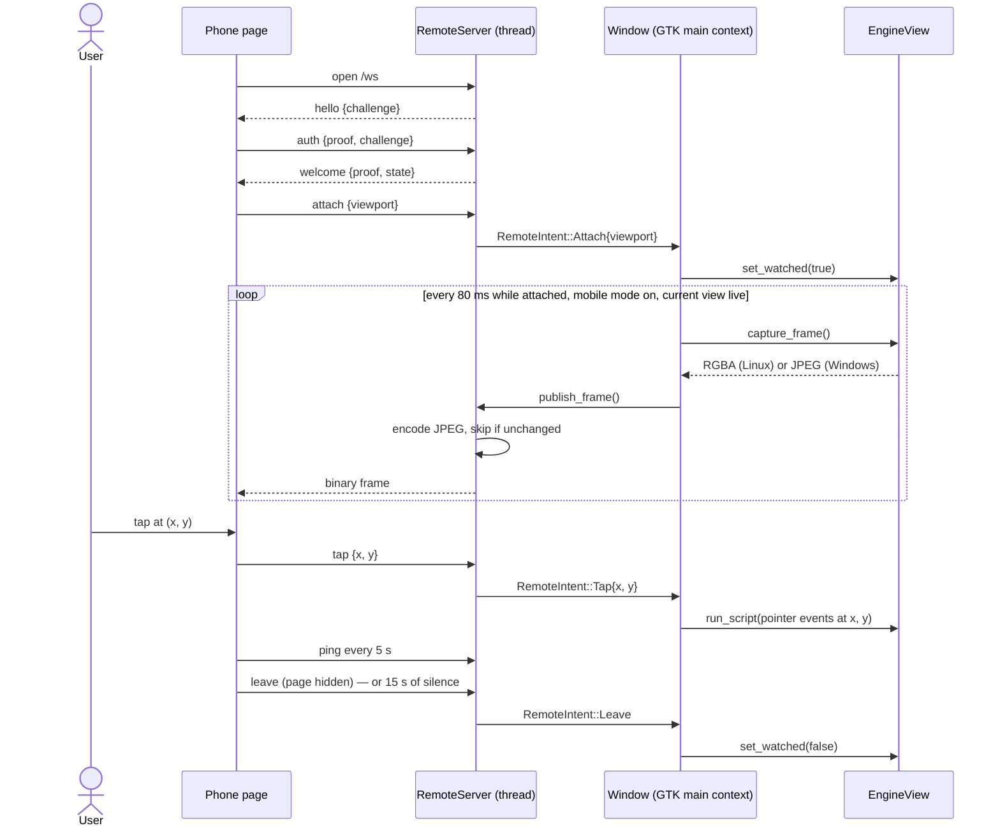
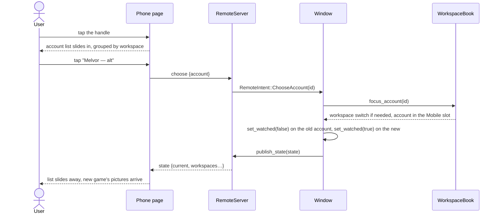

# 13 — Operating an account from a phone

**Depends on:** 11, 12 · **Status:** in-progress · **Estimate:** 13

## Context

This application runs several browser idle games at once on a desktop computer
that stays switched on all day. Each game is an account with its own isolated
browser storage, shown in a place on a grid, and the whole point of the program
is to keep those games ticking while costing as little memory and power as
possible. When nobody is at the desk, the window is minimised and the games
marked to keep running do so at full speed with nothing drawn on screen.

The owner is away from that desk for most of the day and needs to act on a game
roughly every half hour. Today that means opening a general remote-desktop app
on a phone, which shows the whole desktop window, with its grid of two or four
games, squeezed onto a six-inch screen. Every action starts with pinching and
panning to find the button. This item replaces that with a phone experience
built for the phone: one game at a time, filling the screen, laid out by the
game itself for a phone-sized viewport, with taps that land where the finger
went.

The phone does not run the game. Running a game on the phone was ruled out
earlier because both phone systems suspend or slow a background web page and
give an app no way to stop them, which is the exact problem this application
exists to defeat. Instead the game keeps running on the desktop, and the phone
sees a live picture of it. The desktop takes a snapshot of the game's page many
times a second, compresses each into a small image, and sends it to the phone
over a persistent connection. A tap on the phone is sent back as a coordinate,
and the desktop delivers it to the page as a click at that point. The result is
live enough that animations play and a tap on something that just appeared
lands, with well under a second between the tap and its visible effect.

For the picture to make sense on a phone, the desktop has to show the game at a
phone's shape. So the item adds a fourth arrangement, called mobile mode, that
shows exactly one game in a slot the size and shape of the enrolled phone's
screen. Every game the owner plays already has a mobile layout, so given a
phone-shaped viewport the game arranges itself for a phone on its own. Mobile
mode is switched on from the desktop or from the phone. It is only a layout:
it is never saved, so the program always starts in the arrangement it had
before, and leaving it puts the previous arrangement back exactly.

The phone experience is a single web page the desktop itself serves. The owner
opens it in the phone's browser once and adds it to the home screen, after
which it opens like an app. Choosing a web page rather than a native app means
one build covers Android and iPhone at once. The page shows the game full
screen, with a small handle that opens a list of every account grouped by
workspace, each with the same state word the desktop sidebar uses. From that
list the owner can switch to another account, park one, or start one that is
stopped, and nothing more. Adding, renaming, regrouping or deleting an account,
changing settings, or steering a game to another website are all impossible
from the phone by construction: the desktop only understands the handful of
messages the phone is allowed to send.

Reaching the desktop from outside the home works through a private mesh
network the owner installs on both devices. That gives an encrypted path from
the phone to the desktop from any network with internet access, home Wi-Fi or
mobile data alike, without opening a port on the home router or configuring
anything on it. The desktop listens only on its address inside that private
network, so nothing on the public internet or on a shared Wi-Fi can even see
it. On top of that the application adds its own proof of identity. Exactly one
phone is enrolled, by scanning a code shown on the desktop screen while
standing at it. Every later connection has to prove it holds the secret minted
at enrolment before the desktop sends a single picture, and the phone checks
the desktop's proof too before it shows anything. Anyone else gets nothing,
not even a login prompt. Un-enrolling from the desktop cuts off the phone at
once, mid-session if need be.

The cost rule of the whole project holds here. While no phone is connected,
the desktop behaves exactly as it does today, minimised with its games ticking
and nothing being drawn or encoded. While a phone is watching, only the one
game on the phone screen is snapshotted and sent, and a game that is not marked
to keep running is woken for as long as the phone is looking at it and put back
to rest the moment the phone moves on, without changing the owner's per-account
choice. A phone that vanishes without saying goodbye, because its battery died
or its signal dropped, is treated as gone after fifteen seconds of silence and
the encoding stops on its own.

The desktop side works the same whether the desktop runs Linux or Windows: the
snapshot and the click delivery each go through the engine seam the Windows
work built, with one implementation per engine behind it.

## User Experience

- **Entry** — On the desktop, a fourth toggle labelled `Phone` joins the
  linked `1` `2` `4` layout toggles in the header bar and switches mobile mode
  on and off. A new header-bar menu button holds `Enrol a phone…` and
  `Un-enrol the phone`. On the phone, the experience is the web page reached
  from the enrolment link and added to the home screen.
- **Flow** — Enrol: open the header menu → `Enrol a phone…` → the phone
  dialog shows a QR code and the same address as text, valid for ten minutes
  → scan it with the phone → the phone's browser opens the page, which
  stores its credential and shows the mobile mode toggle → the dialog's
  status line changes to `Phone enrolled` and the QR code disappears.
- **Flow** — Turn on mobile mode from the phone: tap the toggle → the desktop
  switches to the `Mobile` layout at the phone's own screen size → the page
  shows the current account's game filling the screen within a second.
- **Flow** — Switch account: tap the handle in the top-left corner → the
  account list slides in over the game → tap a name → the list slides away and
  the game changes to that account. If that account belongs to another
  workspace, the desktop switches workspace, as clicking its sidebar row does.
- **Flow** — Park or start from the phone: in the list, each account row
  carries one button reading `Park` while it runs and `Start` once it is
  parked; tapping it does what the desktop's row menu item does, and the row's
  state word follows.
- **Flow** — Tap and scroll the game: a short touch is a tap at that point; a
  drag scrolls the page under the finger. There is no keyboard.
- **Flow** — Leave: switch to another app, lock the phone, or open the list
  and choose nothing. The desktop stops sending pictures within a second and
  the account it was showing returns to its resting behaviour. Coming back
  resumes on the same account.
- **Flow** — Turn mobile mode off from either end → the desktop restores the
  arrangement it had before mobile mode was entered and the phone page shows
  only the toggle again.
- **Flow** — Un-enrol: header menu → `Un-enrol the phone` → the phone is cut
  off at once, its page reads that it was un-enrolled and offers nothing else,
  and the desktop's dialog status returns to `No phone enrolled`.
- **States** — Mobile mode off, phone connected: the page shows only the
  mobile mode toggle, centred, and nothing else.
- **States** — Current account parked, queued or starting: the page shows the
  account's name, its state word and a `Start` button (insensitive while
  starting or queued) where the game would be, mirroring the desktop's
  absent-game panel.
- **States** — Active workspace holds no accounts: the page shows the line
  `No games in this workspace` where the game would be, and the list still
  opens.
- **States** — Connecting or reconnecting: the last picture stays dimmed under
  a one-line `Reconnecting…` label; taps are not sent until the connection
  proves itself again.
- **States** — Refused: after un-enrolment, or when the stored credential no
  longer matches, the page shows one line, `This phone is no longer enrolled`,
  and no controls.
- **States** — Desktop phone dialog, not listening: when no private-network
  address was found at start-up, the dialog's status line reads
  `Not listening: no mesh network address found` and `Enrol a phone…` is
  insensitive; the rest of the dialog stays usable.
- **States** — Desktop, `Mobile` layout: the grid shows one phone-shaped slot
  centred on the window background, with the slot's outline drawn around it;
  when the window is shorter than the slot, the slot is clipped at the bottom
  rather than scaled, so the page's viewport stays the phone's.
- **Pattern** — The phone list's state words are the desktop sidebar's own
  liveness vocabulary and nothing else (design rule 1, `session_sidebar/row.rs`
  `status_key`).
- **Pattern** — The phone row's Park/Start button is the one inverting control
  of design rule 2, insensitive while starting or queued.
- **Pattern** — The phone's absent-game panel is the plain centred panel of
  design rule 4: name, one state line, one button.
- **Pattern** — A workspace heading in the phone list carries no dot and no
  mark of which workspace is shown (design rule 13).
- **Pattern** — The phone dialog's not-listening line is design rule 8's one
  dim line inside a form that keeps working, never a modal.
- **New pattern** — a fixed-size, phone-shaped slot centred in the grid, with
  its outline drawn and its overflow clipped rather than scaled. Nothing in
  `docs/design.md` covers a slot that does not fill its share of the window;
  the design doc owes a rule once this ships.
- **New pattern** — a dialog that shows a QR code and the same address as
  selectable text for a fixed time. Nothing in `docs/design.md` covers a
  pairing screen; the design doc owes a rule once this ships.
- **New pattern** — the phone page itself: a full-screen picture with a
  top-left handle that slides an account list over it. It is HTML the
  application serves, outside GTK; `docs/design.md` owes a short section on
  what of its rules carry to it once this ships.

### Enrolling the phone

```mermaid
sequenceDiagram
    actor User
    participant Dialog as Phone dialog (GTK)
    participant Link as PhoneLink (remote crate)
    participant Browser as Phone browser
    User->>Dialog: header menu → Enrol a phone…
    Dialog->>Link: begin_enrolment()
    Link-->>Dialog: one-time address, valid 10 min
    Dialog-->>User: QR code + address text + countdown
    User->>Browser: scan the code
    Browser->>Link: GET /enrol/{code}
    Link->>Link: mint device id + secret, replace any earlier phone, persist
    Link-->>Browser: 200, page with the credential embedded, cookie with the device id
    Browser->>Browser: store the credential, open the socket
    Link-->>Dialog: phone_status() = Enrolled
    Dialog-->>User: status "Phone enrolled", QR code gone
```

Screen: the desktop's phone dialog and the phone's browser. Components: the
dialog's status line, QR picture, address label and countdown; the remote
crate's enrolment route. States: `No phone enrolled` → enrolling (QR shown) →
`Phone enrolled`; an expired code returns the dialog to the first state with
the line `The code expired; start again`. The user sees the code, scans it,
and watches the dialog confirm.

### Watching and tapping a game



Screen: the phone page's game view. Components: the page's canvas, the remote
server's socket handler, the window's capture timer, and the engine seam's new
capture and script calls. States: connecting (dimmed last picture), attached
(live pictures), left (no pictures). The user sees the game move and their tap
take effect within a few hundred milliseconds.

### Switching account from the phone



Screen: the phone page's list. Components: the list's workspace headings and
account rows with state words and Park/Start buttons. States: a row keyed by
its liveness word; the current account's row highlighted. The user sees the
list close and the other game appear.

### Entering and leaving mobile mode on the desktop

```mermaid
sequenceDiagram
    actor User
    participant Header as Header bar toggles
    participant Window as Window
    participant Book as WorkspaceBook
    participant Grid as SessionGrid
    User->>Header: press "Phone"
    Header->>Window: layout toggle → Mobile
    Window->>Book: enter_mobile_mode(viewport)
    Book->>Book: snapshot the active workspace's layout, focus and slots; set_layout(Mobile)
    Window->>Grid: sync(book)
    Grid-->>User: one phone-shaped slot centred, outline drawn
    Window->>Window: request_save() — saved() writes the pre-mobile arrangement
    User->>Header: press "2"
    Header->>Window: layout toggle → SideBySide
    Window->>Book: leave_mobile_mode(); set_layout(SideBySide) if it differs
    Book->>Book: restore every snapshotted workspace
    Window->>Grid: sync(book)
    Grid-->>User: the arrangement from before, then two slots
```

Screen: the main window. Components: the header's four linked layout toggles,
the grid's slot allocation, the book's mobile mode. States: mobile mode on (one
fixed slot) and off (the ordinary layouts). The user sees the window become a
phone-shaped frame and later return to exactly what it was.

## Technical Details

### Back-end

The back-end here means the non-widget crates, as `docs/roadmap/README.md`
defines the term for this repository: the domain in `idle-manager-core`, the
disk adapter in `idle-manager-store`, a new network adapter, and the
composition root. Everything obeys `docs/architecture.md` rules 1 to 11 and
`docs/code-standards.md` throughout; the specific rules are named where they
bite.

**A sixth crate, `idle-manager-remote`.** Add `crates/idle-manager-remote/`
(naming rule 5), a driving adapter beside the shell: it turns network messages
into domain intents and domain state into network messages. It depends on
`idle-manager-core` only (architecture rule 2), never on the shell, the store
or metrics. `scripts/arch-check.sh` gains the rule
`idle-manager-remote gtk4 gdk4 glib gio webkit6 wry webview2-com gdk4-win32 idle-manager-shell idle-manager-store idle-manager-metrics`
and adds `idle-manager-remote` to the shell's, store's and metrics' forbidden
lists (architecture rule 4). The architecture doc's shape diagram, folder
structure and "Where a change goes" table name the crate. This is a new
concept for the project, flagged here on purpose: the first adapter that
*drives* the application from outside besides the shell. Its dependencies,
declared in the workspace root and pinned to a minor version per
`docs/stack.md`: `serde` and `serde_json` for the wire messages, `sha1` and
`base64` for the WebSocket handshake, `hmac` and `sha2` for the enrolment
proofs, `rand` for secrets and nonces, `jpeg-encoder` for frames, and
`if-addrs` to find the mesh address. It runs on plain `std::thread`s with
blocking `std::net` sockets — no `tokio` (`docs/stack.md`) and no glib — so
its integration tests drive it with a plain TCP client and need no display
(architecture rule 14, code standards rule 25).

**The domain vocabulary, in `idle-manager-core`.** Add `remote.rs` (code
standards rule 9) holding the types both sides share. `RemoteIntent` is an
enum with exactly these variants and no others: `Attach { viewport: Viewport }`,
`Leave`, `ChooseAccount(SessionId)`, `Park(SessionId)`, `Start(SessionId)`,
`SetMobileMode(bool)`, `Tap { x: u32, y: u32 }` and
`Scroll { x: u32, y: u32, dx: i32, dy: i32 }`. That closed set *is* the
boundary Remote Access `FR.6.3` demands: adding, renaming, regrouping,
deleting, keep-awake, loading another site, layout and zoom are not
representable, so the desktop refuses them by type (code standards rule 1).
`RemoteState` is the snapshot the phone renders: `mobile_mode: bool`,
`viewport: Viewport`, `current: Option<SessionId>`, and
`workspaces: Vec<RemoteWorkspace>` where each holds its name and
`accounts: Vec<RemoteAccount { id, name, liveness: Liveness }>`, built from a
`WorkspaceBook` by `RemoteState::from_book`. `Viewport { width: u32, height: u32 }`
is in logical pixels, with `DEFAULT_MOBILE_VIEWPORT` of 412 × 915 (code
standards rule 5) for mobile mode entered with no phone attached
(`FR.3.2`). `Frame` is `Rgba { width, height, stride, bytes: Vec<u8> }` or
`Jpeg(Vec<u8>)`, the two shapes the two engines capture in. `PhoneStatus` is
`NotListening { reason }`, `NotEnrolled`, `Enrolled { attached: bool }`.
`EnrolledPhone { device_id: String, secret: Vec<u8>, enrolled_on: String }`
is the record the store keeps. The attach policy is pure and clocked from
outside (architecture rule 9): `Presence::observe(now_millis)` with the
constants `HEARTBEAT_INTERVAL_SECS = 5` and `SILENCE_LIMIT_SECS = 15` decides
when a silent phone counts as gone (`FR.4.5`), unit-tested with numbers.

**Two new ports in `ports.rs`** (architecture rules 5 and 6; naming rule 10).
`PhoneLink: Send + Sync` is what the shell holds: `publish_state(&RemoteState)`,
`publish_frame(Frame)`, `begin_enrolment() -> EnrolmentOffer { address: String, expires_in_secs: u64 }`,
`cancel_enrolment()`, `revoke_phone()` and `phone_status() -> PhoneStatus`.
`PhoneRecordStore: Send + Sync` is what the remote crate reads and writes
through: `read() -> Result<Option<EnrolledPhone>, PhoneRecordError>`,
`write(&EnrolledPhone)` and `clear()`. Intents travel the other way as values
on an `async_channel::Receiver<RemoteIntent>` the server hands out at start;
the shell polls it on the main context, so no widget is ever touched from the
server's thread (architecture rule 10).

**Mobile mode in the domain.** `Layout` gains a fourth variant, `Mobile`,
with `slot_count() == 1` (`FR.3.1`: it is a layout and nothing more).
`WorkspaceBook` gains `enter_mobile_mode(viewport)`, `leave_mobile_mode()`,
`is_mobile_mode()`, `mobile_viewport()` and `set_mobile_viewport(viewport)`.
Entering records, per workspace the mode touches, an `Arrangement` snapshot
— its layout, focused slot and every account's slot — the first time that
workspace is shown while the mode is on, then applies `set_layout(Mobile)`
through the existing placement pass, so the overflow goes off-grid exactly as
`FR.3.2` describes. Leaving restores every snapshot: an account deleted since
is skipped, an account added since keeps the place it has (`FR.3.5`).
`saved()` substitutes each snapshot for the live arrangement while the mode is
on, so `sessions.toml` never records `Mobile` and a restart opens in the usual
layout (`FR.3.4`, `FR.3.5`); liveness changes made meanwhile are still
written. The store's `LayoutRecord` gains no variant; its `From<Layout>` maps
`Mobile` to `Single` behind a comment naming that `saved()` never emits it
(code standards rule 18, architecture rule 7). `Session::zoom_for(Layout::Mobile)`
returns `ZoomLevel` 1.0 always and `zoom_in`, `zoom_out` and `reset_zoom` are
no-ops in that layout: the slot's pixel size *is* the phone's viewport, and a
zoom would change the page's viewport out from under the game. `RememberedZoom`
therefore never holds a `mobile` key.

**Delivering a tap and a scroll.** The core builds the script text: pure
functions `tap_script(x, y)` and `scroll_script(x, y, dx, dy)` in `remote.rs`
return the JavaScript the seam runs. A tap finds `document.elementFromPoint`,
then dispatches `pointerdown`, `mousedown`, `pointerup`, `mouseup` and `click`
at those client coordinates; a scroll walks up from the element to the nearest
scrollable ancestor, or the window, and adds the deltas. Both are unit-tested
as strings, so the shell does no string building (architecture rule 8).

**The store.** `idle-manager-store` gains `phone_record.rs` with
`TomlPhoneRecord` implementing `PhoneRecordStore`, writing
`<XDG config>/idle-manager/phone.toml` (paths added to `paths.rs` beside
`workspace_file`) with its own serde record types mapped from `EnrolledPhone`
(architecture rule 7). On Unix the file is created with mode `0600`
(`std::os::unix::fs::OpenOptionsExt`, `#[cfg(unix)]`); the secret is stored as
hex. The same file's optional `[listen] address = "auto" | "<ip>:<port>"` key
overrides address discovery, read by `TomlPhoneRecord::listen_override()`.
Reads tolerate a missing file as `None`; a malformed file is an error the
composition root logs and treats as `NotEnrolled` after moving the file
aside, the `TomlWorkspaceStore` precedent.

**The server, in `idle-manager-remote`.** `RemoteServer::start(config, record_store) -> Result<(RemoteHandle, async_channel::Receiver<RemoteIntent>), StartError>`.
`config` is `RemoteConfig { bind: SocketAddr }`; `bind_address(override)` in
`address.rs` returns the first IPv4 address in `100.64.0.0/10` found by
`if-addrs` — the range the mesh network assigns — on port
`DEFAULT_PHONE_PORT = 7466`, or the override, or `StartError::NoMeshAddress`,
which the composition root turns into `PhoneStatus::NotListening` rather than
a failed launch (`FR.5.1`). `RemoteHandle` implements `PhoneLink` and is
`Clone + Send + Sync` over an `Arc<Mutex<Shared>>`. An accept thread hands
each connection to `http.rs`, a minimal HTTP/1.1 request parser serving
exactly three routes (the contract is `openapi.json`): `GET /enrol/{code}`
consumes a one-time code minted by `begin_enrolment` (32 random bytes, hex,
valid `ENROLMENT_CODE_TTL_SECS = 600`), mints a device id and a 32-byte
secret, replaces any earlier record through `PhoneRecordStore::write`
(`FR.6.1`), and answers with the client page carrying the credential in a
`<meta>` tag and a `Set-Cookie: idle-manager-phone=<device id>; Path=/;
Max-Age=31536000; SameSite=Strict; HttpOnly`. `GET /` serves the same page
only when that cookie matches the enrolled device id. `GET /ws` upgrades to a
WebSocket (RFC 6455 handshake: `Sec-WebSocket-Accept` = base64 of SHA-1 of
the key and the fixed GUID) only with that cookie. Every other request, and
every request without the cookie, is answered `404` with an empty body and no
`Server` header — nothing, not even a prompt (`FR.6.1`). `websocket.rs` frames
and unframes text and binary messages with masking; `protocol.rs` holds the
serde wire types and their mapping to `RemoteIntent` and from `RemoteState`
(architecture rule 7 applied to the wire).

**The session, in `session.rs` of the remote crate.** On upgrade the server
sends `hello { challenge }` and nothing else. The phone answers
`auth { proof, challenge }` where `proof` is HMAC-SHA256 over
`"phone|" + server challenge` keyed by the secret; the server verifies in
constant time (`hmac::Mac::verify_slice`), answers
`welcome { proof, state }` with its own HMAC over `"desktop|" + phone
challenge`, and only then treats the socket as the phone's (`FR.5.2`,
`FR.6.1`). A wrong proof closes the socket with no message. A second
authenticated socket replaces the first, for reconnects. After `welcome` the
server forwards `attach`, `leave`, `choose`, `park`, `start`, `mobile`, `tap`
and `scroll` as `RemoteIntent`s onto the channel, drops any other message with
a `tracing::warn!` and no reply (code standards rule 15), and treats `ping`
as a heartbeat for `Presence`. Attached means authenticated, `attach` received
and a heartbeat within the silence limit (`FR.4.4`, `FR.4.5`); losing it emits
`RemoteIntent::Leave` exactly once. `revoke_phone()` clears the record through
the store, sends `bye { reason: "revoked" }`, closes the socket and emits
`Leave` (`FR.6.2`). `publish_state` sends `state { … }` to an authenticated
socket; `publish_frame` puts the frame in a one-slot mailbox the connection
thread drains: it encodes `Frame::Rgba` to JPEG at quality 75 with
`jpeg-encoder`, passes `Frame::Jpeg` through, skips a frame whose bytes hash
equal to the last sent, and sends a binary message of two big-endian `u32`
(width, height) followed by the JPEG. Encoding happens on the server's thread,
never on the GTK main context (architecture rule 10). The server never sends a
frame while the phone is not attached or mobile mode is off (`FR.3.3`,
`FR.4.2`).

**The client page** is `crates/idle-manager-remote/assets/phone.html` (naming
rule 1), one file with its CSS and JavaScript inline, embedded with
`include_str!`. It is served on a plain-HTTP origin inside the mesh, where
`crypto.subtle` is unavailable, so it carries a small pure-JavaScript SHA-256
and HMAC for the proof. It reads the frame's width and height from the binary
header, draws the JPEG onto a canvas scaled to fit the screen, and maps touch
coordinates back through that scale into viewport pixels before sending
`tap` and `scroll`. It sends `attach` with `window.innerWidth` and
`window.innerHeight` when it is visible and an account is chosen, `leave` on
`visibilitychange` to hidden and on `pagehide`, and `ping` every five seconds.
It requests fullscreen on the first tap where the browser allows it and
carries the `<meta name="apple-mobile-web-app-capable">` and viewport tags so
"Add to Home Screen" opens it standalone on both systems (`FR.1.5`).

**The composition root**, `crates/idle-manager/src/main.rs`, builds
`TomlPhoneRecord`, calls `RemoteServer::start` and passes the handle as
`Arc<dyn PhoneLink>` plus the intent receiver into a new `WindowPorts.phone`
field (architecture rule 3); a `StartError` is logged and becomes a
`NotListening` status the dialog shows. `make verify` is unchanged in shape;
`make windows-check` covers the new crate because it is pure std.

**Measurements**, recorded in a `## Measured` section on this README as item
04 did: tap-to-visible latency and frame rate on the home network and on
mobile data; processor use of the whole process tree while attached versus
resting, sampled with `make memory-report`'s method; the memory added by the
remote crate at rest. `docs/memory-budget.md` gains a line for the resting
state with the server listening, which must be within noise of today's
figures (`FR.4.1`).

### Front-end

Everything here lives in `idle-manager-shell` under `docs/architecture.md`
rules 8, 10, 12 and 13 and `docs/code-standards.md` rules 17, 18, 25 and 28;
design rules are in `docs/design.md`.

**The engine seam grows three calls**, each with a WebKit and a WebView2
implementation behind `web_engine.rs` (roadmap item 12's seam), so the rest
of the shell never names an engine. `EngineView::capture_frame(done)` takes
a one-shot callback receiving `Result<Frame, EngineCaptureError>`: on Linux
`WebView::snapshot(SnapshotRegion::Visible, SnapshotOptions::NONE)` yields a
`gdk::Texture` that is downloaded to RGBA on the main context and returned as
`Frame::Rgba`; on Windows `ffi.rs` calls `ICoreWebView2::CapturePreview` with
`COREWEBVIEW2_CAPTURE_PREVIEW_IMAGE_FORMAT_JPEG` into an `IStream` and returns
`Frame::Jpeg`, hopping back to the main context with `invoke_local`.
`EngineView::run_script(source)` calls `evaluate_javascript` on Linux and
`wry::WebView::evaluate_script` on Windows, logging a failure with the session
field and never surfacing it. `EngineView::set_watched(on)` is the phone's
wake (`FR.4.3`): on Windows it forces `set_background(false)` while on and
reapplies `background_for(minimised, keep_awake)` when off; on Linux it flips
the two hidden-page features through `apply_keep_awake(view, on || keep_awake)`
without a reload and arms the frame shim through `run_script`. For that,
`resources/js/keep-awake.js` is injected into *every* page at document start,
not only keep-awake accounts, and reads a runtime flag: `window.__idleManager`
exposes `setAwake(on)` and `setHiddenFrameInterval(ms)`, the shim intercepts
`requestAnimationFrame` only while `document.hidden && awake`, and a keep-awake
account's prelude sets `awake = true` before the page runs, so item 04's
behaviour is unchanged. `set_watched(true)` runs `setAwake(true)` and
`setHiddenFrameInterval(WATCHED_FRAME_INTERVAL_MS = 33)`; `set_watched(false)`
restores the account's own flag and `HIDDEN_FRAME_INTERVAL_MS`. The deliberate
keep-awake toggle keeps its reload; only the phone's wake uses the runtime
path. A debug environment switch, `IDLE_MANAGER_DUMP_FRAMES=<dir>`, makes the
window write every captured frame to that folder, so the snapshot-while-
minimised question in Blockers is answered by a file on disk on each engine.

**`web_view.rs`.** `SessionView` gains `set_watched(on, minimised)` forwarding
to the live view with the remembered keep-awake flag, a no-op while parked,
and `run_script` and `capture_frame` pass-throughs.

**The `Mobile` layout in the grid.** `session_grid/imp.rs` `grid_dimensions`
returns `(1, 1)` for `Mobile`; `allocate_slots` gives slot 0 a rectangle of the
book's `mobile_viewport()` in logical pixels, centred horizontally, top-aligned
when the grid is shorter than it, and clipped by the existing
`set_overflow(Hidden)`; off-grid entries are allocated outside as today.
`draw_slot_lines` draws the slot's outline in `Mobile` so the phone shape is
visible against the window background (the new pattern above). No grip and no
grip strip are shown, the `Single` rule extended to `Mobile` in `sync` and
`sync_grip_strip` (design rule 14 on Windows). `SessionGrid::sync` reads the
viewport from the book.

**The header bar.** `window.ui` adds `layout_mobile`, a `gtk::ToggleButton`
labelled `Phone` in the linked `layout_toggles` group after `4`, and a
`gtk::MenuButton` `phone_menu` with `open-menu-symbolic` holding a `gio::Menu`
of `Enrol a phone…` (`win.enrol-phone`) and `Un-enrol the phone`
(`win.revoke-phone`, disabled while no phone is enrolled). `window/imp.rs`
`connect_layout_toggle` learns the fourth toggle: activating `Mobile` calls
`book.enter_mobile_mode(viewport)` with the attached phone's viewport when one
is attached, else `DEFAULT_MOBILE_VIEWPORT`; activating `1`, `2` or `4` while
the mode is on calls `leave_mobile_mode()` first, then `set_layout` if the
chosen layout differs from the restored one; `select_layout_toggle` maps
`Mobile` to the new toggle so a mode change from the phone flips it under the
existing re-entrancy guard. Both paths call `snap_zoom_for_active()` and
`redraw()` and `request_save()`. `handle_shortcut_key` and `apply_zoom_step`
return early with no readout while the active layout is `Mobile`.

**The phone dialog**, `phone_dialog.rs` with `phone_dialog/imp.rs` and
`ui/phone-dialog.ui` (architecture rules 12 and 13, naming rules 4 and 7),
registered in the GResource. It shows a status line driven by
`PhoneLink::phone_status()` — `No phone enrolled`, `Phone enrolled`,
`Phone connected`, or `Not listening: <reason>` in `dim-label` (design rule 8)
— a `gtk::Picture` for the QR code, the address as a selectable `gtk::Label`,
a countdown label, and two buttons: `Enrol…` (insensitive while not listening
or while a code is live) and `Un-enrol` (`destructive-action`, insensitive
while none is enrolled). `Enrol…` calls `begin_enrolment()` and renders the
address with the `qrcode` crate (pure Rust, added to the shell's dependencies)
into a `gdk::MemoryTexture`; a `glib::timeout_add_local` ticks the countdown
and calls `cancel_enrolment()` at zero with the line `The code expired; start
again`. The dialog polls `phone_status()` once a second while open, so the
line flips to `Phone enrolled` the moment the phone scans. `Un-enrol` calls
`revoke_phone()` and updates the line and the menu item's enabled state
(`FR.6.2`).

**Wiring the phone into the window.** `WindowPorts` gains
`phone: Option<PhonePorts { link: Arc<dyn PhoneLink>, intents: async_channel::Receiver<RemoteIntent> }>`
(`None` when the server failed to start; the dialog then reads the status from
a `NotListening` value the composition root builds). `Window::attach_ports`
spawns `glib::spawn_future_local` looping `intents.recv()` and calling
`apply_remote_intent` on the main context (architecture rule 10). That
function maps each variant onto the existing intent handlers and nothing else
(architecture rule 8): `ChooseAccount` → `focus_session`; `Park` →
`park_session` only when the account is `Live`; `Start` → `start_session` only
when it is `Parked`; `SetMobileMode(true)` → the same path as the `Phone`
toggle with the attached viewport, `SetMobileMode(false)` → the leave path;
`Attach { viewport }` → record `attached = true`, `set_mobile_viewport` if the
mode is on and the size differs, start the capture timer, `set_watched(true)`
on the current account's holder; `Leave` → stop the timer, `set_watched(false)`,
`attached = false`; `Tap` and `Scroll` → `run_script` with the core's script
text on the current account's live view, ignored while mobile mode is off or
the current account has no view. `redraw()` ends by calling
`link.publish_state(&RemoteState::from_book(&book))`, so every change the
sidebar sees, the phone sees (`FR.2.1`). The capture timer is a
`glib::timeout_add_local` every `FRAME_INTERVAL_MILLIS = 80` that calls
`capture_frame` on the current account's view only when attached, mobile mode
is on, the account is `Live` and no capture is in flight, and hands the result
to `publish_frame` (`FR.4.2`); switching account moves `set_watched` from the
old current to the new one before the next tick (`FR.4.3`). The current
account is `book.active().focused_session()`, the account in the `Mobile`
slot.

**The sidebar** is unchanged. Its `status_key` list is the vocabulary
`RemoteState` carries as `Liveness`; the phone page maps `Live` to `live`,
`Parked` to `parked`, `Starting` to `starting`, `Queued` to `queued` (design
rule 1). Item 08's seventh word joins that map when it lands; it is not a
dependency of this item.

### Technical References

- WebKitGTK's `webkit_web_view_get_snapshot` paints the page in the web
  process with compositing layers flattened, independently of the widget's
  on-screen frame, which is why it is the capture path rather than GTK's own
  widget rendering, which stops while the toplevel is minimised. Whether it
  also paints while the view's activity state says hidden is the first
  Blocker's measurement.
- WebView2's `ICoreWebView2::CapturePreview` returns PNG or JPEG of the view
  into an `IStream`; the environment already runs with
  `--disable-backgrounding-occluded-windows` (item 12), which is what should
  keep it painting while covered.
- Browsers expose `crypto.subtle` only on secure contexts; a plain-HTTP origin
  on a mesh address is not one, so the proof needs a script-level SHA-256.
  Everything else the page uses — WebSocket, canvas, pointer events, the Page
  Visibility API, fullscreen — works on an insecure origin.
- Events dispatched from script carry `isTrusted = false`. Games built on
  ordinary click and pointer handlers accept them; a framework that checks the
  flag would ignore the tap, so the three budgeted games are the acceptance
  test.
- The mesh network (Tailscale, or any WireGuard mesh) assigns addresses in
  `100.64.0.0/10`, authenticates both peers and encrypts the path, satisfying
  `FR.5.1` and the transport half of `FR.5.2`; the application's own proof
  covers the rest without depending on the mesh.
- The WebSocket handshake (RFC 6455 §4) is one SHA-1 over the client key and
  a fixed GUID, base64-encoded; framing is a two-to-fourteen-byte header plus
  client-side masking. Small enough to write against the RFC and test with a
  TCP client, which is why no HTTP framework is added.
- `jpeg-encoder` encodes a 412 × 915 RGBA frame in single-digit milliseconds at
  quality 75 and yields roughly 30 to 60 KiB, so twelve frames a second cost
  under 1 MiB/s on the wire.

## Blockers

- Whether either engine returns a current picture of a page while the window
  is minimised is unmeasured. `crates/idle-manager-shell/src/web_engine/webkit.rs`
  `set_background` is a permanent no-op because WebKit derives hiddenness from
  the toplevel's state, and item 04's `## Measured` section records that a
  minimised window is exactly when the engine treats every view as hidden. Task
  02's frame dump answers it on both engines; if a hidden view snapshots stale,
  the fallback is to stop marking the *watched* view hidden by keeping it in a
  small unminimised popup, which would need a decision.
- Whether flipping the two hidden-page features through `apply_keep_awake`
  (`webkit.rs`) takes effect on a page that has already loaded, without the
  reload `EngineView::set_keep_awake` performs today, is unmeasured. The frame
  shim's runtime flag covers animation frames either way; timer throttling may
  still slow a non-keep-awake game to one tick a second while watched.
- A WebGL canvas may snapshot black on a software paint path. `FR.19.7` made
  WebGL a per-preset field in `presets/*.toml`; the three games measured in
  `docs/memory-budget.md` decide whether any played game is affected.
- Script-dispatched events are untrusted (`isTrusted = false`). Whether the
  three games in `docs/memory-budget.md` act on them is only known once tried.
- The Windows VM in `scripts/windows-vm/compose.yml` has no mesh client and its
  network is Docker's; verifying the phone path there needs the `[listen]`
  override in `phone.toml` and a published port in that compose file.
- `window.ui` sets `default-height` 800, shorter than the 915-pixel default
  viewport; the `Mobile` slot is clipped at the bottom on a default-sized
  window, which the desktop user sees as a cut-off frame.
- A game that chooses its mobile layout from the user agent rather than the
  viewport keeps its desktop layout: `FR.10.5` fixed each account's identity
  to the engine's own, and this item does not change it.
