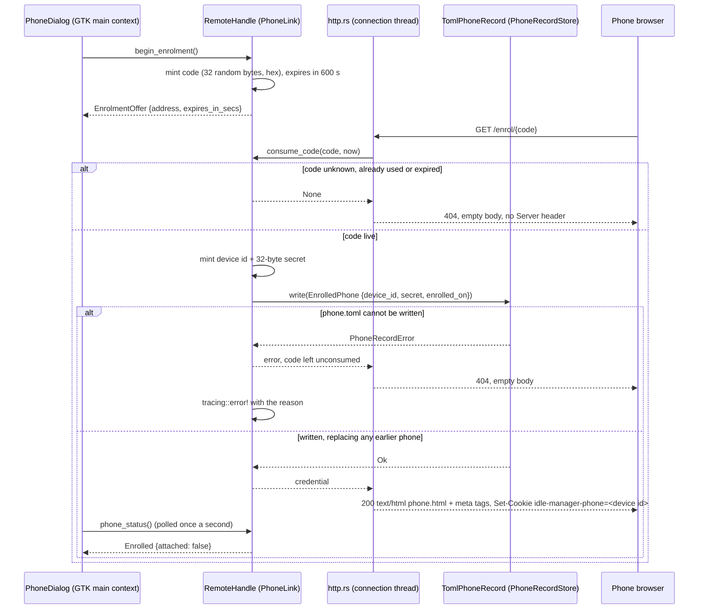
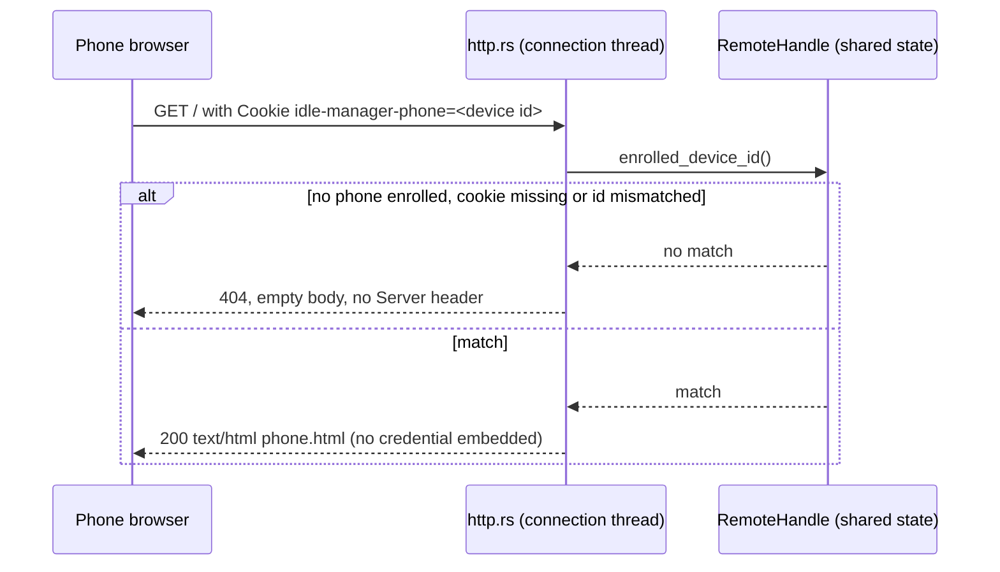
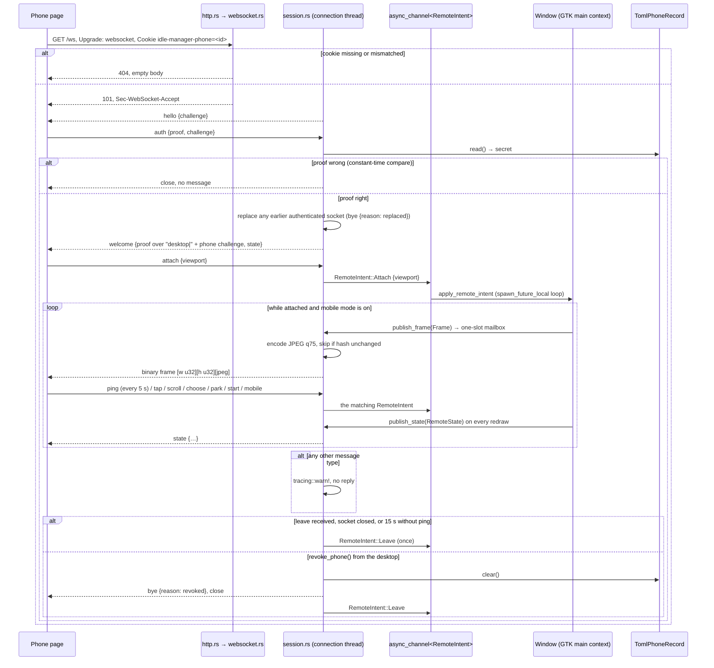

# Sequence diagrams

All three routes are new: the application serves no HTTP today. They are
served by `idle-manager-remote`, the sixth crate, on its own thread; the rule
doc is `docs/architecture.md`.

**Endpoint:** `GET /enrol/{code}`

**Architecture rules**

- Rule 2 — the remote adapter reaches the store only through the core's
  `PhoneRecordStore` port; the two adapters never depend on each other
- Rule 3 — the binary alone knows the record is a TOML file and hands the
  store into `RemoteServer::start`
- Rule 5 — `PhoneLink` and `PhoneRecordStore` are defined in the core for the
  capability, implemented outside for the technology
- Rule 7 — `phone.toml` has its own serde record types mapped from
  `EnrolledPhone`
- Rule 9 — code expiry takes `now` as an argument; the policy is tested with
  numbers
- Rule 10 — the dialog polls `phone_status()` from the GTK main context; the
  connection thread never touches a widget
- Rule 11 — `PhoneRecordError` is a `thiserror` enum defined beside the port in the core and returned by the store adapter

**Endpoint:** `GET /`

**Architecture rules**

- Rule 8 — serving the page changes no state; the page later drives the
  application only through intents
- Rule 14 — the route is covered by an integration test driving a plain TCP
  client, needing no display

**Endpoint:** `GET /ws`

**Architecture rules**

- Rule 1 — the intent and state types live in the core with no serde; the
  wire types in `protocol.rs` map to and from them
- Rule 7 applied to the wire — the JSON message shapes are the adapter's own
  types, so a domain rename never changes the protocol
- Rule 8 — every phone message becomes a `RemoteIntent` the window applies
  through its existing handlers; the server decides nothing about accounts
- Rule 9 — `Presence::observe(now_millis)` decides the silence limit from
  elapsed time passed in
- Rule 10 — JPEG encoding and socket I/O run on the connection thread;
  `apply_remote_intent` runs on the GTK main context via the channel
- Rule 14 — the handshake, the proof and the closed message set are covered
  by integration tests against a TCP client
