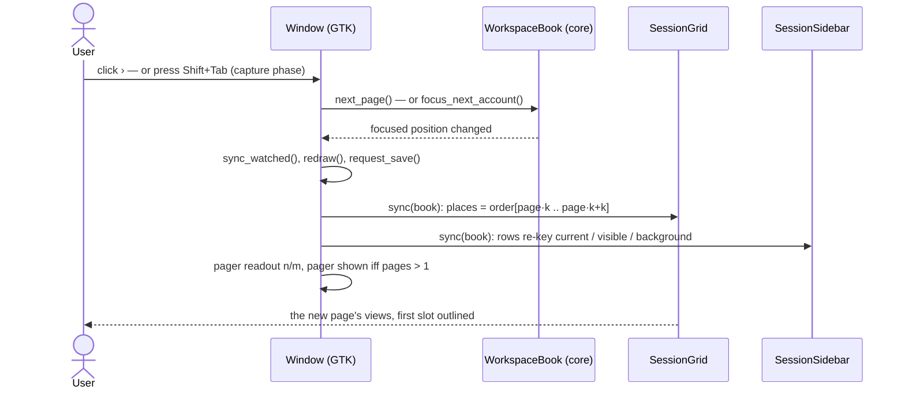
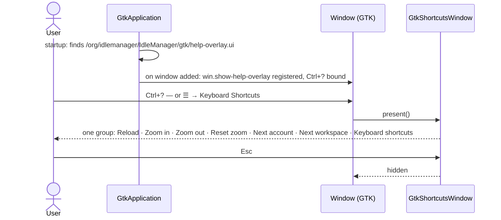

# 14 — Keyboard navigation and paged workspaces

**Depends on:** 11, 12, 13 · **Status:** done · **Estimate:** 13 · **Merged:** 2026-09-22

## Context

This application keeps several browser idle games running at once on a desktop
that stays on all day. Each game is an account with its own isolated browser
storage. Accounts are grouped into workspaces, and the window shows one
workspace at a time in one of three arrangements: one game filling the window,
two side by side, or four in a grid. There is also a phone-shaped arrangement,
added when the phone experience shipped, that shows one game at a phone's own
size. Every account in a workspace is listed in a sidebar, where a coloured dot
says whether it is on screen, running out of sight, or stopped.

Today the window has more accounts than places to show them, and the way the
extra ones are handled is the problem this item solves. Each account either
holds a place on screen or sits "off-grid", still running but unseen. To look at
an off-grid account the owner clicks its name in the sidebar, which swaps it
into whichever place is currently focused and pushes that place's occupant
off-grid. With four accounts in the two-game arrangement, seeing all four means
two sidebar clicks per round and a mental note of which one was displaced. And
because each account remembers a place of its own, switching arrangements
sometimes shows an account the owner was not looking at and hides one they
were. The keyboard helps none of this: a game's page owns the keyboard while it
has focus, so moving to another account or another workspace always means
reaching for the mouse.

This item replaces the place-per-account model with pages. A workspace's
accounts have one order — the order the sidebar already shows — and the screen
shows a page of that order: the first two accounts, then the next two, and so
on, with the page size set by the arrangement. Nothing is swapped and nothing
is displaced. Which page is showing follows from which account is focused, so
changing arrangement always keeps the focused account on screen, and clicking a
sidebar name simply turns to the page that holds it. Dragging an account into
another place still reorders, but only within the page it happened on. A small
pager appears in the header bar whenever a workspace has more than one page,
with arrows and a `2/3` readout, and it disappears when there is only one.

On top of pages come two keyboard shortcuts that work no matter what has the
keyboard. `Shift`+`Tab` steps to the next account, turning the page when it
reaches the end and wrapping from the last account to the first. `Ctrl`+`Tab`
steps to the next workspace that holds at least one account, landing on the
page and account that workspace was left on. Both keys are caught by the window
before any game page can see them, on Linux and on Windows alike, through the
same path the reload and zoom keys already use.

Two smaller things ride along because they belong to the same act of moving
around a whole workspace at once. A workspace heading's menu gains `Park all`
and `Start all`, which stop or start every account in the workspace with one
click instead of one row menu per account, and the ungrouped heading gains a
menu holding exactly those two. And the shortcuts are made discoverable from
the application itself: the pager and each workspace heading name their key in
a tooltip, and a standard shortcuts window, opened with `Ctrl`+`?` or from the
main menu, lists every key the window understands.

The saved workspace file changes shape with this item, since it no longer needs
to record a place per account. The format's version number goes up, an existing
file is read once and rebuilt from its order, and a copy of the old file is kept
beside it so an older build can still open it. The phone is unaffected: it
already follows the focused account, and a page turn is just another focus
change to it.

## User Experience

- **Entry** — The pager, in the header bar directly left of the `1` `2` `4`
  `Phone` layout toggles, shown only while the shown workspace has more than
  one page. `Shift`+`Tab` and `Ctrl`+`Tab` from anywhere in the window,
  including while a game page has the keyboard. `Park all` and `Start all` at
  the top of every workspace heading's ⋯ menu, `Ungrouped`'s included. A
  `Keyboard Shortcuts` item at the end of the ☰ menu, and `Ctrl`+`?`.
- **Flow** — Turn a page: click `›` or `‹` → the whole page changes → the new
  page's first slot is focused, its sidebar row goes bold → the readout reads
  the new `n/m`. Past the last page wraps to the first, and before the first
  wraps to the last.
- **Flow** — Next account: press `Shift`+`Tab` → the focus moves to the next
  occupied slot on the page; from the page's last account the page turns and
  the first slot of the next page is focused; from the last account of the
  last page the first page's first slot is focused. Holding the key does not
  repeat.
- **Flow** — Next workspace: press `Ctrl`+`Tab` → the sidebar's next workspace
  that holds an account is shown, on the page and slot it was left on, its
  layout toggle follows → the sidebar rows re-key to it. Empty workspaces are
  skipped; `Ungrouped` is in the cycle. Holding the key does not repeat.
- **Flow** — Click a sidebar name: the page holding that account is shown and
  its slot is focused; in the one-slot layout this is exactly today's swap.
  Nothing else moves.
- **Flow** — Change layout: the page holding the focused account is shown at
  the new size; the pager appears or disappears as the page count changes.
- **Flow** — Add an account to the shown workspace: it takes the end of the
  order; the screen turns to the page holding it and focuses it.
- **Flow** — Drag an account onto another slot of the same page: the two swap,
  or the account moves into the empty slot; the sidebar's order follows. No
  drop can reach another page.
- **Flow** — Park all: heading ⋯ → `Park all` → every running, queued or
  starting account in that workspace is parked, no confirmation; its slots show
  the plain stopped panel. `Start all` → every parked account in the workspace
  is queued and comes back one at a time, in order.
- **Flow** — Learn the keys: hover the pager → `Next account (Shift+Tab)`;
  hover a workspace heading → `Next workspace (Ctrl+Tab)`. ☰ → `Keyboard
  Shortcuts`, or `Ctrl`+`?` → a shortcuts window lists reload, zoom in, zoom
  out, reset zoom, next account, next workspace and the window itself.
- **States** — One page: the pager is hidden. One account in the workspace:
  `Shift`+`Tab` changes nothing. One non-empty workspace: `Ctrl`+`Tab` changes
  nothing. Both keys are still consumed, so the page never sees them.
- **States** — Sidebar in selection mode: both keys are consumed and change
  nothing; `Park all` and `Start all` are unreachable because the heading menu
  is hidden, as it is today.
- **States** — Last page part-empty: trailing slots show nothing, and a click
  on one changes nothing — the focus stays where it was.
- **States** — Heading menu: `Park all` is greyed when the workspace has no
  running, queued or starting account; `Start all` is greyed when it has no
  parked account. An empty workspace greys both.
- **States** — A workspace holding no account cannot be reached by
  `Ctrl`+`Tab`; it is still reachable by expanding its heading and, once an
  account is moved into it, by the key.
- **Pattern** — The pager is a linked box of two icon buttons and a label, the
  same linked-box shape as the layout toggles (`window.ui` `layout_toggles`,
  `.linked`), with `go-previous-symbolic` / `go-next-symbolic` icons.
- **Pattern** — `Park all` and `Start all` are menu items whose sensitivity
  follows the workspace's state, exactly as a row's Park/Start item is
  insensitive when it does not apply (design rule 2).
- **Pattern** — A parked slot shows the plain centred panel of design rule 4;
  `Park all` produces that panel in every slot at once.
- **Pattern** — A heading stays undecorated: no dot, no bold, no mark of the
  shown workspace (design rule 13). The tooltip is the only thing it gains.
- **Pattern** — The readout uses tabular figures so `9/10` and `10/10` are the
  same width, as design rule 11 already asks of a measured figure.
- **New pattern** — a pager in the header bar: two arrows around an `n/m`
  readout, hidden when there is one page. Nothing in `docs/design.md` covers
  paging through a workspace; the design doc owes a rule once this ships.
- **New pattern** — a GTK shortcuts window listing the window's keys. Nothing
  in `docs/design.md` covers a help overlay; the design doc owes a rule once
  this ships.

### Turning the page, from the pager or from Shift+Tab



Screen: the main window. Components: the header-bar pager (`‹`, readout,
`›`), the grid's slots, the sidebar rows. States: the focused position in the
shown workspace's order; the page derived from it. The user clicks an arrow or
presses `Shift`+`Tab` while a game has the keyboard; the game never receives
the key. They see the whole page change, the readout tick, and the current
row's bold move in the sidebar. With one page the pager is not there and
`Shift`+`Tab` moves the focus within the page only.

### Next workspace with Ctrl+Tab

```mermaid
sequenceDiagram
    actor User
    participant Window as Window (GTK)
    participant Sidebar as SessionSidebar
    participant Book as WorkspaceBook (core)
    User->>Window: press Ctrl+Tab (capture phase)
    Window->>Sidebar: is_selecting()?
    alt selection mode
        Sidebar-->>Window: true
        Window-->>User: nothing changes; key consumed
    else
        Window->>Book: focus_next_workspace()
        Book-->>Window: Switch { from, to } or None (one non-empty workspace)
        Window->>Window: select_layout_toggle(to.layout), snap_zoom_for_active()
        Window->>Window: sync_watched(), redraw(), request_save()
        Window-->>User: the next workspace, on the page and slot it was left on
    end
```

Screen: the main window. Components: the layout toggles, the grid, the sidebar
rows and headings. States: which workspace is shown; whether the sidebar is in
selection mode. The user presses `Ctrl`+`Tab`; they see the grid swap to the
next non-empty workspace in sidebar order, the layout toggle follow that
workspace's arrangement, and the bold row move under a different heading. In
selection mode nothing moves and the key is still swallowed.

### Park all and Start all

```mermaid
sequenceDiagram
    actor User
    participant Sidebar as SessionSidebar
    participant Window as Window (GTK)
    participant Book as WorkspaceBook (core)
    participant Queue as StartQueue
    User->>Sidebar: heading ⋯ → Park all
    Sidebar->>Window: on_park_all(workspace)
    Window->>Book: park_all(workspace)
    Book-->>Window: [(id, liveness before)] for every account parked
    loop each id
        alt was Live
            Window->>Window: holder.stop(), grid.release_view(id)
        else was Queued
            Window->>Window: nothing — the queue skips a no-longer-queued id
        else was Starting
            Window->>Window: park_on_paint.insert(id); parked at finish_starting
        end
    end
    Window->>Window: redraw(), request_save()
    User->>Sidebar: heading ⋯ → Start all
    Sidebar->>Window: on_start_all(workspace)
    Window->>Book: queue_parked(workspace)
    Book-->>Window: ids now Queued, in workspace order
    Window->>Queue: enqueue(ids) — begins, or appends to a draining queue
    Queue->>Window: start_session(id), one at a time
```

Screen: the sidebar's heading menu and the grid. Components: the two menu
items, the slot panels, the rows' dots. States: each account's liveness —
live, parked, starting, queued. The user picks `Park all`; every row under the
heading turns to the grey parked dot and every slot on the shown page shows the
stopped panel with its `Start` button. They pick `Start all`; rows turn purple
(queued), then blue (starting) one at a time, then green as each page paints.
Each item is greyed when it would touch nothing.

### The shortcuts window



Screen: the shortcuts window over the main window. Components: GTK's own
`GtkShortcutsWindow` built from a `.ui` resource, and the ☰ menu's new item.
States: shown or hidden. The user opens it from the key or the menu, reads the
list, and closes it with `Esc` or the close button; nothing in the workspace
changes.

## Technical Details

### Back-end

The back-end here means the non-widget crates, as `docs/roadmap/README.md`
defines the term for this repository: the domain in `idle-manager-core` and the
disk adapter in `idle-manager-store`. Everything obeys `docs/architecture.md`
rules 1 to 9 and `docs/code-standards.md` throughout; the specific rules are
named where they bite. The remote crate and the metrics crate are untouched.

**The seat model, in `idle-manager-core/src/session.rs`.** `Session` loses its
`visibility` and `remembered_slot` fields; it keeps id, name, address, liveness,
keep-awake, identity, WebGL and zoom memory. `SessionBook` keeps `sessions:
Vec<Session>` as the workspace's one order, `layout: Layout`, and replaces
`focused: SlotId` with `focused: usize`, the position in that order of the
focused account (`FR.22.2`). Every seat is derived, never stored (code
standards rule 1 — the two-field state where a slot and a visibility could
disagree is gone): with `k = layout.slot_count()`, `page_of(position) =
position / k`, `slot_of(position) = SlotId::new(position % k)`, and the shown
page is `page_of(focused)`. `SessionBook` gains `page_count() -> usize`
(`sessions.len().div_ceil(k)`, `0` for an empty book), `page() -> usize`,
`placement(&SessionId) -> Option<Visibility>` (`InSlot(slot_of(p))` when
`page_of(p) == page()`, `OffGrid` otherwise, `None` for an unknown id — the
same answer type the shell already reads, so `Visibility` stays as the derived
vocabulary), and `focused_session()` becomes `sessions.get(focused)`. `focused`
is clamped on every mutation: `sessions.is_empty()` leaves it `0`, otherwise it
is always `< sessions.len()`, and a helper `keep_focus_on(id_before)` moves it
to wherever the account that held it now sits, so a reorder or a removal never
changes which account is focused unless that account is gone. `set_focused(SlotId)`
becomes `focus_slot(SlotId) -> bool`, which moves `focused` to
`page() * k + slot.index()` only when that position holds an account and
returns whether it did — a click on an empty trailing slot changes nothing.
`set_layout(Layout)` now changes only `layout`: the page is recomputed from the
unchanged `focused`, which is what makes a layout switch keep the focused
account on screen (`FR.22.2` refining `FR.3.2`). `focus_session(id)` becomes
"set `focused` to `id`'s position" and returns whether the page changed
(`FR.22.3`); the `Placement` type, `bring_into_focus` and `layout.rs`'s
`arrange` are deleted with the swap-and-displace behaviour they implemented.
`add` and `add_from_preset` push to the end of the order and set `focused` to
the new account's position, so the shown page turns to it; nothing is
displaced (`FR.22.1`). `remove`/`take` drop the account and clamp. `adopt`
pushes to the end and leaves `focused` alone, so an account moved into a
hidden workspace does not change what that workspace shows.

**Paging and stepping, in `session.rs`.** Add `focus_next() -> bool`, which
sets `focused = (focused + 1) % len` and returns whether it moved (`false` for
a book of one or none): walking A, B, turn, C, D, turn, A of `FR.23.1` is
exactly `+1` modulo the length once pages derive from positions. Add
`next_page() -> bool` and `previous_page() -> bool`, which set `focused` to
`((page() ± 1) mod page_count()) * k` — slot 1 of the new page — and return
`false` when `page_count() <= 1` (`FR.22.5`). Each is a unit test in the file's
`tests` module (code standards rules 21–24): the four-in-two walk, the wrap,
the one-account no-op, the part-empty last page, and the clamp after a removal.

**Drops, in `session.rs`.** `move_to_slot(account, target: SlotId) ->
MoveOutcome` keeps its name and its three outcomes but works on positions
(`FR.22.4`): the source position `p` is the account's index; the target
position is `page() * k + target.index()`. If the target position holds an
account, the two swap in the `Vec` and the outcome is `Swapped`; if it is past
the end of the order — an empty trailing slot on the last page — the account is
removed from `p` and pushed to the end, outcome `Filled`. `Unchanged` when the
target is the source, outside the layout, or the id is unknown or on another
page (it cannot be, since only the shown page has places, but the book's answer
is trusted over the caller's). `keep_focus_on` runs after either change, so a
drop moves the focus with the dragged account as today. Every other page's
accounts keep their positions because both edits stay inside the page's slice
of the `Vec`. `FR.14.7`'s "rewrite the list to read like the window" is
satisfied trivially — the list *is* the window's order.

**Workspaces, in `workspace_book.rs`.** `WorkspaceBook::focus_account(id)`
keeps its signature and `Switch` result; it now calls the book's
`focus_session`. Add `focus_next_workspace() -> Option<Switch>`: from the
active entry, walk `entries` forward with wraparound to the first whose book
has at least one session, skipping the active one; `None` when no other
qualifies (`FR.23.2`). Landing sets `active` and, in mobile mode, runs the
existing `apply_mobile_to_active`, so the landed workspace shows the page and
slot it was left on (`FR.18.3` — its `focused` is untouched). Add
`next_page()`, `previous_page()` and `focus_next_account()` as one-line
delegations to the active book, so the shell never reaches for `active_mut()`
for a navigation (architecture rule 8). Add `park_all(&WorkspaceId) ->
Vec<(SessionId, Liveness)>`, returning every account whose liveness was not
`Parked` with the liveness it had, after setting each to `Parked` — the shell
needs the "before" to know which engine act matches (`FR.24.1`). Add
`queue_parked(&WorkspaceId) -> Vec<SessionId>`, setting every `Parked` account
to `Queued` in workspace order and returning those ids (`FR.24.2`); this is a
new liveness transition, `Parked → Queued`, so `SessionBook` gains `queue(id)`
beside `park`, `unpark` and `mark_started`, guarded to act only on `Parked`.
Add `can_park_all(&WorkspaceId) -> bool` and `can_start_all(&WorkspaceId) ->
bool` for the menu items' sensitivity (`FR.24.3`). `MobileMode`'s snapshot
shrinks to `(Layout, usize)` — the layout and the focused position — because
order is untouched by the mode; `leave_mobile_mode` restores both, which keeps
Remote Access `FR.3.5`'s "puts the arrangement back exactly" true, and
`apply_mobile_to_active` becomes `set_layout(Layout::Mobile)` alone, since the
page holding the focused account is now what a layout switch shows. The named
workspace capacity `NAMED_WORKSPACE_CAPACITY` (`FR.15.3`) is kept: a named
workspace still holds at most four, so it pages only in the `Single`,
`SideBySide` and `Mobile` layouts; `Ungrouped` pages however many it holds
(`FR.22.1`). Lifting the cap is a separate decision, not slipped in here.
`Workspace`, the snapshot type `SessionBook::workspace()` builds, carries
`focused: usize` and per-account entries without a slot.

**The file, in `idle-manager-store/src/session_file.rs`.** `FORMAT_VERSION`
becomes `3`. `SessionEntry` drops `slot`; `WorkspaceRecord::focused` becomes
the position in the account list (architecture rule 7: the format has its own
types, mapped in `entry_to_account` and back). A version 3 file is read as is.
A version 2 file is read once and migrated: each workspace's list order is the
order, and `focused` is the position of the account whose `slot` equals the
record's `focused` — or `0` when no account holds that slot. The first write
over a version 2 file copies it to `sessions.v2.toml` beside `sessions.toml`,
the same one-time backup `V1_BACKUP_FILE` already does for version 1, so a
downgraded build can still open its arrangement (`FR.22.2`). A version 1 file
still migrates through the existing path, now landing in version 3's shape.
`WorkspaceReadError::UnsupportedVersion`'s message names versions 1, 2 and 3.
Integration tests in `crates/idle-manager-store/tests/` (naming rule 3, code
standards rule 25) cover: a v3 round trip, a v2 file whose focused slot is held
mapping to that account's position, a v2 file whose focused slot is empty
mapping to `0`, the v2 backup written once, and a v1 file landing as v3.

### Front-end

The front-end here is the shell crate, `idle-manager-shell`, obeying
`docs/architecture.md` rules 8, 10, 12 and 13, `docs/design.md` rules 2, 4, 11
and 13, and `docs/naming.md` rules 4 and 7 throughout.

**One shortcut table, in `window/shortcut.rs`.** Split the window's key
handling in two so both engines share one decision and one act. Add a pure
module `window/shortcut.rs` (code standards rule 9; naming rule 2) holding
`enum Shortcut { Reload, Zoom(ZoomStep), NextAccount, NextWorkspace }` and
`fn shortcut_for(key: gdk::Key, modifiers: gdk::ModifierType) -> Option<Shortcut>`.
It masks the modifiers with `gtk::accelerator_get_default_mod_mask()` so Caps
Lock and Num Lock cannot spoil a match, then: `F5` or `Ctrl`+`r` → `Reload`;
`Ctrl` plus a zoom key → `Zoom` (moving `zoom_step_for` here); `Shift` plus
`Tab`, `ISO_Left_Tab` or `KP_Tab` → `NextAccount`; `Ctrl` plus the same three
→ `NextWorkspace` (`FR.23.3`). Unit tests pin each mapping and the two
lock-mask cases; `gdk::Key` constants need no display (code standards rule
25). `Window::handle_shortcut_key(key, modifiers) -> bool` becomes
`shortcut_for` followed by `run_shortcut(shortcut)`, kept `pub(crate)` for the
Linux controller; add `pub(crate) fn run_shortcut(&self, shortcut: Shortcut)`
holding the acts: `Reload` and `Zoom` exactly as today, `NextAccount` →
`book.focus_next_account()` then `sync_watched`, `redraw`, `request_save`;
`NextWorkspace` → `book.focus_next_workspace()` and, on `Some(switch)`, the
same four calls `focus_session` makes for a switch today
(`select_layout_toggle`, `snap_zoom_for_active`, `sync_watched`, `redraw`)
plus `request_save`. Both navigation arms return before acting when
`self.sidebar.is_selecting()` (`FR.23.4`); add that `pub(crate) fn` on
`SessionSidebar` reading the existing `is_selecting` cell. The key is consumed
either way. The shown workspace being empty makes both a no-op by the book's
own answer.

**Auto-repeat, on the GTK controller in `window/imp.rs`.** The capture-phase
`gtk::EventControllerKey` at `window/imp.rs:277` keeps its `key-pressed`
handler and gains a `key-released` one. Add `tab_held: Cell<bool>` to the
window: a press that maps to `NextAccount` or `NextWorkspace` while `tab_held`
is set is consumed and ignored; a press that runs one sets it; a release of
`Tab`, `ISO_Left_Tab` or `KP_Tab` clears it. GTK 4 exposes no repeat flag on a
key event, so the latch stands in for one (`FR.23.3`; code standards rule 18).
The release is left to propagate — WebKitGTK re-queues an unhandled press but
never sees the one we stopped, so the page receives a release with no press,
which it ignores.

**Windows, in `web_engine/webview2/ffi.rs`, `host/imp.rs` and
`web_engine/virtual_key.rs`.** `watch_accelerator_keys` stops gating on `Ctrl`
alone: it reads `GetKeyState` for `VK_CONTROL` and `VK_SHIFT`, builds a
`gdk::ModifierType` from the two, reads `args.PhysicalKeyStatus()` and
returns early when `WasKeyDown` is set — that is the auto-repeat drop on this
engine — and calls `on_key(virtual_key, modifiers)`; the closure's type becomes
`Fn(u32, gdk::ModifierType) -> bool`. `virtual_key.rs` adds `vk::TAB = 0x09 →
gdk::Key::Tab` with a test. The host's closure at `host/imp.rs:435` becomes:
map the key, call `window.imp().shortcut_for(key, modifiers)`, and on `Some`
schedule `glib::idle_add_local_once` running `window.imp().run_shortcut(it)`
through a `glib::WeakRef`, returning `true` so the event is marked handled and
the page never sees a `keydown` (`FR.23.5`). The idle hop is the constraint
`AcceleratorKeyPressed` imposes: the callback runs with the browser process
blocked, and a switch refocuses a different `EngineHost` (code standards rule
18, architecture rule 10). `Reload` and `Zoom` take the same hop for
uniformity; nothing about them needs to be synchronous.

**The pager, in `window.ui` and `window/imp.rs`.** `window.ui` gains a
`<child type="end">` declared after `layout_toggles` — header bars pack `end`
children right to left, so this lands directly left of the toggles — holding a
`GtkBox` `pager` with the `linked` class and the tooltip
`Next account (Shift+Tab)` (`FR.25.1`), containing a `GtkButton`
`page_previous` (`go-previous-symbolic`, tooltip `Previous page`), a
`GtkLabel` `page_readout` with the `numeric` CSS class for tabular figures and
a fixed `width-chars` of 5, and a `GtkButton` `page_next`
(`go-next-symbolic`, tooltip `Next page`) (`FR.22.5`). The three become
`TemplateChild`s (architecture rule 13). `constructed` connects each button
to `book.previous_page()` / `book.next_page()` followed by `sync_watched`,
`redraw`, `request_save` — the same three calls `run_shortcut`'s `NextAccount`
makes. `redraw` sets `page_readout`'s text to `format!("{}/{}", page + 1,
pages)` and `pager.set_visible(pages > 1)`, reading both from
`book.active()`; `select_layout_toggle` is unchanged.

**The grid, in `session_grid/imp.rs`.** `sync` keeps reading
`book.placement(&entry.id)` and `book.active().focused().index()` — the
derived answers have the same shape, so the placing code, `slot_rect`,
`sync_grip_strip` and the drag source need no change. `focused` on the grid
becomes the focused *slot* as today (`slot_of(focused)`), read from a new
`SessionBook::focused_slot() -> SlotId`. The click-to-focus handler at
`session_grid/imp.rs:822` stops setting `self.focused` itself: it reports the
slot through `on_slot_focused`, the window calls `book.focus_slot(slot)` and
redraws only when it returns `true`, so an empty slot leaves the focus alone
(architecture rule 8). `reload_focused` and `is_focused_session` are
unchanged.

**The sidebar, in `session_sidebar/imp.rs` and `row.rs`.** `Row::new`'s
`current` flag becomes `book.active().focused_session().map(Session::id) ==
Some(session.id())` at the call at `session_sidebar/imp.rs:292`; `status_key`
is unchanged, so `current`, `visible` and `background` keep their meaning
(design rule 1) with `visible` now meaning "on the shown page". `WorkspaceRow`
gains `can_park_all: bool` and `can_start_all: bool`, filled at sync from the
book's two new predicates. `bind_heading_menu` builds the menu as two
sections: `Park all` and `Start all` bound to `HEADING_ACTION_GROUP` actions
`park-all` and `start-all` whose `enabled` follows the two flags, then the
existing `Rename…` and `Remove workspace` (`FR.24.3`, design rule 2).
`bind_heading` shows the ⋯ button for `Ungrouped` too, outside selection mode,
and for `Ungrouped` the menu holds the first section only. Two new handlers,
`on_park_all_requested: Option<Box<dyn Fn(WorkspaceId)>>` and
`on_start_all_requested`, with `connect_` setters on `SessionSidebar`, follow
the shape of `on_workspace_rename_requested`. The heading's name label gets the
tooltip `Next workspace (Ctrl+Tab)` in `bind_heading` (`FR.25.1`, design rule
13 — a tooltip is not a mark).

**Park all and Start all, in `window/imp.rs` and `start_queue.rs`.**
`wire_sidebar_signals` connects the two handlers to `park_all(&WorkspaceId)`
and `start_all(&WorkspaceId)`. `park_all` calls `book.park_all(workspace)` and,
for each `(id, before)`: `Live` → `holder.stop()`, clear `watched` if it was
this id, `grid.release_view(id)` — the body of `park_session` minus its book
call and redraw, so factor that into `stop_view(id)`; `Queued` → nothing, since
`StartQueue::advance` asks `is_queued` before every turn and skips an id the
book no longer reports queued; `Starting` → insert into a new
`park_on_paint: RefCell<HashSet<SessionId>>`. `finish_starting` checks that set
after `mark_started`: an id found there is removed and goes through
`park_session`, so the account is parked the moment its page paints and no
second view is ever built (`FR.24.1`). One `redraw` and one `request_save`
after the loop. `start_all` calls `book.queue_parked(workspace)` and hands the
ids to the queue (`FR.24.2`, `FR.8.2`): `StartQueue` gains
`pub(crate) fn enqueue(&self, ids: Vec<SessionId>)`, which appends to `pending`
and, when nothing is in flight (a new `draining: Cell<bool>` set in `advance`
and cleared when it finds nothing queued), calls `advance`; the window keeps
one `StartQueue` for its lifetime instead of `Option`, created in
`constructed` with an empty list, and `restore_workspace` enqueues the restore
order into it. Replacing the queue mid-drain, as `Option::replace` would, is
the bug this avoids.

**The shortcuts window, in `resources/ui/help-overlay.ui`, the gresource
manifest, `window.ui` and `window/imp.rs`.** Add `ui/help-overlay.ui` — the
one `.ui` not named after the widget it defines, because GTK looks it up by
this fixed name (naming rule 4, noted as the exception) — registered in
`idle-manager.gresource.xml` at the alias `gtk/help-overlay.ui`, which under the
existing prefix `/org/idlemanager/IdleManager` is exactly the path
`GtkApplication` derives from the id `org.idlemanager.IdleManager`
(`main.rs:42`). The file holds a `GtkShortcutsWindow` with id `help_overlay`,
one section, one group titled `Idle Manager`, and one `GtkShortcutsShortcut`
per key: `F5` / `<Control>r` Reload the focused game, `<Control>plus` Zoom in,
`<Control>minus` Zoom out, `<Control>0` Reset zoom, `<Shift>Tab` Next account,
`<Control>Tab` Next workspace, `<Control>question` Keyboard shortcuts
(`FR.25.2`). GTK registers `win.show-help-overlay` on every
`GtkApplicationWindow` it finds the resource for and binds `Ctrl`+`?` to it;
nothing is wired in Rust. `window.ui`'s `phone_menu_model` gains a second
section with the item `Keyboard Shortcuts` → `win.show-help-overlay`, and
`phone_menu`'s tooltip becomes `Menu`, since it no longer holds only phone
actions. `GtkShortcutsWindow` is deprecated from GTK 4.18; `Cargo.toml` pins
`v4_10`, so no deprecation lint fires and libadwaita is not added.

**Tests and the runbook.** The core and store changes are unit and integration
tested as above; the shell is covered by this item's
`docs/tasks/14-keyboard-navigation/test-script.md` (architecture rule 14),
which must include, at minimum: the four-in-two walk on X11 with `Shift`+`Tab`
while a game canvas has focus, `Ctrl`+`Tab` across three workspaces with one
empty, the pager appearing on the third account, a drop on a part-empty last
page, `Park all` on a workspace with one starting account, and a launch from a
saved version 2 file showing the same page and focused account as before, with
`sessions.v2.toml` written once. The Windows half is run in the VM
`scripts/windows-vm/compose.yml` with a physical keyboard, as item 12's
runbook does.

### Technical References

- `WebView2`'s `AcceleratorKeyPressed` fires for both `Shift`+`Tab` — `Tab`
  "does not map to a character" — and `Ctrl`+`Tab`, so no keyboard hook is
  needed. `ffi.rs` `watch_accelerator_keys` gates on `Ctrl` only today; it
  widens to `Shift`, and `virtual_key.rs` gains `0x09 → Tab`. Both are marked
  handled. The switch runs from an idle because the callback runs with the
  browser process blocked and a switch refocuses another host. Auto-repeat is
  dropped with `PhysicalKeyStatus.WasKeyDown`.
- GTK delivers `Shift`+`Tab` as the keyval `ISO_Left_Tab` on X11, Wayland and
  Windows; the match accepts `Tab`, `ISO_Left_Tab` and `KP_Tab` and masks Caps
  and Num Lock with `gtk::accelerator_get_default_mod_mask()`. `GtkWindow`'s
  own move-focus bindings for `Tab` are bubble-phase, so the existing
  capture-phase controller at `window/imp.rs:277` wins.
- WebKitGTK re-queues an unhandled `keydown` through `gdk_display_put_event`,
  so a key let through in capture is seen twice; a key stopped in capture never
  reaches the page. The page therefore sees an orphan key-release for `Tab`,
  which is harmless and is ignored.
- `GtkShortcutsWindow` is loaded by `GtkApplication` from
  `<resource base path>/gtk/help-overlay.ui`, exposed as `win.show-help-overlay`
  and bound to `Ctrl`+`?` only. Deprecated in GTK 4.18, fine under the pinned
  `v4_10`.
- Pager: `go-previous-symbolic` / `go-next-symbolic` in a linked box, tabular
  figures on the readout via the `numeric` style class. The GNOME HIG would
  disable rather than hide a pager with one page; hiding was the recorded
  choice (`FR.22.5`) and stands.
- GTK 4 exposes no auto-repeat flag on a key event; a press/release latch is
  the portable substitute.

## As built

- The seat model stores one order and a focused position; pages are derived from
  them, so nothing stored can disagree with anything else. `sessions.toml`
  became format version 3, and a version 1 or 2 file is migrated once with a
  byte-identical backup kept beside it.
- Key handling splits into a pure decision (`shortcut_for`) and an act
  (`run_shortcut`), so both engines share the table. GTK 4 exposes no
  auto-repeat flag, so a press/release latch stands in for it.
- On Windows the WebView2 accelerator-key callback only decides; the act runs on
  the main loop's next idle turn, because the callback fires with the browser
  process paused and a switch refocuses another engine host.
- The start queue became one object living as long as the window, appended to
  rather than replaced, so Start all during a still-draining launch restore
  cannot start two accounts at once.
- The pager's arrow and readout wiring was first left out of its commit by
  mistake and folded in afterwards (`acaafb0`) — the pager is worth a glance in
  any bisect through that range.
- The X11 manual walks and the Windows-VM steps could not be run where the
  implementation was written (no display server, no VM) and were ticked
  afterwards (`f5fbb20`).

## Blockers

- Whether `gtk::EventControllerKey` in the capture phase on the toplevel sees
  `Shift`+`Tab` while a `WebKitWebView` child holds keyboard focus is
  measured for `F5` and the zoom keys (`window/imp.rs:263`) but not for a
  key GTK itself binds to focus movement; if `GtkWindow`'s
  `move-focus` binding pre-empts it, the fallback is a `gtk::ShortcutController`
  in capture scope `Global`.
- `GetKeyState(VK_SHIFT)` inside `AcceleratorKeyPressed` reads the thread's
  message-queue state; item 12's `ffi.rs:107` measured this for `VK_CONTROL`
  only. `Shift` should behave identically, but the VM runbook has to confirm
  it before `FR.23.5` is ticked.
- The `numeric` style class for tabular figures depends on the font carrying
  the `tnum` feature; the default GTK font on the Windows VM
  (`scripts/windows-vm/compose.yml`) is unverified. If it jitters, the
  readout falls back to a fixed `width-chars`.
- `restore_workspace` (`window/imp.rs:694`) creates the start queue with
  `Option::replace`; `Start all` during a still-draining launch restore
  depends on the `enqueue` change landing before it, or a second queue starts
  two accounts at once against `FR.8.2`.
