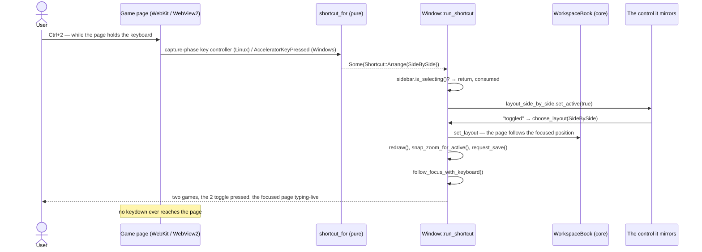
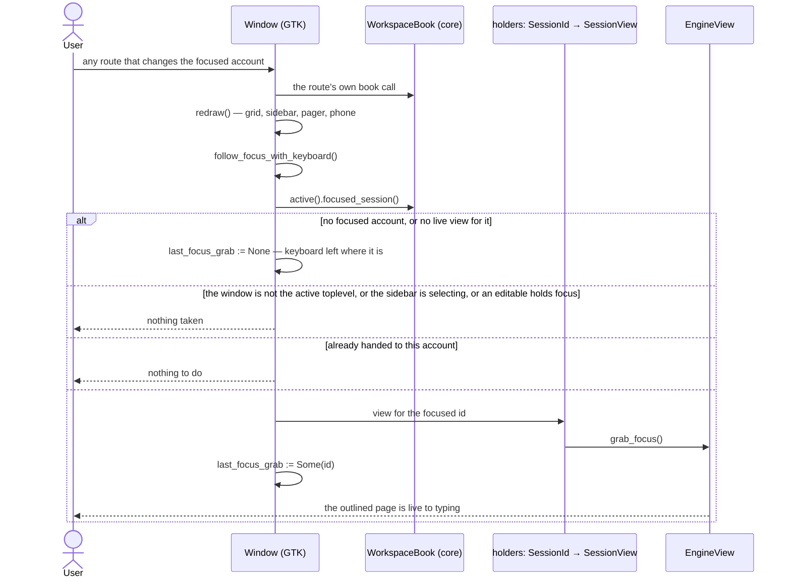

# 15 — Window shortcuts, and focus that hands over the keyboard

**Depends on:** 14 · **Status:** done · **Estimate:** 5

## Context

This application keeps several browser idle games running at once in one
window. Each game is an account with its own isolated browser storage;
accounts are grouped into workspaces, and the window shows a page of one
workspace at a time in one of three arrangements — one game, two side by
side, four in a grid — plus a phone-shaped one. Item 14 gave the window a
single shortcut table and two keys that move around it: `Shift`+`Tab` for the
next account and `Ctrl`+`Tab` for the next workspace, both caught before any
game page can see them, on Linux and Windows alike.

Two things are left over from that, and they are the same complaint twice.

**The window's own controls have no keys.** Everything the header bar and the
row menus do still needs the mouse: showing or hiding the sidebar, choosing
between one, two and four games, parking the account in front of you, starting
it again, parking or starting a whole workspace. Having just added the keys
that move *between* accounts, the application still makes the owner reach for
the pointer to do anything *to* one. Eight chords close that gap — `Ctrl`+`B`
for the sidebar, `Ctrl`+`1` / `2` / `4` for the three arrangements, `Ctrl`+`P`
and `Ctrl`+`S` for the focused account, and `Ctrl`+`Shift`+`P` /
`Ctrl`+`Shift`+`S` for the whole shown workspace. All eight are the window's,
none of them ever reaches a game's page, and every one of them is a new variant
of item 14's one shortcut table rather than a second key path (`FR.26.5`).

**A focused account does not actually have the keyboard.** An account can be
focused — bold in the sidebar, its slot carrying the 2 px outline, the account
the zoom and reload keys act on — and still not receive a keypress. Pressing a
key meant for the game does nothing until the owner clicks inside the page.
That click is entirely wasted, and while it is needed the outline is a lie: it
says "this is the one you are working with" about a page that is not listening.
The cause is narrow. Focusing a slot moves only the application's own idea of
which position is focused; nothing ever calls the view's `grab_focus`. Both
engines have carried the method since item 12, and both still mark it
`#[allow(dead_code)]` because nothing has ever called it. This item calls it,
from every route that can change which account is focused (`FR.27.1`).

The two halves belong together because they are each other's test. Keys that
are caught in the capture phase have to keep firing once a game page holds the
keyboard — which, after this item, is the normal state rather than the state
you reach by clicking. Item 14 measured that for `F5` and the zoom keys with
the page focused; this item makes every check run that way (`FR.27.4`).

Nothing in the domain changes. `park_all`, `queue_parked`, `set_layout` and
the focused position all landed with item 14 and are called as they are; the
work is the shell's shortcut table, the routes into paths the mouse already
uses, the shortcuts window, the tooltips, and one design rule that has to be
narrowed rather than quietly broken.

## User Experience

- **Entry** — Eight chords, from anywhere in the window including while a game
  page has the keyboard: `Ctrl`+`B`, `Ctrl`+`1`, `Ctrl`+`2`, `Ctrl`+`4`,
  `Ctrl`+`P`, `Ctrl`+`S`, `Ctrl`+`Shift`+`P`, `Ctrl`+`Shift`+`S`. Each is also
  reachable with the mouse, through the control it mirrors, and each is listed
  in the shortcuts window `Ctrl`+`?` opens.
- **Flow** — Hide the sidebar: press `Ctrl`+`B` → the sidebar folds away and
  the grid takes the full width, exactly as clicking `▤` does; the `▤` button
  comes up out of its pressed state at the same moment. Press again to bring it
  back.
- **Flow** — Change the arrangement: press `Ctrl`+`2` → the shown workspace
  arranges for two games, the `2` toggle goes pressed, the page holding the
  focused account is the page shown, and every account snaps to the size it
  last chose for that arrangement. Pressing the chord for the arrangement
  already showing changes nothing. From the phone arrangement, any of the
  three leaves it first, exactly as its toggle does.
- **Flow** — Park the focused account: press `Ctrl`+`P` → the account in the
  outlined slot stops, its slot shows the plain stopped panel with its `Start`
  button, its sidebar dot goes grey. Press `Ctrl`+`S` → it is started again.
  Pressing `Ctrl`+`P` on an account that is already parked, or `Ctrl`+`S` on
  one that is live or on its way up, does nothing at all.
- **Flow** — Park the shown workspace: press `Ctrl`+`Shift`+`P` → every
  running, queued or starting account in the shown workspace is parked, with no
  confirmation, exactly as the heading menu's `Park all` does. Press
  `Ctrl`+`Shift`+`S` → every parked account in it is queued and comes back one
  at a time, in order.
- **Flow** — Focus hands over the keyboard: focus an account by any route — a
  sidebar row, `Shift`+`Tab`, `Ctrl`+`Tab`, a pager arrow, a click on its slot,
  an arrangement change, a drag, a workspace switch, adding it, a restore, or a
  phone choosing it — and its page is typing-live the moment its outline
  appears. No click into the page.
- **States** — A chord that would touch nothing is consumed and silent: no
  message strip, no sound, no flash. `Ctrl`+`P` on a parked account,
  `Ctrl`+`S` on a live or starting one, `Ctrl`+`Shift`+`P` on a workspace with
  nothing running, `Ctrl`+`Shift`+`S` on one with nothing parked, and any of
  the eight on an empty workspace.
- **States** — Sidebar in selection mode: all eight chords are consumed and
  change nothing, as `Shift`+`Tab` and `Ctrl`+`Tab` already are (`FR.23.4`).
  The screen must not move under a move-to-workspace decision, and that
  includes the sidebar itself folding away.
- **States** — A chord held down runs once. Holding `Ctrl`+`Shift`+`P` does not
  park, re-park and re-park.
- **States** — The focused position holds no live view — parked, queued,
  starting, or an empty trailing slot on a part-empty last page: the keyboard
  stays wherever it was. Nothing reaches sideways for another slot's view.
  When that same account's view goes live, it takes the keyboard then.
- **States** — A dialog is open, or a text field has the keyboard: nothing is
  taken from it. The rename dialog's entry, the add-game form and the sidebar's
  selection mode all keep what they hold.
- **Pattern** — `Ctrl`+`1` / `2` / `4` drive the arrangement toggles' own
  active state and `Ctrl`+`B` drives the sidebar toggle's, rather than
  reaching past them to the book or the revealer, so a control and the thing it
  controls can never disagree about where they stand (design rule 2's
  one-control reasoning, applied to a control a key also presses).
- **Pattern** — Park and start are two chords, not one flip key. This departs
  from design rule 2's shape and is recorded as a narrowing of it rather than
  an exception — see the Design bullet below and `docs/design.md` rule 20.
- **Pattern** — Discoverability is design rule 19 and not optional: each chord
  gets a line in the shortcuts window, and each control that mirrors one names
  it — a tooltip for the toggles, accelerator text for the menu items, which
  have nowhere to hover (`FR.25.3`, `FR.25.4`).
- **Pattern** — The phone arrangement keeps its toggle and gains no key
  (`FR.26.2`), and no phone key is listed in the shortcuts window.

### Design — the two-chord departure from rule 2

Design rule 2 asks for one control whose label and effect invert with the
account's state — `Park` while it runs, `Start` once it is parked — for two
stated reasons: a single control that reads the current state can never be
triggered in a direction that does not apply, and a pair of buttons would
always have one half disabled on a trailing edge that rule 6 says is scarce.

Two chords keep the rule's *shape* broken. Neither of its reasons survives
contact with a keyboard:

- The inapplicable direction is a silent no-op (`FR.26.6`), so there is no
  wrong state to reach and nothing to undo. What a disabled control prevents,
  silence prevents just as well.
- A key occupies no trailing edge. Rule 6's scarcity — the reason the control
  went into the menu rather than onto the row — never applied to a chord.

What is genuinely lost is that a key carries no label to read the direction
off. The row's dot already answers that: it names which of the two keys is
live before either is pressed. And a single flip key would obey the letter of
the rule while reading worse — nothing would say which direction the press is
about to take, and liveness moves on its own (queued → starting → live)
between deciding and pressing, so the flip could invert under the reader's
hand. Two idempotent chords cannot: `Ctrl`+`S` always means running,
`Ctrl`+`P` always means parked (`FR.26.3`).

Recorded as a narrowing, not an exception: rule 2's one-control reasoning
governs a control carrying a visible label, and `docs/design.md` gains rule 20
for the keyboard case — one key per direction, each inert where it does not
apply. The same reading covers `Ctrl`+`Shift`+`P` / `Ctrl`+`Shift`+`S` against
the heading menu's own paired `Park all` / `Start all`, which were already two
controls rather than one flip.

### A window chord, on either engine

Screen: the main window. Components: the header bar's toggles, the grid's
slots, the sidebar rows. States: the shown workspace's layout; whether the
sidebar is selecting. The user presses a chord while a game holds the
keyboard; the game never receives it. Every chord follows this shape — only
the control and the book call differ. The key is consumed whether or not it
changed anything.

### Focus following the focused account

Screen: the main window. Components: the grid's focused slot, the sidebar's
bold row. States: which account is focused; whether it has a live view;
what holds the keyboard. `redraw` is the one funnel every route already
passes through, so hooking the grab there covers all of them at once rather
than eleven call sites — and `last_focus_grab` is what keeps it a *focus
change* rather than a grab on every redraw, so a redraw for a memory reading
or a liveness change never yanks the keyboard back from the sidebar.

## Technical Details

### Back-end

Nothing. The domain already answers every question these chords ask:
`WorkspaceBook::park_all`, `queue_parked`, `set_layout`, `active_id` and
`SessionBook::focused_session` all landed with item 14 and are called
unchanged. `idle-manager-core`, `idle-manager-store`, `idle-manager-metrics`
and the composition root are untouched, and `make arch-check` has nothing new
to judge. This is deliberate and is the point of architecture rule 8: the
shell decides no transition here, it only names one.

### Front-end

The shell crate, `idle-manager-shell`, obeying `docs/architecture.md` rules 8,
10, 12 and 13, `docs/design.md` rules 2, 4, 19 and the new 20, and
`docs/naming.md` rules 2, 4 and 7 throughout.

**The table, in `window/shortcut.rs`.** `Shortcut` gains six variants:
`ToggleSidebar`, `Arrange(Layout)`, `ParkFocused`, `StartFocused`,
`ParkWorkspace`, `StartWorkspace` — `Arrange` carrying
`idle_manager_core::Layout` so one variant covers three chords and the match
in `run_shortcut` cannot miss one. `shortcut_for` stays pure, with no display
and no widget: it keeps reading named modifier bits with `contains` rather
than comparing the modifier set for equality, so Caps Lock or Num Lock riding
along still cannot spoil a match (code standards rule 25). The new arms, after
the existing reload and zoom checks:

- `ctrl` and `b`/`B` → `ToggleSidebar`.
- `ctrl` and `_1`/`KP_1`, `_2`/`KP_2`, `_4`/`KP_4` → `Arrange(Single)`,
  `Arrange(SideBySide)`, `Arrange(Grid)`. Keypad digits are accepted for the
  same reason `zoom_step_for` accepts `KP_0`. `Ctrl`+`3` maps to nothing.
- `ctrl` and `p`/`P` → `ParkWorkspace` when `shift`, `ParkFocused` otherwise;
  `ctrl` and `s`/`S` likewise for start. Both letter cases are matched in both
  arms and the direction is taken from the `shift` bit, because GDK delivers
  the shifted keyval `P` for `Ctrl`+`Shift`+`P` and `p` for `Ctrl`+`P` — the
  keyval alone would be a fragile discriminator, the modifier bit is not.

Every new arm is a plain unit test in the module's own `tests`, including that
`Ctrl`+`Shift`+`P` is not `ParkFocused`, that `Ctrl`+`3` is `None`, and that
the lock-mask case holds for one of the new chords too.

**The acts, in `window/imp.rs`'s `run_shortcut`.** Each new arm returns
without acting while `self.sidebar.is_selecting()` (`FR.26.6`, following
`FR.23.4`'s existing two), then reuses the path the mouse already uses
(architecture rule 8 — the shell decides nothing):

- `ToggleSidebar` → `self.sidebar_toggle.set_active(!is_active())`. The
  revealer follows through the `bind_property` already set up in
  `constructed`, so the button and the panel cannot disagree (`FR.26.1`).
- `Arrange(layout)` → `self.select_layout_toggle(layout)`, which sets the
  matching toggle active and lets its own `toggled` handler reach
  `choose_layout` — the same call a click makes, including leaving mobile mode
  first and `finish_layout_change`'s `snap_zoom_for_active` (`FR.26.2`). A
  chord naming the arrangement already shown emits no `toggled` and so is a
  no-op for free.
- `ParkFocused` / `StartFocused` → read the focused account's id and liveness
  from the book, and call `toggle_parking(&id)` only when the liveness matches
  the direction asked for: `Live` for park, `Parked` for start. That keeps
  each chord idempotent (`FR.26.3`) while still going through the row menu's
  own handler; `Starting` and `Queued` fall through to silence, matching the
  greyed row item.
- `ParkWorkspace` / `StartWorkspace` → `self.park_all(&id)` /
  `self.start_all(&id)` for `book.active_id()`. Both already return early on
  an empty result, so the silent no-op is free (`FR.26.4`, `FR.26.6`).

**Auto-repeat, in `window/imp.rs`.** `tab_held: Cell<bool>` becomes
`chord_held: Cell<bool>` and stops being about `Tab`: every shortcut outside
`Reload` and `Zoom` latches it, and the `key-released` handler clears it on
*any* key release rather than only on a `Tab` release. Zoom and reload keep
repeating while held, which is what a user holding `Ctrl`+`-` wants; nothing
else does (`FR.26.6`). GDK enables detectable auto-repeat on X11 and
synthesises repeats as presses alone on Wayland, so a held chord produces no
intervening release to clear the latch (code standards rule 18). The Windows
side needs none of this: `ffi.rs` already drops a repeat with
`PhysicalKeyStatus.WasKeyDown` before the table is ever consulted.

**Windows, in `web_engine/virtual_key.rs`.** The only Windows change.
`gdk_key_for_virtual_key` gains `VK_B` (`0x42`), `VK_P` (`0x50`), `VK_S`
(`0x53`), `VK_1` (`0x31`), `VK_2` (`0x32`) and `VK_4` (`0x34`), mapped to
`gdk::Key::b`, `p`, `s`, `_1`, `_2` and `_4`, each with a test. Everything
else on that engine already generalised with item 14:
`ffi::watch_accelerator_keys` reads both `VK_CONTROL` and `VK_SHIFT` into a
`gdk::ModifierType`, drops auto-repeat, and marks the event handled; the
host's closure in `webview2/host/imp.rs` runs whatever `shortcut_for` returns
from `glib::idle_add_local_once`, because the callback runs with the browser
process blocked (`FR.26.7`). Note the case asymmetry against Linux: Win32
reports the unshifted virtual key, so `Ctrl`+`Shift`+`P` arrives as
`gdk::Key::p` with `SHIFT_MASK` set, which is exactly why the table
discriminates on the modifier bit and not the keyval's case.

**Focus, in `window/imp.rs`.** A new `last_focus_grab: RefCell<Option<SessionId>>`
and one method, `follow_focus_with_keyboard`, called at the end of `redraw`
after the book borrow is dropped. It reads the focused account, gives up and
clears `last_focus_grab` when there is none or it has no live view
(`FR.27.2`), does nothing when `last_focus_grab` already names it, and
otherwise grabs — but only while `self.obj().is_active()` (a modal dialog is
its own toplevel, so this covers the rename dialog and the add-game form),
`!self.sidebar.is_selecting()`, and `self.obj().focus()` is not a
`gtk::Editable` (`FR.27.3`). Hooking `redraw` rather than each of the eleven
routes is what makes `FR.27.1` hold for routes not yet written; `last_focus_grab`
is what keeps it a focus *change* rather than a grab on every redraw, so a
redraw for a memory reading never yanks the keyboard back from a widget the
user deliberately clicked. `#[allow(dead_code)]` comes off `grab_focus` in
both `web_engine/webkit.rs` and `web_engine/webview2.rs`, and their doc
comments stop saying no caller exists.

**Discoverability, in `help-overlay.ui`, `window.ui` and
`session_sidebar/imp.rs`.** `help-overlay.ui` gains eight
`GtkShortcutsShortcut` entries — `<Control>b` "Show or hide the sidebar",
`<Control>1` "One game", `<Control>2` "Two games", `<Control>4` "Four games",
`<Control>p` "Park the focused game", `<Control>s` "Start the focused game",
`<Control><Shift>p` "Park every game in the workspace",
`<Control><Shift>s` "Start every parked game in the workspace" — in a second
`GtkShortcutsGroup` titled `Window`, leaving item 14's group as the navigation
one (`FR.25.3`). `window.ui`: `sidebar_toggle`'s tooltip becomes
`Show or hide the account list (Ctrl+B)`, and the three arrangement toggles
gain their own `tooltip-text` — `One game (Ctrl+1)`, `Two games (Ctrl+2)`,
`Four games (Ctrl+4)` — which means `layout_toggles`' box-level tooltip is no
longer what the reader sees on those three; it stays for the `Phone` toggle's
neighbours-free gaps and `layout_mobile` keeps its own. `session_sidebar/imp.rs`
sets the `accel` attribute on four `gio::MenuItem`s — `Park all`
(`<Control><Shift>p`), `Start all` (`<Control><Shift>s`) in `bind_heading_menu`,
and the row's single Park/Start item in `bind_row_menu` with `<Control>p` or
`<Control>s` chosen from `data.action_label()`'s own direction, so the menu
names the key that actually applies (`FR.25.4`, design rule 19).

**Design and naming.** `docs/design.md` rule 2 gains one closing sentence
narrowing its scope to a control carrying a visible label, and a new rule 20
records the keyboard case: one key per direction, each idempotent and inert
where it does not apply, with the reasoning above. Rule 19's discoverability
half is extended to name accelerator text as the menu-item equivalent of a
tooltip. No naming rule changes.

**Tests and the runbook.** `shortcut_for`'s new arms and `repeats_while_held`
are unit tests with no display; the `virtual_key` additions are unit tests
that run on Linux, since `make windows-check` compiles the Windows target but
never runs it. Everything else is a widget, and architecture rule 14 settles
how a widget is covered here: not by driving GTK from a harness, which costs
more than it catches, but by
`docs/tasks/15-window-shortcuts-and-focus/test-script.md` — one checkbox per
concrete action and the result it must produce, hand-run headless with Xvfb
and the dlopen-XTest helper earlier items used. That is most of this item's
acceptance, and it is deliberate rather than a gap: the sidebar toggle
following `Ctrl`+`B`, and a view actually holding the keyboard, are both
claims about the toolkit's own state that only the toolkit can answer. Every
keyboard check is run with a game page holding the keyboard, not the sidebar
(`FR.27.4`).

### Technical References

- `GtkToggleButton::set_active` emits `toggled` only on a real change, so
  `select_layout_toggle` for the arrangement already shown is a no-op with no
  second `choose_layout`, no second save and no second `snap_zoom_for_active`
  — the same property `focus_session` already relies on.
- `sidebar_toggle` is bound to `sidebar_revealer`'s `reveal-child` with
  `bind_property(...).sync_create()` in `constructed`, so driving the button
  is the whole of `Ctrl`+`B`; nothing touches the revealer directly.
- GDK delivers the shifted keyval for a letter under `Shift` on X11 and
  Wayland (`P` for `Ctrl`+`Shift`+`P`), while Win32's `AcceleratorKeyPressed`
  reports the unshifted virtual key. Matching both cases in both arms and
  discriminating on `SHIFT_MASK` is what makes one table serve both.
- GDK enables `XkbSetDetectableAutoRepeat` on X11 and synthesises Wayland key
  repeat as presses without releases, so a press/release latch is a sound
  stand-in for the repeat flag GTK 4 does not expose.
- A modal `gtk::Window` is its own toplevel, so `gtk::Window::is_active` on
  the main window is false while the rename dialog or the add-game form holds
  the keyboard — one check covering every dialog in the shell, present and
  future.
- `GtkShortcutsShortcut`'s `accelerator` property takes
  `gtk::accelerator_parse` syntax, so `<Control><Shift>p` is the spelling for
  a chord; `gio::MenuItem::set_attribute_value("accel", …)` is the menu-item
  equivalent, rendered by `GtkPopoverMenu` at the item's trailing edge.
- `GtkShortcutsWindow` is deprecated from GTK 4.18; `Cargo.toml` pins `v4_10`,
  so no deprecation lint fires and libadwaita is still not a dependency.

## Blockers

- **Answered on Linux, open on Windows.** Whether a `WebKitWebView` handed
  focus by `grab_focus` — as opposed to one focused by a click — still lets
  the toplevel's capture-phase controller see a chord was the assumption the
  whole item rested on (`FR.27.4`). It holds: every chord in this item's
  `test-script.md` was pressed with a grab-focused page holding the keyboard
  and every one was acted on, with the page receiving nothing but the bare
  modifier. The same question on `WebView2` is untested — see the third
  blocker.
- **Closing a dialog cannot be exercised on the development box.** When a
  modal dialog takes the keyboard, the window's own `is-active` goes false and
  the grab is refused, which is exactly what protects the dialog's field
  (`FR.27.3`). `follow_window_activation` makes the hand-over again when the
  window is re-activated, which is what should put the keyboard back the
  moment a dialog closes. It could not be run: this machine has no window
  manager installed, and without one a `GtkWindow` never regains `is-active`
  after a modal toplevel goes. Measured on the box: with the dialog closed a
  click into the page restores typing while a focus change does not, and the
  debug line `the focused account's view was not handed the keyboard …
  active=false` names the guard. Run it on a desktop with a window manager
  before calling `FR.27.3` complete.
- **The Windows VM was not brought up.** `scripts/windows-vm/compose.yml` and
  a physical keyboard are what item 12's runbook uses, and neither was
  available for this work. The six virtual keys are unit tested on Linux —
  including that what Win32 delivers decides the same eight shortcuts the
  Linux keyvals decide — and `make windows-check` and `make windows-package`
  both pass, but no chord has been pressed on that engine (`FR.26.7`). Every
  Windows step in `test-script.md` is unticked and says so.
- **`Ctrl`+`S` and `Ctrl`+`P` are keys an idle game's page may bind** for its
  own save or print. Taking them in capture is the recorded choice
  (`FR.26.5`), but no game in the catalogue has been checked for a page-level
  binding worth keeping; the probe page the runbook uses binds neither. If one
  is found, the record is where the trade-off is revisited, not the code.
- **The hand-over follows a focus change, not every redraw** — so clicking a
  header-bar control leaves the keyboard on that control until the focused
  account next changes. Measured: after clicking the `Phone` toggle and
  pressing `Ctrl`+`4`, no page held the keyboard until a focus change.
  `FR.27.1` promises only the focus-change case, so this matches the
  requirement, and the chords mean a keyboard user never clicks those controls
  at all. It is recorded rather than fixed because widening the grab to any
  non-editable widget would start taking focus from the sidebar during
  selection and from the ⋯ menus. Worth a decision if it grates in daily use.
- **`follow_focus_with_keyboard` assumes `redraw` is reached by every route
  that changes the focused account.** Each of the eleven was read against the
  shell and exercised in the runbook where a display could reach it, and the
  drop handler — the one that does not go through `focus_session` — redraws on
  `Swapped` and `Filled`. The assumption is structural rather than enforced: a
  twelfth route added later that changes the focus without redrawing would
  silently not hand over the keyboard, and nothing fails when it does.
