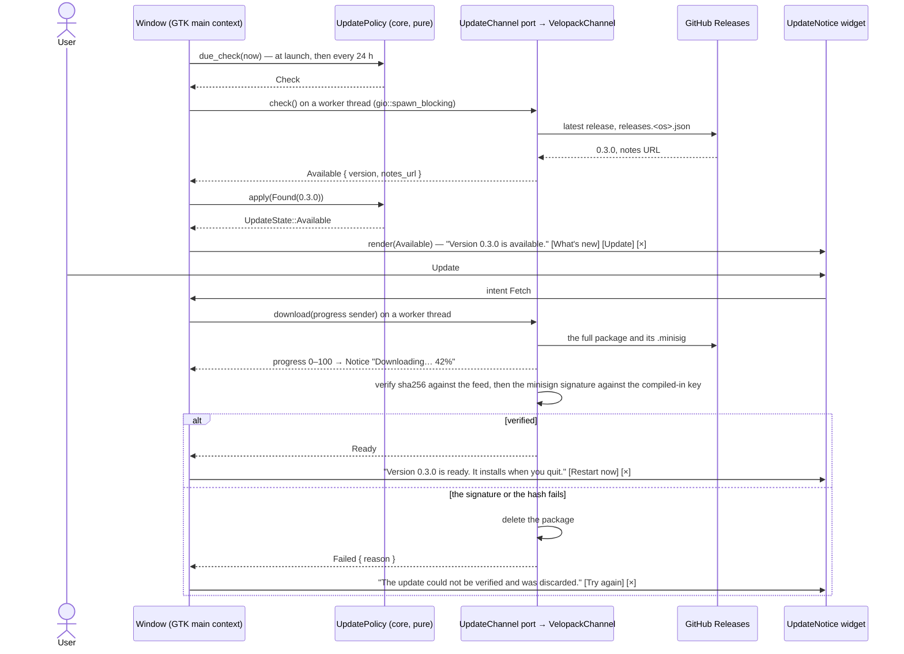
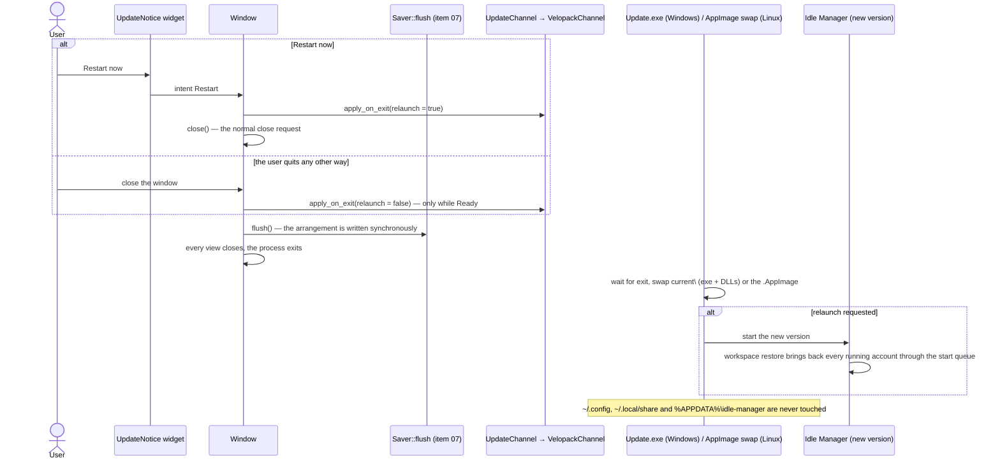
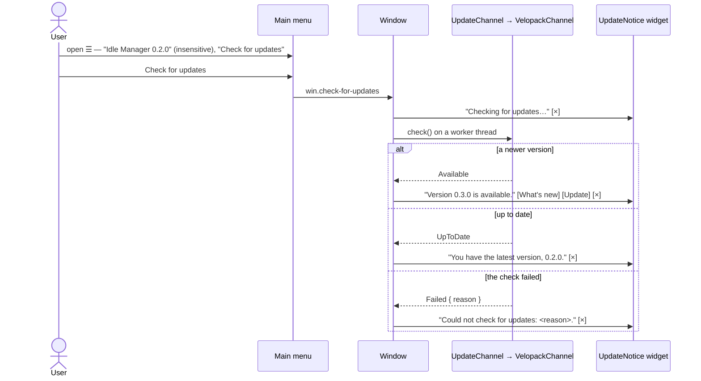

# 16 — Releasing from GitHub, and updating from inside the app

**Depends on:** 07, 12 · **Status:** not-started · **Estimate:** 13

## Context

Idle Manager keeps several browser idle games running at once in one window,
on Linux and on Windows. Today nobody but the owner can run it without
building it from source. There is no release: the version number in the
project's manifest has said `0.1.0` since the first commit, no tag has ever
been made, and no build has ever been published. Two local commands exist. One
compiles the Linux program. The other cross-compiles the Windows program from
the Linux machine and zips it together with the GTK library files it needs, so
that a Windows user can unzip the folder anywhere and double-click the
program, with no installer and no administrator rights. Nothing at all
packages the Linux build for a user.

This item turns "the work on `main` is ready" into "every running copy has
updated itself", with no hand work in between. It has two halves.

**The first half runs on GitHub.** Every push to the `main` branch runs the
project's whole quality gate on a GitHub-hosted Linux runner. When the pushed
commits include a new feature or a fix, the same run then works out the next
version number from the commit messages, writes it into the manifest, writes
the release notes from the same messages, builds the Linux program and the
Windows program on that one Linux runner, packages both, signs both, and
publishes them as a GitHub Release. Only once every package is built and every
upload has succeeded does the run commit the version bump and tag it, so a
failure anywhere leaves the repository and the Releases page exactly as they
were. A push that contains only documentation or housekeeping commits is
verified and then released nothing. The owner never edits a version number, a
changelog or a release page.

The notes are generated from the commit subjects, so the subjects of feature
and fix commits have to be written for the person playing the games rather than
for the developer. That becomes a written coding rule.

**The second half runs inside the app.** Once a day, and once at launch, the
app quietly asks GitHub whether a newer release exists. When one does, a notice
appears under the header bar naming the new version, linking to what changed,
and offering one button: Update. Nothing is downloaded before that button is
pressed. Pressing it downloads the package in the background while every game
keeps running, then checks two things: that the file is intact, and that it
was signed with the owner's private signing key, whose public half is compiled
into the app. A package that fails either check is thrown away and the notice
says so. A package that passes changes the notice to "ready, installs when you
quit", with a second button: Restart now. The app never quits or restarts on
its own, because a restart drops every live game for the minute or so it takes
the workspace to come back. The user chooses the moment, and either route goes
through the window's normal close, so the arrangement is saved first. A menu
item lets the user run the check by hand at any time, and the menu shows the
version the app is running.

The two systems install the update differently, because Windows will not let a
running program overwrite itself or the seventy library files it has loaded.
On Windows a small helper shipped in the zip waits for the app to exit, then
swaps the whole program folder in one step, inside the folder the user
unzipped, still with no installer and no administrator rights. On Linux the
app ships as a single file that runs on any system carrying GTK 4 and
WebKitGTK 6.0 at the versions the project already requires, and the update
replaces that one file. Neither route touches anything the user has made.
Accounts, logins, workspaces, presets, zoom levels and the phone pairing all
live under the user's own configuration and data folders, which the update
never reads, writes or moves.

A fresh install is the same download the updater fetches: on Windows a zip to
unzip and run, on Linux one file to mark executable and run. Nothing is
installed, and both are published under one release with a checksum file and a
provenance record so a person can also check by hand what they downloaded.

The Windows program ships without a code-signing certificate. Windows will show
its "protected your PC" warning on first run, and the README documents the
"Run anyway" step. Buying or applying for a certificate is a later item.

## User Experience

- **Entry** — The update notice appears on its own, under the header bar,
  when a launch-time or daily check finds a newer version. The `Check for
  updates` item in the header bar's main menu runs the same check on demand,
  with the running version shown as an insensitive line directly above it.
- **Flow** — A newer version exists: the notice reads `Version 0.3.0 is
  available.`, with a `What's new` link that opens the release page in the
  browser, an `Update` button and a dismiss `×` at its trailing edge. Nothing
  has been downloaded yet.
- **Flow** — Press `Update`: the button becomes insensitive, the line reads
  `Downloading version 0.3.0… 42%`, and every game keeps running. When the
  download ends the line reads `Checking the download…` for the moment the
  signature is verified.
- **Flow** — The package verifies: the line reads `Version 0.3.0 is ready. It
  installs when you quit Idle Manager.` and the button becomes `Restart now`.
  The notice stays until the app quits.
- **Flow** — Press `Restart now`: the window closes through its normal close
  path, saving the arrangement, the update applies, and the app relaunches at
  the new version with the workspace restoring every account that was running,
  one at a time, exactly as a normal launch does.
- **Flow** — Quit any other way while an update is ready: the update applies
  after the app has exited and the app does not relaunch. The next launch runs
  the new version.
- **Flow** — `Check for updates` from the main menu: the notice appears at once
  reading `Checking for updates…`, then either `You have the latest version,
  0.2.0.` with only the dismiss `×`, or the available state above.
- **States** — Nothing newer exists after an automatic check: nothing is
  shown, nothing is logged above debug level.
- **States** — An automatic check fails (offline, GitHub down, rate limited):
  nothing is shown; one warning line in the log; the next check is the daily
  one. The app starts and runs exactly as if no check existed.
- **States** — A manual check fails: the notice reads `Could not check for
  updates: <one-line reason>.` with only the dismiss `×`. Never a dialog.
- **States** — The download or the signature check fails: the line reads
  `The update could not be verified and was discarded.` (or `The download
  failed: <reason>.`), the button becomes `Try again`, and the downloaded
  file is deleted. Nothing is ever applied.
- **States** — Dismissed while available: hidden for the rest of this run;
  back at the next launch while the version is still newer. Dismissed while
  ready: the notice hides but the update still installs on quit. A dismissed
  notice reopens only for a still-newer version found by a later check.
- **States** — Both the message strip and the update notice have something to
  say: the strip stays first, the notice sits directly beneath it, both
  spanning the sidebar and the grid.
- **States** — The swap did not apply after quitting (a locked file, a failed
  write): the previous version is left runnable, and the next launch shows the
  message strip line `The update to 0.3.0 did not apply; the previous version
  is running.`
- **Pattern** — The notice never leaves on its own and goes only when
  dismissed, and it takes the theme's warning tint rather than error red:
  design rule 9's reasoning for the message strip, carried onto a bar that
  also holds an action.
- **Pattern** — A failed manual check is one line inside the thing the user
  asked for, never a modal: design rule 8.
- **Pattern** — The running version is an insensitive main-menu item, the
  same "item with no bound action draws disabled" device design rule 23 uses
  for the row's own workspace.
- **Pattern** — Only the notice's text changes between states; the bar, the
  link and the buttons keep their places so an eye returning to it never has to
  re-find them: design rule 12's "moves nothing" reasoning.
- **New pattern** — A dismissible bar under the header bar carrying one line, a
  link and one action button whose label follows the update's state. Design
  rule 9 forbids an action on the message strip on purpose, so this is its own
  widget, `update_notice.rs` with `update-notice.ui`; the design doc owes a
  rule once it ships, saying when a bar may carry an action and when it may
  not.

### Learning a new version exists, and fetching it

Screen: the main window. Components: the update notice bar beneath the header
bar (and beneath the message strip when both show), its label, its `What's
new` link, its one button and its dismiss. States: hidden, available,
downloading with a percentage, checking, ready, failed. The user sees the bar
appear on its own and presses `Update`; every game keeps running through the
download. The core decides which state follows which event; the shell only
renders the answer and forwards the button press as an intent (architecture
rule 8). Every network call and file check happens on a worker thread and
comes back to the GTK main context with the result.

### Installing: restart now, or on the next quit

Screen: the main window, then no window, then the main window again at the new
version. Components: the notice's `Restart now` button; the window's close
request, which is the one place a save is allowed to block. The user chooses
the moment. Both routes go through the same close path so the pending save is
flushed before the swap, and the swap itself happens only after the process has
exited, which is what makes the locked Windows DLLs a non-issue.

### Checking by hand from the main menu

Screen: the main window's header-bar main menu, then the update notice.
Components: two new menu items in their own section, the notice bar. States:
checking, up to date, available, failed. Unlike the automatic check, a manual
check always answers on screen, because the user asked; it answers inside the
notice rather than in a dialog or the message strip.

## Technical Details

### Back-end

The work obeys `docs/architecture.md` rules 1, 2, 3, 4, 5, 6, 9, 10, 11 and
14, `docs/code-standards.md` rules 5, 12, 14, 15, 17, 18 and 29, and
`docs/naming.md` rules 1, 5 and 10. It adds a seventh crate, one port, one
pure policy in the core, two workflows, a configuration file for the notes
tool, and eight `make` targets. Every step a workflow runs is a target, so the
workflow files hold only checkout, caching, secrets and calls to `make`.

**Verifying every push, in `.github/workflows/ci.yml`.** One job on
`ubuntu-24.04`, triggered by `push` to `main` and by `pull_request` targeting
it. It installs the apt packages `scripts/system-check.sh` names
(`build-essential pkg-config libgtk-4-dev libwebkitgtk-6.0-dev`) plus `clang
lld llvm` for the cross build below, restores three caches keyed on the
Makefile's `GVSBUILD_VERSION`, `WINDOWS_CRT_PACKAGE` and the `cargo-xwin`
version (`target/windows-sdk/gtk`, `target/windows-sdk/crt`,
`~/.cache/cargo-xwin`), restores the cargo registry cache keyed on
`Cargo.lock`, then runs `make bootstrap` and `make verify`. `make bootstrap`
already installs the pinned toolchain, the cargo tools and both Windows SDK
downloads; it gains `git-cliff` in its `cargo install` line, and
`scripts/system-check.sh` gains `clang-cl`, `lld-link`, `minisign` and `vpk` as
tools it names when missing, with one line each on how to install them, so a
developer machine and the runner fail the same way.

**Choosing the version and writing the notes, with `git-cliff` 2.x.**
`cliff.toml` at the repository root holds the `commit_parsers`: `feat` into a
`New` group, `fix` into `Fixed`, `perf` into `Faster`, every other type
(`docs`, `chore`, `test`, `refactor`, `ci`, `style`, `build`) `skip = true`,
`filter_unconventional = true` so the `Merge feat/…` subjects go, and
`features_always_bump_minor = true` with `breaking_always_bump_major = false`
so that while the version is `0.x` a breaking change raises the minor number
like a feature. The tag pattern is `v[0-9]*`. Three targets wrap it:
`make release-version` prints `git cliff --bumped-version` with the `v`
stripped, or nothing when no releasable commit exists since the last tag;
`make release-notes` prints `git cliff --unreleased --strip all`;
`make release-prepare` runs `scripts/release-prepare.sh`, which takes the
version from `release-version`, rewrites the one `version = "…"` line under
`[workspace.package]` in the root `Cargo.toml`, runs `cargo update --workspace`
so `Cargo.lock` follows, and runs `git cliff --unreleased --tag v<version>
--prepend CHANGELOG.md`. The script exits non-zero and writes nothing when
`release-version` is empty, and writes nothing when the working tree already
differs in those files, so the release job can never bump twice. With no tag
in the history the whole history is unreleased and the first release is the
bump from the `0.1.0` already in the manifest. `docs/code-standards.md` gains
a rule: a `feat`, `fix` or `perf` subject is written for the person running
the app, because it is published verbatim as a release note, with one before
and after example.

**Packaging both systems with Velopack 1.x, from Linux.** `make
windows-package` keeps building the staging folder `scripts/windows-package.sh`
already assembles (the exe, the GTK DLLs, the CRT DLLs, the schemas, the icons
and the pixbuf loaders), then calls `vpk [win] pack --packId IdleManager
--packVersion <version> --packDir <staging> --mainExe idle-manager.exe
--noDelta --outputDir dist/releases/win` instead of zipping the folder itself;
`dist/releases/win/IdleManager-win-Portable.zip` becomes the Windows download,
holding `Update.exe` and a `current\` folder with the program, and the
`Setup.exe` Velopack also writes is not uploaded. A new `make linux-package`
runs `make release`, stages `target/release/idle-manager`, `presets/`, a
`.desktop` file and a 256 px PNG icon into `dist/.staging/linux`, and calls
`vpk [linux] pack` with the same pack id and version, writing
`dist/releases/linux/IdleManager.AppImage`. Both outputs come with a
`IdleManager-<version>-full.nupkg` and a `releases.<os>.json` feed, which are
uploaded too, because the in-app updater reads the feed and downloads the
`.nupkg`. GTK and WebKitGTK are not bundled into the AppImage; the file runs
against the system's own, which keeps the floors `make system-check` already
enforces. Deltas are switched off so there is exactly one downloaded file per
system to verify. The binary's `main.rs` calls `idle_manager_update::run_hooks()`
as its first statement, before the tracing subscriber and before GTK, because
Velopack's `Update.exe` starts the program with hook arguments during install
and swap and expects it to exit at once; on Linux the call is a no-op.

**Signing and checksums.** `make release-sign` signs every file in
`dist/releases/*/` with `minisign -S -s <key>`, writing `<file>.minisig`
beside it; the secret key path comes from `MINISIGN_SECRET_KEY_FILE`, which the
workflow writes from an Actions secret to a temporary file and deletes after.
The public key is committed at `release/minisign.pub` and compiled into the
update crate with `include_str!`. `make release-checksums` writes
`dist/releases/SHA256SUMS` over every asset with `sha256sum`. The workflow
then runs `actions/attest-build-provenance` over the same set, with the
`id-token: write` and `attestations: write` permissions.

**Publishing, in `.github/workflows/release.yml`.** Triggered by `push` to
`main`, gated on the head commit's subject not starting with `chore(release):`,
and by `workflow_dispatch` with one input, `tag`, for recovery. One job on
`ubuntu-24.04` with `contents: write`. Its steps, each a `make` target unless
noted: the same apt and cache setup as `ci.yml`; `make bootstrap`; `make
verify`; `make release-version` into a step output, and every later step
skipped when it is empty; `make release-prepare`; `make linux-package`; `make
windows-package`; `make release-sign`; `make release-checksums`; then the one
irreversible act: `git commit -am "chore(release): v<version> [skip ci]"`,
`git tag v<version>`, `git push --follow-tags` as the Actions bot, which never
triggers another run because pushes made with the workflow token do not start
workflows and the subject is gated anyway; then `gh release create v<version>
--draft --notes-file <notes> <assets>` followed by `gh release edit
--draft=false`, so the release becomes visible only once every upload has
succeeded; then the attestation step. A failure before the push leaves `main`,
the tags and the Releases page untouched, and a re-run on the same commit
recomputes the same version. A failure after the push, before publishing, is
recovered by dispatching the workflow with `tag`, which checks the tag out,
rebuilds, re-signs and publishes without bumping again. The release body is
the `release-notes` output, so the GitHub page, `CHANGELOG.md` and the notice's
`What's new` link all show the same text.

**The port, the policy and the seventh crate.** `idle-manager-core` gains
`update.rs`: `Version` (a newtype over the three numbers with `FromStr` and
`Ord`, code standards rule 2), `UpdateState` with variants `Idle`, `Checking`,
`UpToDate { current }`, `Available { version, notes_url }`, `Downloading {
version, percent }`, `Verifying { version }`, `Ready { version }`, `Failed {
version: Option<Version>, reason }` (rule 1: the states the notice renders are
exactly these), `UpdateEvent` (`CheckRequested { manual }`, `Found`,
`NothingNewer`, `CheckFailed`, `FetchRequested`, `Progress`, `Downloaded`,
`Verified`, `Rejected`, `Dismissed`), a pure `UpdatePolicy::apply(state, event)
-> (UpdateState, Option<Effect>)` where `Effect` is `RunCheck`, `Download` or
`Show`/`Hide`, and `UpdateSchedule::next_check_due(last_check_millis,
now_millis) -> bool` with `CHECK_INTERVAL_SECS = 86_400` (rule 9: time is an
argument). A dismissed `Available` records the dismissed version so the same
version does not reopen the notice within the run, and a `Ready` survives
dismissal because the apply-on-quit still stands. `ports.rs` gains
`UpdateChannel: Debug + Send + Sync` with `check() -> Result<UpdateCheck,
UpdateError>` (`UpdateCheck::{UpToDate, Available(UpdateInfo)}`),
`download(&UpdateInfo, progress: &dyn Fn(u8)) -> Result<VerifiedPackage,
UpdateError>`, `apply_on_exit(&VerifiedPackage, relaunch: bool) ->
Result<(), UpdateError>` and `current_version() -> Version`; `UpdateError` is
a `thiserror` enum with `Offline`, `RateLimited`, `Malformed`, `Rejected {
reason }` and `Io` variants (architecture rules 5, 6, 11). The new crate
`crates/idle-manager-update/` depends on `idle-manager-core`, `velopack`,
`minisign-verify`, `sha2` and `thiserror`, and holds `VelopackChannel`
(implementing the port over `velopack::UpdateManager` with a `GithubSource`
built from the repository URL the composition root passes in, `--noDelta`
packages, and `wait_exit_then_apply_updates` for `apply_on_exit`),
`signature.rs` (fetching `<package>.minisig` from the same release, verifying
the downloaded `.nupkg` against the compiled-in key with `minisign-verify`,
deleting the file on any failure), and `run_hooks()`. `scripts/arch-check.sh`
gains `idle-manager-update` to the forbidden lists of `core`, `store`,
`metrics`, `shell` and `remote`, and a rule forbidding `idle-manager-update`
from `gtk4 gdk4 glib gio webkit6 wry webview2-com gdk4-win32 idle-manager-shell
idle-manager-store idle-manager-metrics idle-manager-remote` (rules 2, 3, 4).
`crates/idle-manager/src/main.rs` builds the channel and hands it to the
window through `WindowPorts`, next to the store and the probe.

**The audit and the bootstrap.** `deny.toml` gains `CDLA-Permissive-2.0` to
the licence allow-list, commented as carried by `webpki-roots` through
Velopack's `ureq` and `rustls`, and `RUSTSEC-2024-0388` (`derivative`
unmaintained) to `advisories.ignore`, commented the same way with the
Velopack version that carries it, so a Velopack bump that drops either is the
moment to remove the entry. `ring`, reached through `rustls`, compiles C, so
the Windows cross build now needs `clang-cl` and `lld-link`; `make bootstrap`
does not install system packages, so `scripts/system-check.sh` names them and
`ci.yml` installs `clang lld llvm`. `docs/stack.md` lists `velopack`,
`minisign-verify`, `git-cliff`, `minisign` and `vpk` with one-line reasons,
and `docs/architecture.md`'s diagram, folder tree and "Where a change goes"
table name the seventh crate.

**The runbook and the Windows VM.** `docs/windows-vm.md` changes its
hand-out step from unzipping `idle-manager-<version>-windows-x64.zip` into
`C:\idle-manager` to unzipping `IdleManager-win-Portable.zip` there and
starting the program from it. The item's `test-script.md` publishes two
versions to a test release on the repository, updates the VM from one to the
other, and confirms the swap, the relaunch, an untouched
`%APPDATA%\idle-manager`, and that `Update.exe` runs. The Linux half runs the
AppImage on a clean Ubuntu 24.04 container and confirms it starts without
extra packages beyond `libgtk-4-1` and `libwebkitgtk-6.0-4`.

### Front-end

The shell crate, obeying `docs/architecture.md` rules 8, 10, 12 and 13,
`docs/design.md` rules 8, 9, 12 and 23 and the new rule the notice owes, and
`docs/naming.md` rules 2, 4 and 7.

**The notice, in `update_notice.rs`, `update_notice/imp.rs` and
`update-notice.ui`.** A `gtk::Box` subclass in the message strip's shape: a
label with `ellipsize = end` and `hexpand`, a `gtk::LinkButton` labelled
`What's new` whose URI is set from the state, one `gtk::Button` whose label is
set from the state, and a flat `×` `gtk::Button` at the trailing edge, styled
`.update-notice` with the theme's warning tint (`@warning_bg_color`), never
`.error`. Its public surface is `render(&UpdateState)` and two signals,
`fetch-requested` and `restart-requested`, plus `dismissed`. `render` maps each
`UpdateState` variant to visibility, the label text, the link's URI and
visibility, and the button's label and sensitivity: `Idle` hides the bar;
`Checking` shows the line with only the dismiss; `UpToDate` the same with the
version; `Available` shows the link and `Update`; `Downloading` shows the
percentage with the button insensitive; `Verifying` likewise; `Ready` shows
`Restart now`; `Failed` shows `Try again` when a version is known and only the
dismiss when the check itself failed. No widget is built or torn down between
states, so nothing moves (design rule 12's reasoning). Its template is
registered in `idle-manager.gresource.xml` and gets the same
"template is readable from the bundle" unit test the message strip has in
`lib.rs`.

**The window, in `window/imp.rs` and `window.ui`.** `root_box` gains the
notice directly after the message strip, so both span the sidebar and the grid
with the strip first. `WindowPorts` gains `update: Arc<dyn UpdateChannel>`.
The window holds `update_state: RefCell<UpdateState>` and
`last_update_check_millis: Cell<Option<u64>>`, and one method
`drive_update(event)` that calls `UpdatePolicy::apply`, stores the new state,
calls `update_notice.render`, and runs the returned effect: `RunCheck` spawns
`channel.check()` with `gio::spawn_blocking` and feeds the result back as
`Found` / `NothingNewer` / `CheckFailed` on the main context; `Download`
spawns `channel.download` the same way, with a `glib::MainContext::channel`
carrying `Progress(percent)` events back. The launch check fires once from
`constructed` after `redraw`, and a `glib::timeout_add_local` every 60 s asks
`UpdateSchedule::next_check_due` whether the daily check is due, so a laptop
that slept past the interval checks on wake rather than exactly 24 h after
launch. The notice's `fetch-requested` maps to `FetchRequested`;
`restart-requested` sets `relaunch_after_update: Cell<bool>` and calls
`self.obj().close()`. The existing `connect_close_request` handler, after
`saver.flush()`, calls `channel.apply_on_exit(&package, relaunch)` when the
state is `Ready`, logging and continuing on error (code standards rule 14), so
a normal quit installs without relaunching and `Restart now` installs and
relaunches. A failed automatic check is `tracing::warn!` with the reason and
nothing on screen; a failed manual check reaches the notice because the
policy's `CheckRequested { manual: true }` routes `CheckFailed` to `Failed`
rather than `Idle`. The "did not apply" line on the next launch reads
`channel.last_apply_failure()`, a fourth port method returning the reason
Velopack left in its log for the previous attempt, and shows it on the
message strip (design rule 9: a problem before the user did anything).

**The main menu, in `build_main_menu`.** A new section before the shortcuts
section with two items: `Idle Manager <version>`, a `gio::MenuItem` with no
action so `GtkPopoverMenu` draws it insensitive (design rule 23's device), the
version read from `channel.current_version()` rather than `CARGO_PKG_VERSION`
so the menu names the version actually installed; and `Check for updates`
bound to a new `win.check-for-updates` action that calls
`drive_update(CheckRequested { manual: true })`. No accelerator: it is not a
key the window answers, and it is not listed in `help-overlay.ui`.

**The design rule and the stylesheet.** `docs/design.md` gains a rule once the
notice ships: a bar under the header bar may carry one action only when the
action is the user's decision about their own program (installing an update)
rather than a repair of the machine's problem, and it keeps rule 9's
dismiss-only-by-hand and warning-not-error shape. `window.css` gains
`.update-notice` beside the strip's own class. Nothing else in the shell
changes: no sidebar, grid, dialog or engine code is touched.

**Tests and the runbook.** `UpdatePolicy`, `UpdateSchedule` and `Version` are
unit tests in the core with no display. `signature.rs` is integration-tested in
the update crate against a key pair generated in the test with a temporary
`minisign` invocation, or a fixture pair committed under `tests/fixtures/`,
covering a good signature, a wrong key and a tampered file. The workflow
scripts are tested by running `make release-version`, `release-notes` and
`release-prepare` against a throwaway clone with synthetic tags and commits.
Everything with a widget is covered by the item's `test-script.md`
(architecture rule 14), including the whole publish-and-update round trip on
both systems.

### Technical References

- `git-cliff` 2.14 computed `v0.2.0` from this history with
  `features_always_bump_minor = true` and skipped every `docs` and `chore`
  commit through `commit_parsers` with `skip = true`, the exploration's verified
  spike; `--prepend CHANGELOG.md` and `--bumped-version` are the two calls the
  targets wrap.
- Velopack 1.2's Rust crate exposes `VelopackApp::build().run()`,
  `UpdateManager::new`, `check_for_updates`, `download_updates` with a
  progress channel, and `wait_exit_then_apply_updates`; its `GithubSource`
  reads the release feed from the latest non-draft GitHub Release. The
  `Portable.zip` updates itself in place with no installer, and `Update.exe`
  swaps the `current\` folder after the app exits, killing it after 60 s if it
  has not. `vpk [win] pack` and `vpk [linux] pack` both run on Linux with the
  .NET SDK, which the Ubuntu 24.04 runner image ships.
- Velopack brings `ureq` → `rustls` → `ring` and `webpki-roots`: `cargo deny`
  with this repository's `deny.toml` rejects `webpki-roots`
  (`CDLA-Permissive-2.0`) and flags `derivative` (RUSTSEC-2024-0388), and the
  Windows cross build fails in `ring`'s build script without `clang-cl`. All
  three verified in the exploration's spike.
- The Ubuntu 24.04 runner image ships `rustup`, Rust 1.98.1, Node 22, clang 18
  and the .NET SDK; Ubuntu 24.04's `libgtk-4-dev` 4.14 and
  `libwebkitgtk-6.0-dev` 2.52 meet the 4.10 / 2.42 floors, so one Linux runner
  builds and verifies both systems. Standard runners are free on public
  repositories.
- A running `.exe` and its loaded DLLs cannot be overwritten on Windows, which
  is why `self_update`'s in-place swap is unsafe for a GTK program and a
  post-exit helper is required.
- `minisign` signatures are Ed25519; `minisign-verify` 0.2 verifies one in
  pure Rust against a public key string, with no C dependency.
- Unauthenticated GitHub API calls are limited to 60 per hour per address;
  one check at launch and one a day uses two.
- GitHub does not start workflows for pushes made with the workflow's own
  `GITHUB_TOKEN`, and honours `[skip ci]` in a commit subject; both guard the
  release commit against a second run.
- `directories::ProjectDirs::from("", "", "idle-manager")` puts the app's
  data under `%APPDATA%\idle-manager` (Roaming) on Windows, while Velopack's
  portable install writes only inside its own folder, so the two never
  overlap.

## Blockers

- **The Windows portable swap is unspiked.** The exploration verified that
  Velopack compiles and how its API reads, not that `Portable.zip` updates
  itself from `C:\idle-manager` in the VM, relaunches, leaves
  `%APPDATA%\idle-manager` alone, or that an unsigned `Update.exe` is not
  blocked (`docs/explorations/01-release-automation-and-auto-update.md`
  section 5). If it fails, `Platform Support` `FR.3.4` has to be superseded
  by a per-user installer, which is a requirements change, not a task.
- **Whether the AppImage needs `libfuse2`** on a clean Ubuntu 24.04, which does
  not install it by default, is not verified (exploration section 4). The
  fallback is a plain tarball of the binary swapped with `self-replace`, which
  the exploration found safe for a single Linux binary.
- **Whether `clang-cl` and `lld-link` are on `PATH` on the runner** after `apt
  install clang lld llvm` is not verified (exploration section 3); `ring`'s
  build script names `clang-cl` explicitly. Locally neither is installed
  (`make bootstrap` today installs no system packages, `Makefile`).
- **The repository has no icon and no `.desktop` file** (exploration section
  4 and the missing-files list), and `vpk [linux] pack` needs both to write an
  AppImage. A plain 256 px PNG and a two-line desktop file are made in the
  packaging task; a designed icon is not this item's job.
- **The repository must be public** for the unauthenticated release check and
  for free runner minutes; `docs/prompts/15-audit-the-repository-before-making-it-public.md`
  has not been executed and `docs/public-release-audit.md` is git-ignored.
- **Velopack's `--noDelta` and the exact `vpk` flags for a Linux pack from a
  bare folder** are read from its documentation, not run here; the packaging
  task pins them.
- **`Update.exe` kills the app 60 s after asking it to exit.** Closing four
  web views on the Windows engine has never been timed against that
  (`crates/idle-manager-shell/src/window/imp.rs` `connect_close_request`,
  `LOAD_SETTLE_TIMEOUT_SECS` in `start_queue.rs`); the VM runbook times it.
- **Smart App Control on Windows 11 may refuse the unsigned `Update.exe`**
  outright (exploration section 7). Recorded as `Distribution` `FR.5.3`; the
  VM has it off, so the runbook cannot show it.
